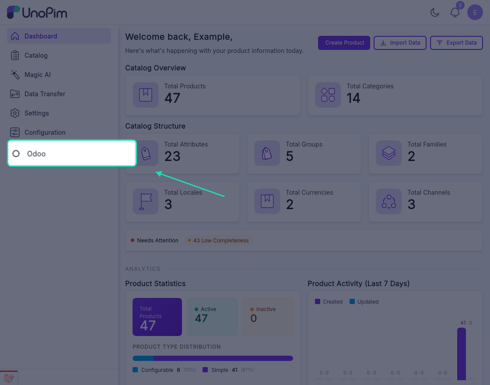

# Installation

Follow the steps below to install the UnoPim Odoo Connector on your UnoPim instance. Make sure you have terminal access to your server before getting started.


## Step 1 - Add the Package Files

Unzip the extension ZIP file you downloaded. Inside, you'll find a `packages` folder - merge this into the **root directory** of your UnoPim project.


## Step 2 - Register the Service Provider

Open the `bootstrap/providers.php` file and add the following:

```php
use Webkul\Odoo\Providers\OdooServiceProvider;

return [
    // ...existing providers...
    OdooServiceProvider::class,
];
```

> [!NOTE]
> This registers `OdooServiceProvider` in Laravel so the connector can bootstrap its services, routes, and package configuration during application startup.


## Step 3 - Update Composer Autoload

Open `composer.json` and add the following line under the `autoload > psr-4` section:

```json
"Webkul\\Odoo\\": "packages/Webkul/Odoo/src"
```


## Step 4 - Run the Setup Commands

Run the following commands one by one in your terminal. Wait for each one to finish before running the next.

**Dump Composer autoload**
```bash
composer dump-autoload
```

**Run database migrations**
```bash
php artisan migrate
```

**Publish the connector assets**
```bash
php artisan vendor:publish --tag=unopim-odoo-connector
```

**Install the Odoo XML-RPC client package**
```bash
composer require alazzi-az/odoo-xmlrpc
```

**Clear the application cache**
```bash
php artisan optimize:clear
```

| Command | Purpose |
|---|---|
| `composer dump-autoload` | Regenerates Composer's autoloader mapping to include the newly added namespace. |
| `php artisan migrate` | Runs pending database migrations required by the connector. |
| `php artisan vendor:publish --tag=unopim-odoo-connector` | Publishes the package configuration/assets into the application. |
| `composer require alazzi-az/odoo-xmlrpc` | Installs the Odoo XML-RPC client dependency required by the connector. |
| `php artisan optimize:clear` | Clears all cached files (bootstrap, configuration, routes, and views) to load the new changes. |


## Verify the Installation

Once all commands have run successfully, log in to your UnoPim dashboard. You should see an **Odoo icon** in the left sidebar - this confirms the connector has been installed correctly.



If the icon doesn't appear, try running `php artisan optimize:clear` again and refresh the page.

