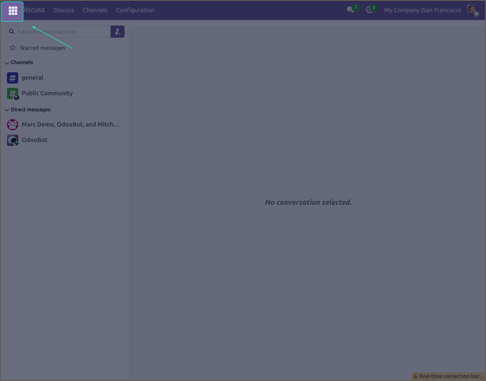
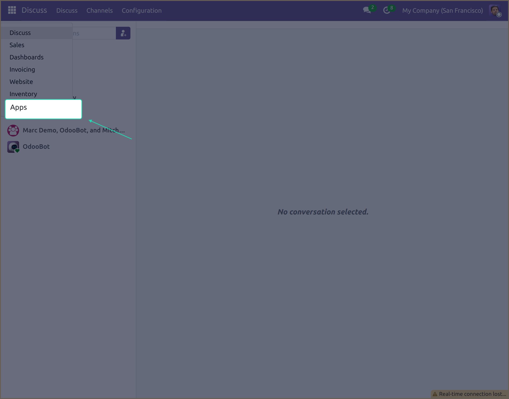
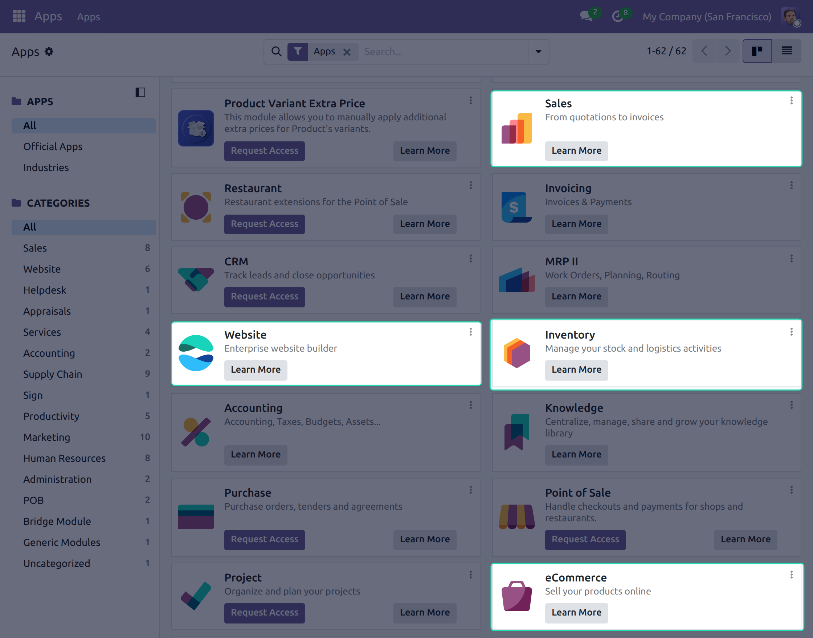

# Setting Up Odoo Before You Begin

Before you start importing or exporting data between UnoPim and Odoo, you need to make sure your Odoo instance has the right apps installed. Without these, the connector won't be able to communicate with Odoo properly.

This is a one-time setup step — once done, you won't need to repeat it.

## Step 1 — Open the Odoo Dashboard

Log in to your Odoo account. Once you're on the dashboard, click the **grid icon** (⊞) in the **top-left corner** of the screen. This opens the main app menu where all available Odoo apps are listed.

## Step 2 — Go to Apps

Click on **Apps** from the menu. This takes you to the Odoo App Store, where you can browse and install modules for your Odoo instance.

Use the search bar to find each app you need.

## Step 3 — Install the Required Apps

The following Odoo apps **must be installed** for the UnoPim Odoo Connector to work correctly:

| App | Why it's needed |
|---|---|
| **Sales** | Required for managing products and pricelists in Odoo |
| **eCommerce** | Enables product publishing and eCommerce category management |
| **Inventory** | Handles stock and product variant management |
| **Website** | Required for eCommerce functionality to work in Odoo |

For each app, click **Install** if it isn't already installed. Wait for each installation to complete before moving on to the next one.

> **Tip:** If an app is already installed, it will show an **Installed** badge — you can skip it and move on to the next one.

Once all four apps are installed, your Odoo store is ready to connect with UnoPim. Head over to [Installation](./installation.md) to continue.