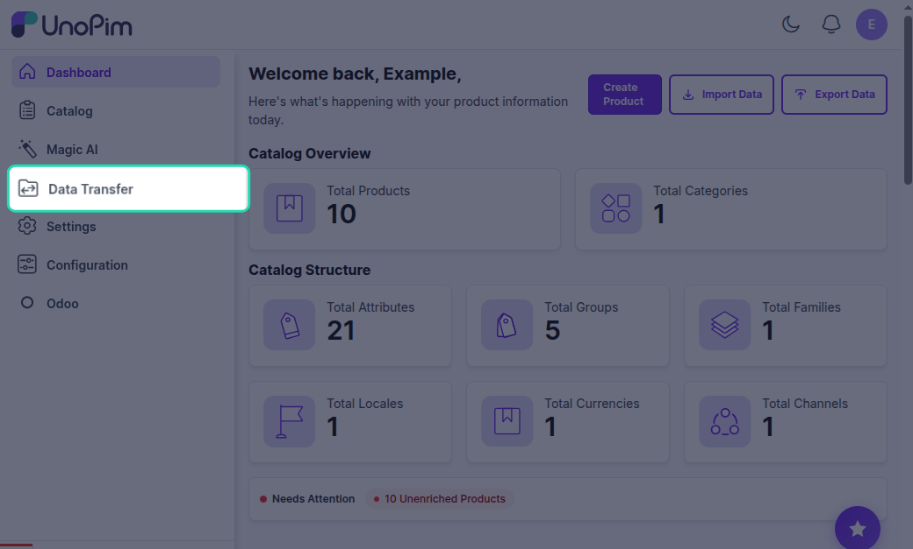
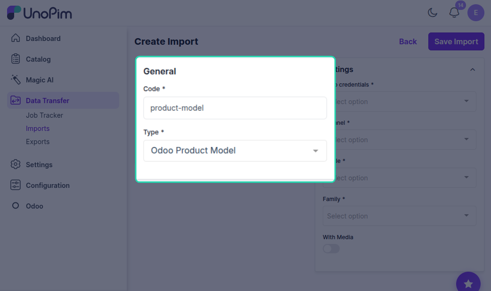
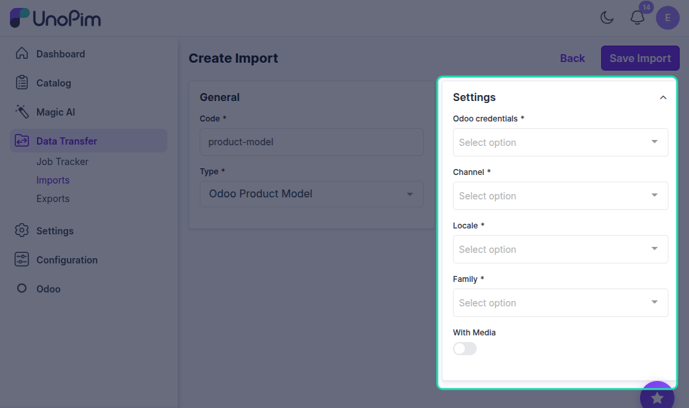
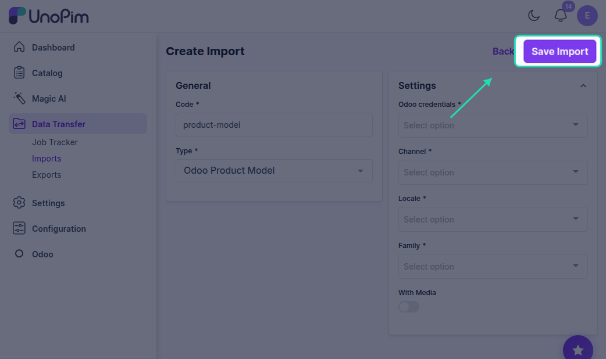
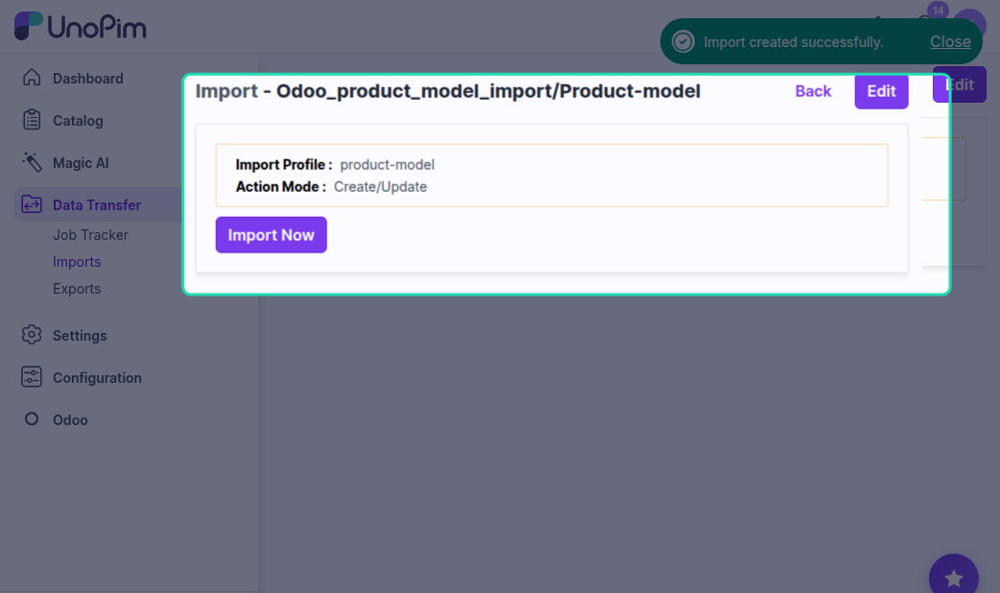
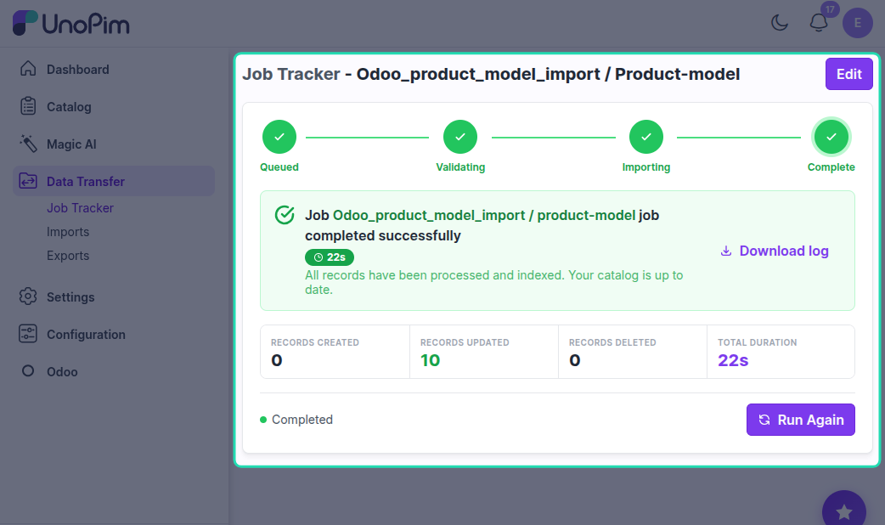

# UnoPim - Odoo Import Product Model

Importing Product Models from Odoo

## Overview

This import job will import all the product models from Odoo to UnoPim.

## Prerequisites

Before importing product models from Odoo, ensure that you have configured your Odoo credentials in UnoPim.

## Step 1: Go to Data Transfer

Navigate to the **Data Transfer** section from the main menu in UnoPim.

## Step 2: Go to Imports

Click on **Imports** to view the available import options.

## Step 3: Create Import

Click on **Create Import** to create a new import profile.

## Step 4: Enter Code and Select Type

In the **General** section, configure the following:

### Code

Enter a unique code for your import profile. This code will help you identify the import profile.

**Example:** odoo_product_model_import

### Type

In the **Type** field, select **Odoo Product Model** from the dropdown menu.

## Step 5: Configure Settings

In the **Settings** section, select the appropriate channel, locale, and currency for importing Odoo products to UnoPim.

### Odoo Credentials

Click on the **Odoo credentials** dropdown and select the specific Odoo credentials or connection you want to import from. This is a required field.

### Channel

Click on the **Channel** dropdown and select the appropriate channel or store view from your Odoo setup. This is a required field.

### Locale

Click on the **Locale** dropdown and select the language or regional settings for imported product data (e.g., English, Spanish). This is a required field.

### Family

Click on the **Family** dropdown and select the product family where you want to import product models. This is a required field.

### With Media

Toggle the **With Media** option to choose whether to import product models along with their images and media files.

- **ON** - Import product models with all associated images and media files
- **OFF** - Import product models without media files

## Step 6: Save Import

Click the **Save Import** button to save your import profile configuration.

## Step 7: Import Now

Once the import profile is saved, click the **Import Now** button to execute the import process and import all product models from Odoo to UnoPim.

## Step 8: Monitor Progress

In the execution process, you can check the progress of the import job and view any errors in the log.

## Benefits of Using Filters

These filters give you fine-grained control over your imports, making it easier to:

- Manage localized catalogs
- Handle multi-channel data
- Organize media-rich content
- Avoid overloading your UnoPim workspace

