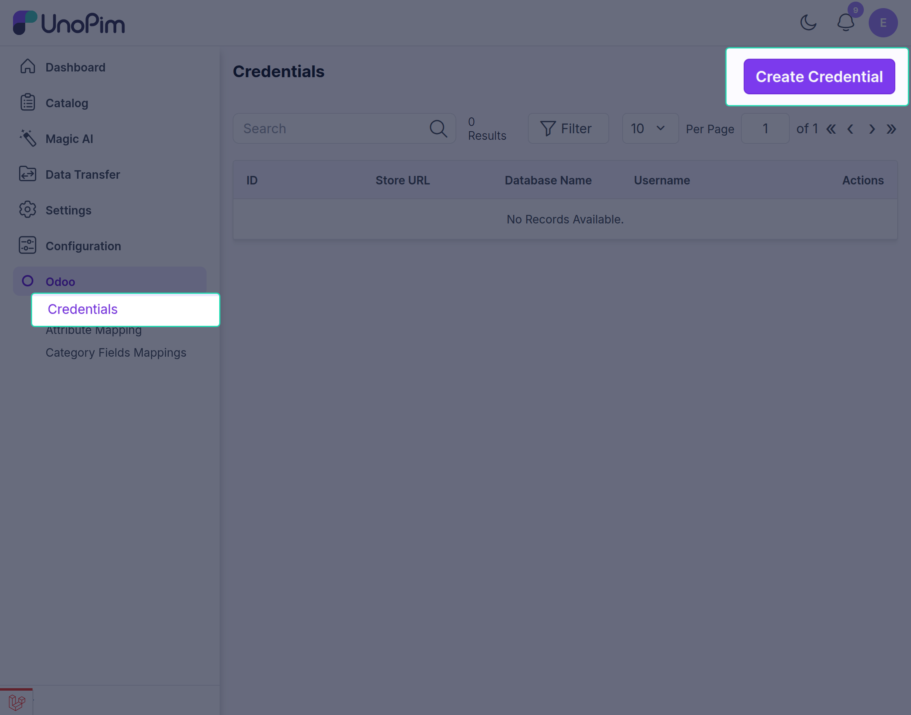
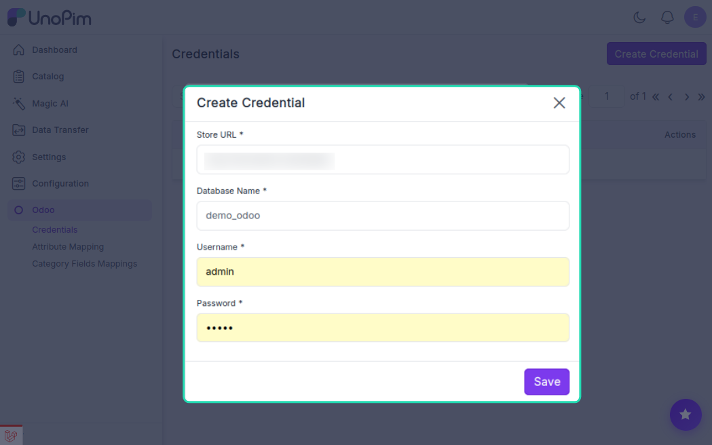
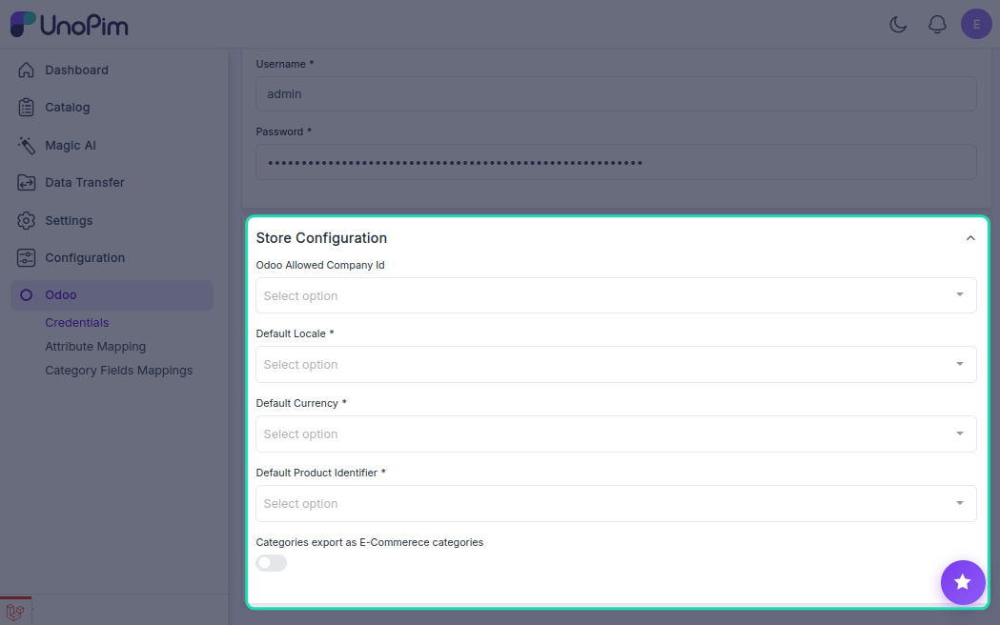

# Setting Up Odoo Credentials

Once the connector is installed, the next step is to connect your Odoo store to UnoPim. This is done by entering your Odoo server details inside the UnoPim dashboard.

## Step 1 — Open the Credentials Page

Log in to your UnoPim dashboard and navigate to **Odoo → Credentials → Create Credentials**.

## Step 2 — Enter Your Odoo Server Details

Fill in the following fields to establish the connection:

| Field | What to enter |
|---|---|
| **URL** | The full URL of your Odoo server (e.g., `https://mystore.odoo.com`) |
| **Database Name** | The name of your Odoo database |
| **Login Username** | Your Odoo admin username |
| **Login Password** | Your Odoo admin password |

> **Note:** Each set of credentials must have a unique database name. If you enter a database name that's already in use, UnoPim will show an error and the credentials won't be saved.

## Step 3 — Configure Export Settings

After entering the server details, you'll need to define how products should be exported. Fill in the following settings:

### Odoo Allowed Company ID
Select the **Company ID** for which you want to export products. If your Odoo instance has multiple companies and you want to export to all of them, leave this field blank.

### Default Locale
Choose the locale that matches your Odoo store's language. For example:
- `English (United States)`
- `Spanish (Brazil)`

### Currency
Select the default currency used in your Odoo store. For example:
- `US Dollar`
- `Euro`
- `British Pound`

### Default Product Identifier
This tells the connector how exported products will be identified in Odoo. Choose one of the following:

| Option | When to use |
|---|---|
| **Internal Reference** (`default_code`) | Use this if your products are identified by an internal reference code in Odoo |
| **Barcode** (`barcode`) | Use this if your products are identified by their barcode |

### Category Export as eCommerce Categories
Toggle this **on** if you want your UnoPim categories to be exported directly as **Odoo eCommerce categories** rather than standard internal categories.

## Step 4 — Save Your Credentials

Once all fields are filled in, click **Save**. Your Odoo store is now connected to UnoPim and ready for export and import jobs.

> **Tip:** You can connect more than one Odoo store by repeating these steps and creating a separate set of credentials for each store.