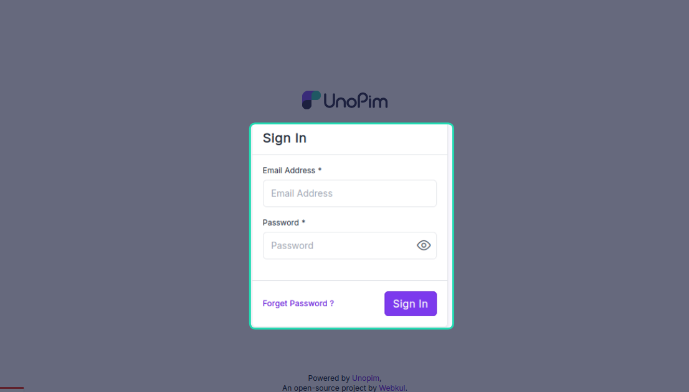
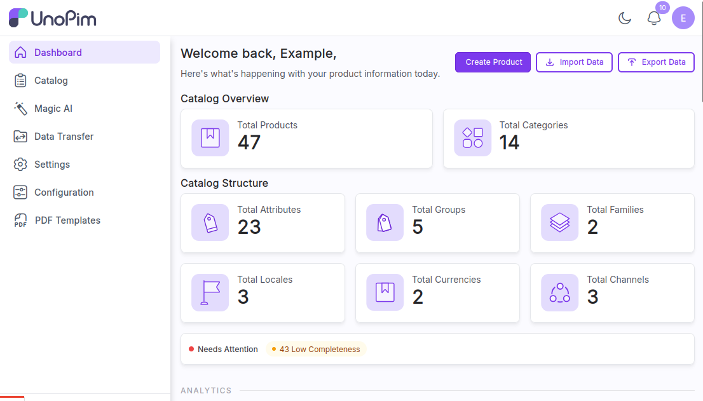
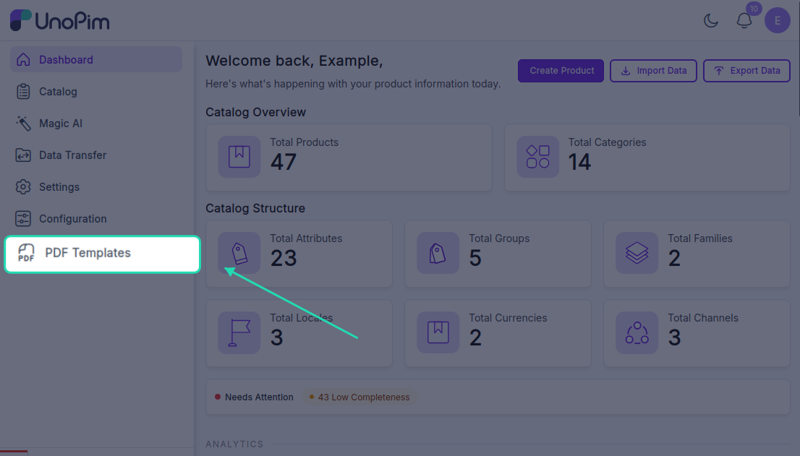
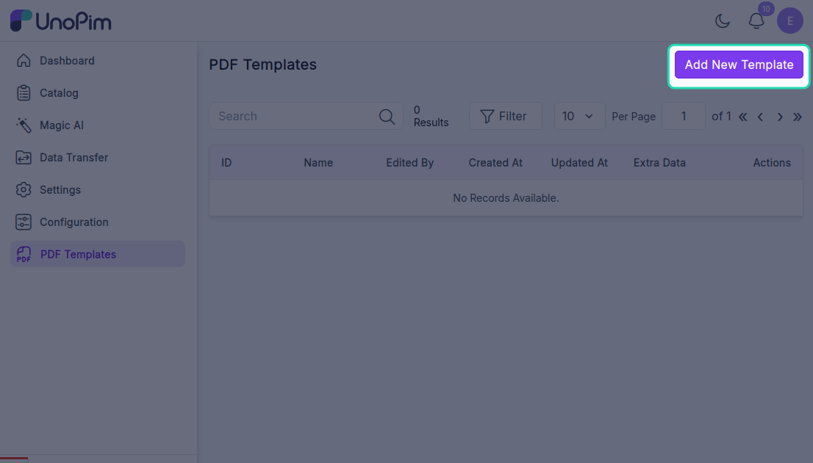
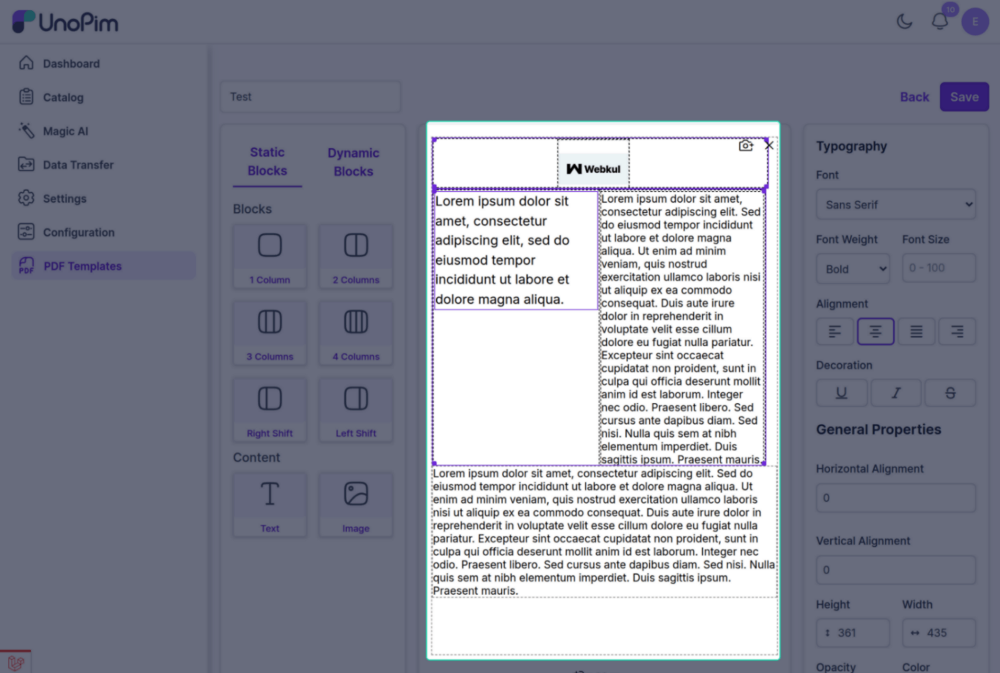
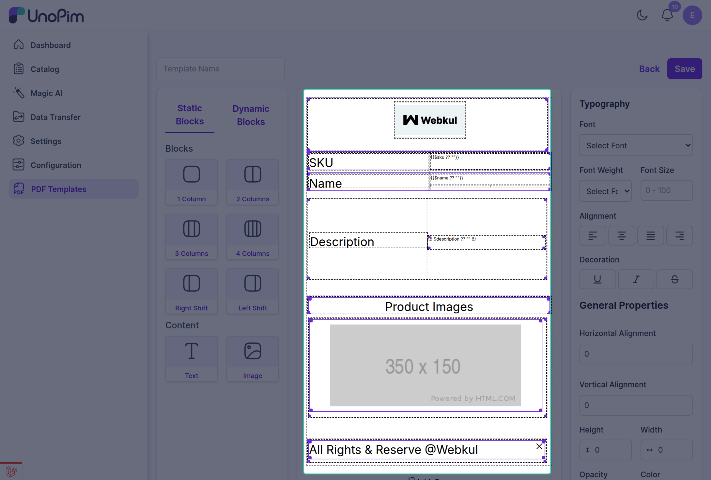

# Attribute Layout

The PDF Generator module lets you build layouts that match the type of product document you want to create.

## Module Configurations

1. Log in to your UnoPim admin panel.

2. After login, you will be redirected to the UnoPim PDF Generator dashboard.

3. Navigate to the **PDF Template** tab under the module.

4. Click **Add New Template** to create and generate a PDF document.

## Flexible Attribute Layouts

You can create single-column documents for minimal designs or use multiple columns and rows for more complex layouts. This is useful for catalogs, specification sheets, brochures, and other structured product documents.

## Static Attributes

Static attributes let you add fixed content that appears on every generated PDF.

You can use static attributes for elements such as:

- Logos
- Headers
- Taglines
- Legal disclaimers

These fixed elements help maintain brand consistency across all documents.

## Dynamic Attributes

Dynamic attributes pull real-time product data directly into your PDF templates, so each generated document stays accurate and up to date.

You can use different dynamic attributes to map product data into the PDF template based on your document design and content requirements.
