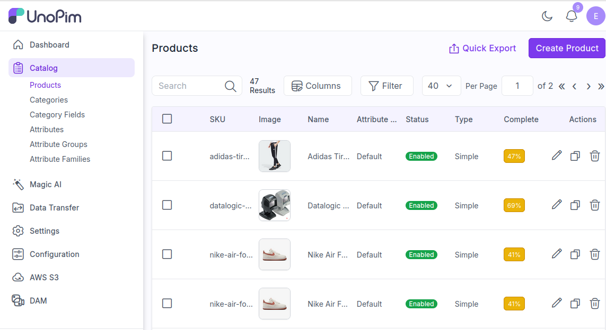
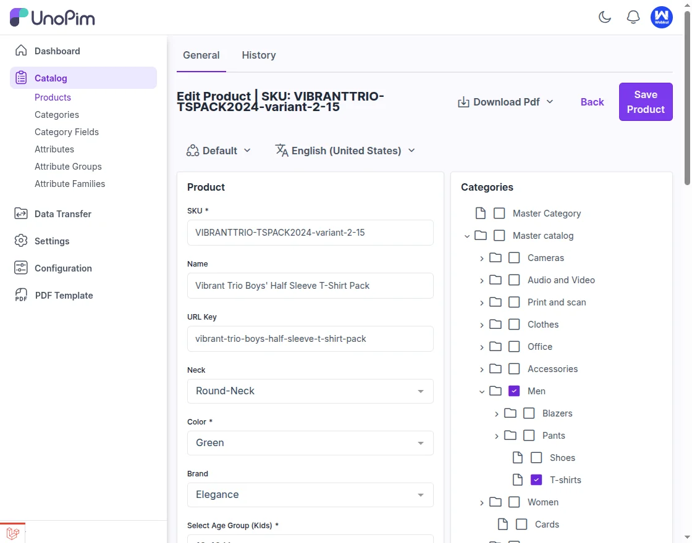
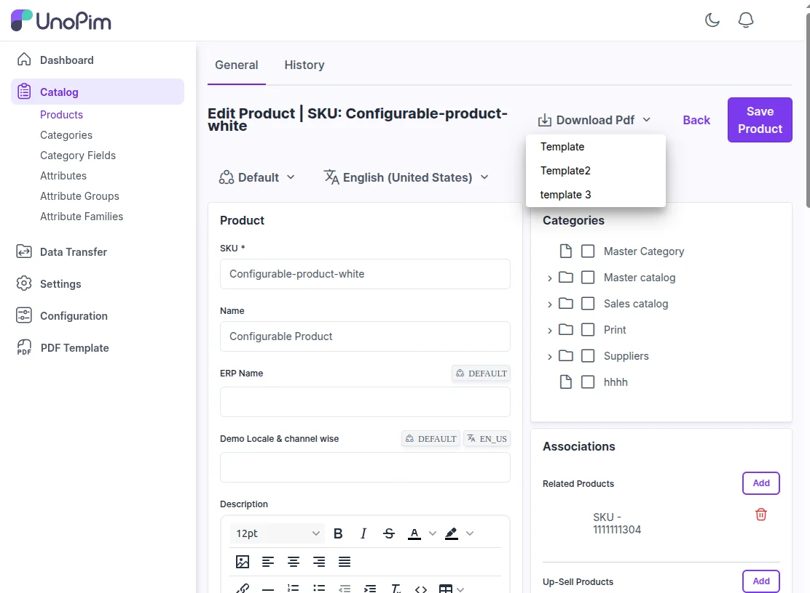
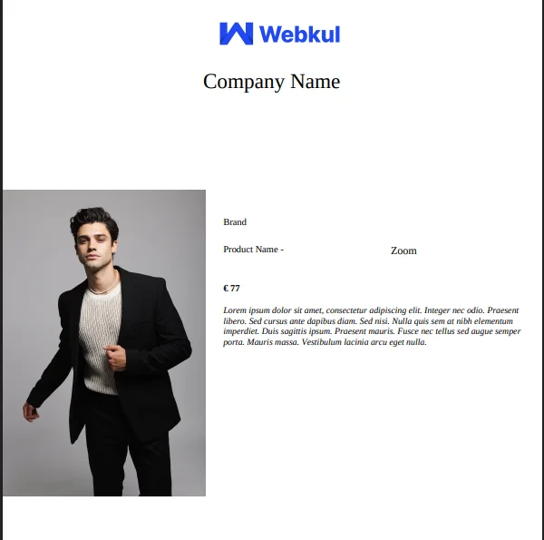

# Generate PDF from Product View

After creating and saving a PDF template, you can generate the final PDF directly from the product view.

## Steps

### Navigate to Product Catalog

To download a PDF, navigate to the Product Detail Page for the product you've associated with the PDF template. Go to **Catalog > Products**.

### Open Product Detail Page

Navigate to the Product Detail Page for the specific product to access the customized PDF template. This page provides a comprehensive view of the product's details, including its name, description, images, pricing, and other relevant information.

It's where all the key product data is displayed for both admin use and customer browsing.

### Select PDF Template

User can see a pop-up of templates that has been created and then select the desired template to download PDF. Templates dropdown as shown below:

### Download PDF

Once on this page, you'll find the section dedicated to PDF Settings, where the generated PDF is ready for download.

