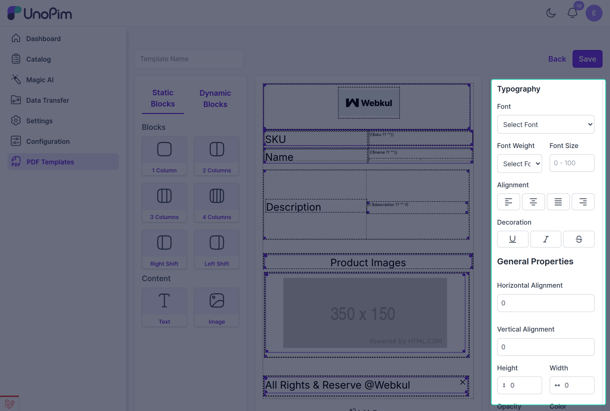
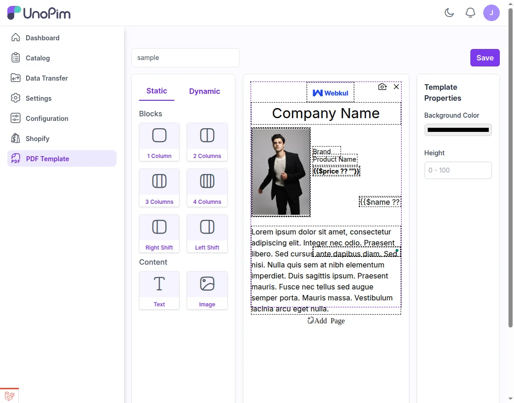
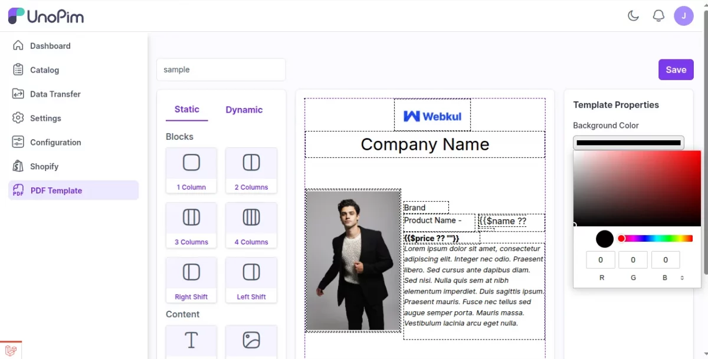

# Product Identification and Description

The PDF Generator can display important product details directly inside the PDF template by using dynamic attribute mapping.

## Product Identification and Descriptions

You can include the following product fields in your PDF template:

- **SKU**: A unique Stock Keeping Unit code used to identify products.
- **Name**: The official product name shown in listings and product records.
- **Description**: The full product description, usually used for detailed content.
- **Short Description**: A concise summary of the product.
- **Product Number**: An alternative unique identifier, often used for internal tracking.
- **URL Key**: A URL-friendly version of the product name used for SEO and link generation.

## Typography Settings

These settings control the visual style of text-based fields such as SKU and product details:

- **Font**: Choose the font family, such as Serif or Sans-serif.
- **Font Weight**: Control how light, regular, or bold the text appears.
- **Font Size**: Set the text size using a scale from `0` to `100`.
- **Alignment**: Align the content to the left, center, or right.
- **Decoration**: Apply styles such as underline, overline, or strikethrough.

## Dynamic Mapping

Dynamic attributes pull live product data into the PDF template when the document is generated. This helps ensure that the PDF always reflects the latest product information stored in UnoPim.

## Drag-and-Drop Field Placement

Once your layout is ready, you can use the drag-and-drop interface to place fields exactly where you want them in the template.

You can add different field types such as:

- Text fields
- Textarea fields for longer descriptions
- Images for product visuals
- Price fields
- Attribute fields for dynamic data

## Customize Styling and Background

Open the **Styling Settings** tab to define font family, font size, and text alignment for each field.

Then use **Background Settings** to apply a background color that matches your brand style.

## Final Step

After configuring the fields and styling options, click **Save Template** to store your changes. You can then assign the template to specific products as needed.
