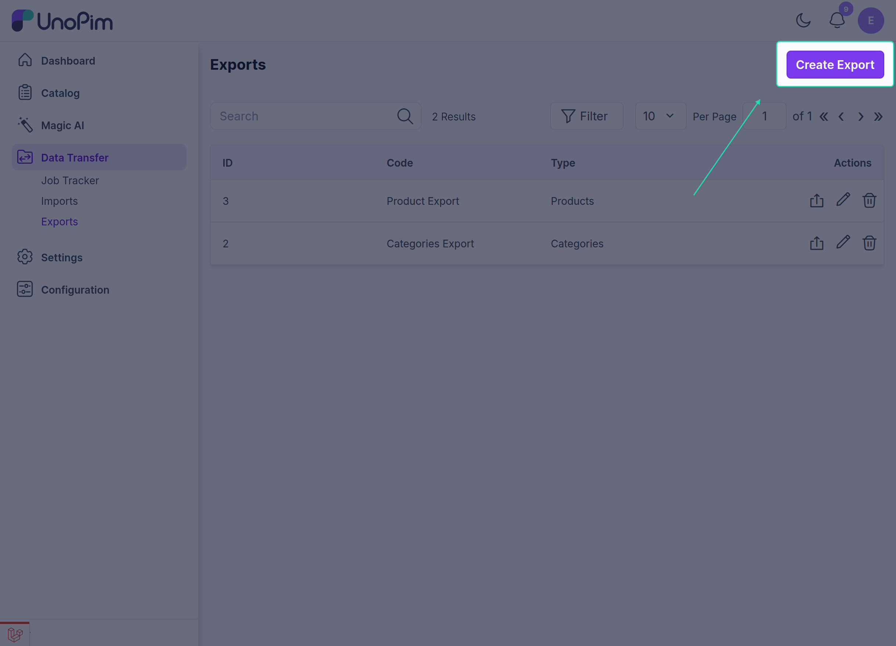
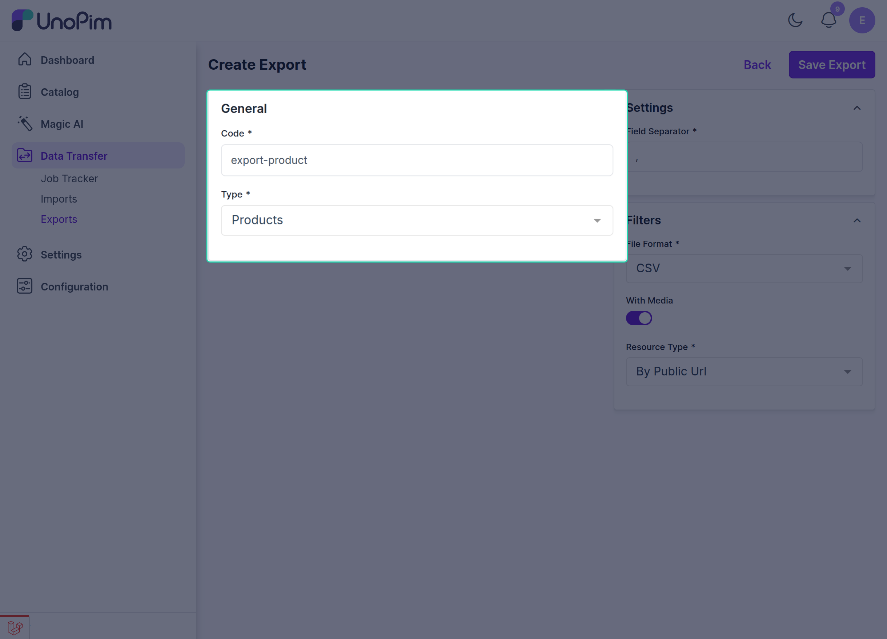
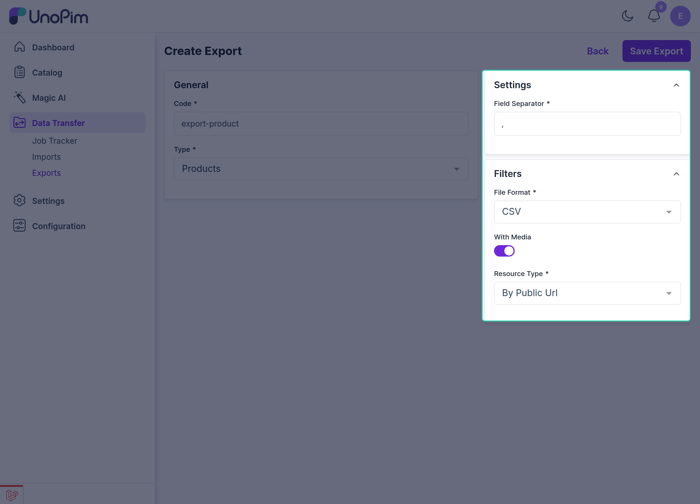
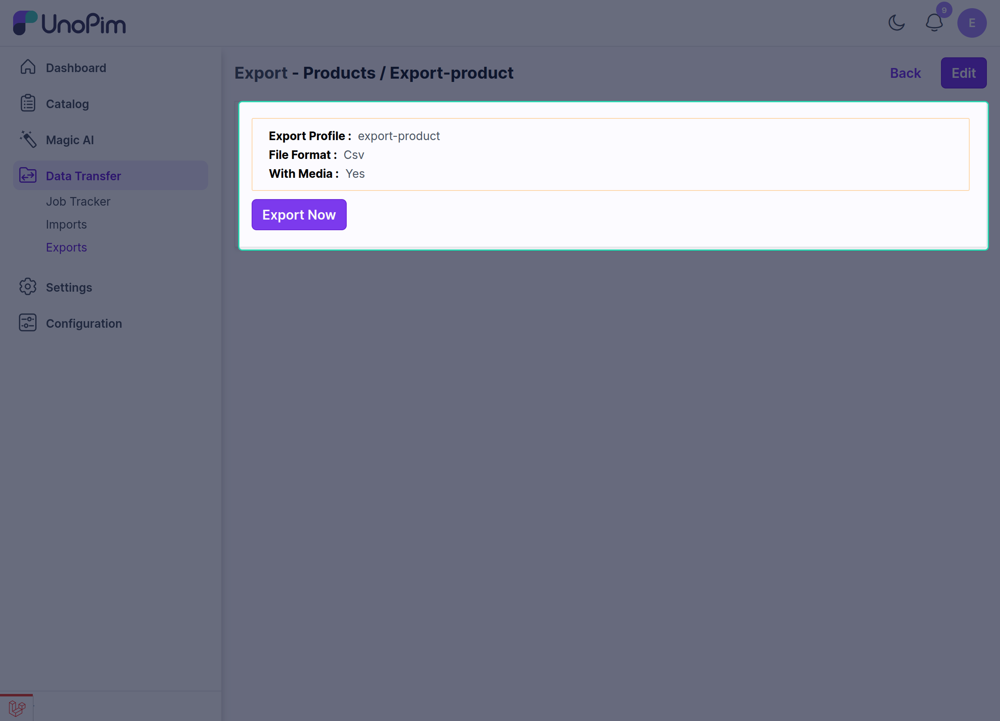
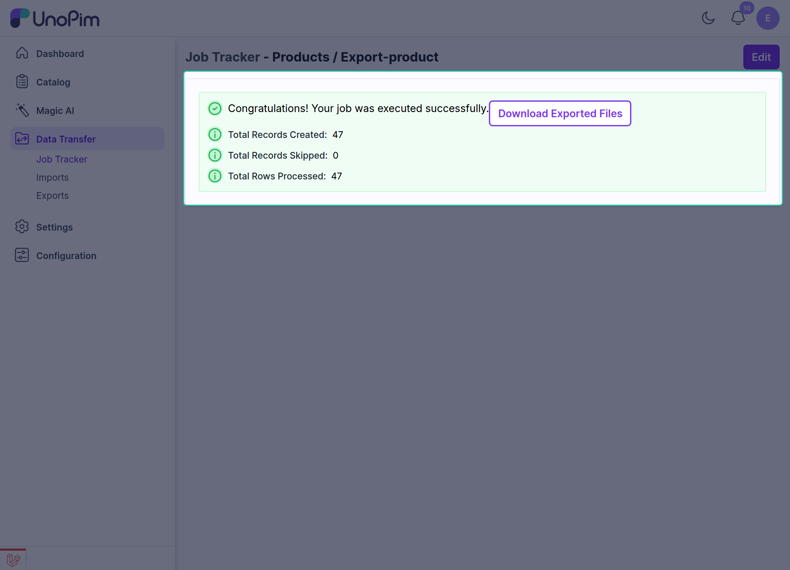

# Use Public Image URL in Exports

After the **UnoPim Public Image URL** extension is installed, you can export product media using **Public URL** or **ZIP** as the resource type.

This is useful when you want product media such as **image**, **gallery**, and **file** attributes to appear in the export file as publicly accessible URLs instead of bundled files.

## What This Export Supports

UnoPim allows you to export product media for product types such as:

- **Simple products**
- **Configurable products**

This export works for **Products** and not for **Categories**.

## Create an Export for Media as Public URL

Follow these steps to create the export:

1. Go to **Data Transfer > Exports > Create Export**.

2. In the **General** section, enter the required fields such as **Code** and **Type**, then select **Products** as the product type.

3. Choose the required file format, such as **CSV** or **XLSX**.

4. Configure the export profile settings as needed.

## Media-Related Export Settings

While editing the export job profile, you can configure the media export options:

| Setting | Description |
|---|---|
| **Field Separator** | Choose the delimiter for the export file, such as `,` or `;`. |
| **File Format** | Select the export format, such as **CSV**, **XLS**, or **XLSX**. |
| **Media Option** | Enable this option to include product media in the export. |
| **Resource Type** | Choose whether media should be exported as **Public URL** or **ZIP**. |

## Public URL vs ZIP

### Public URL

If the **Media** option is enabled and **Public URL** is selected as the resource type:

- product media values are exported as public URLs,
- the exported URLs remain accessible through the public path,
- image, gallery, and file attributes appear in the export file as links.

### ZIP

If **ZIP** is selected as the resource type:

- media is handled as file resources instead of public URLs,
- the exported values will not appear as public URL links in the same way,
- this option is useful when you want media packaged differently for download or transfer.

## Result of the Export

With this setup, UnoPim makes it easy to export product media along with the product data.

Key benefits include:

- exporting product **image**, **gallery**, and **file** attributes as public URLs,
- support for file formats such as **CSV** and **XLSX**,
- simpler handling of product media during external sharing or integration.

> **Note:** Product media attribute values such as `image`, `file`, and `gallery` can be exported as **Public URL** values.
