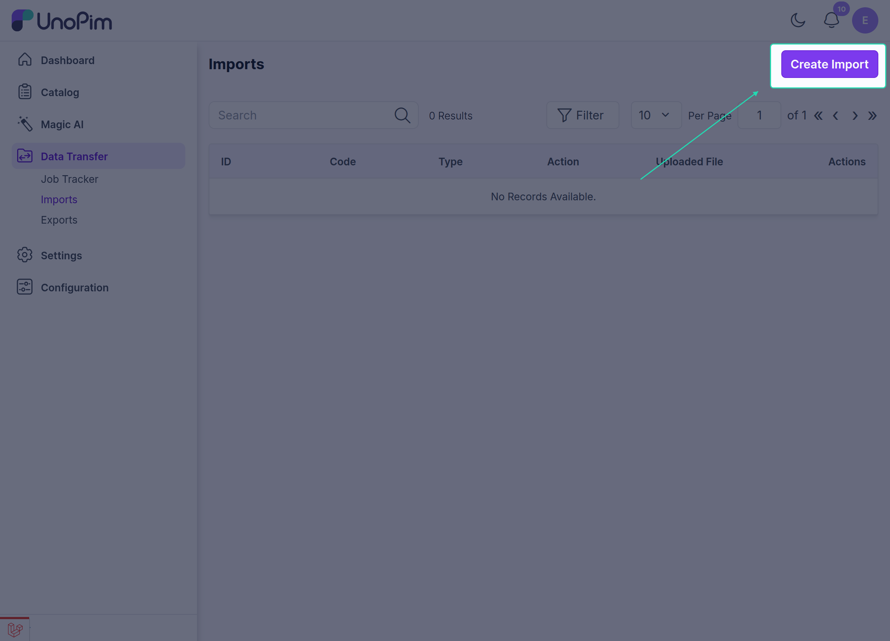
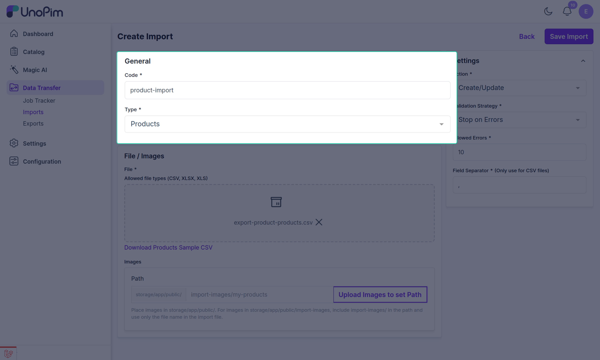
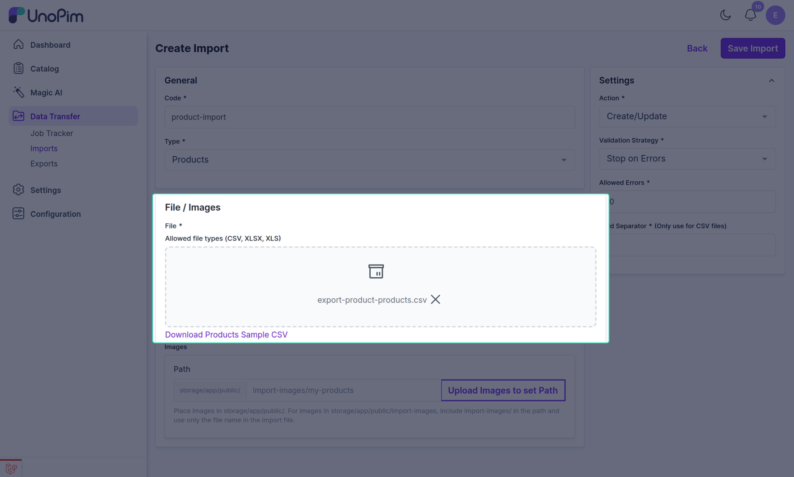
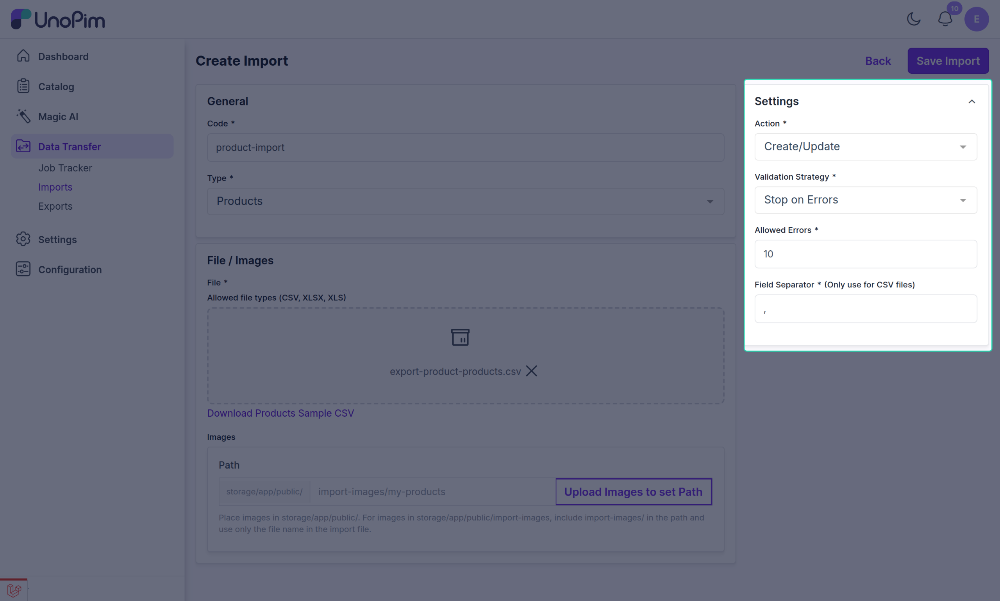

# Use Public Image URL in Imports

After the **UnoPim Public Image URL** extension is installed, you can import product media using public URL values in your import file.

This allows UnoPim to fetch product media automatically and assign it to the correct product attributes during import.

## What This Import Supports

This import works for **Products** only.

You can import media values for product media attributes such as:

- **image**
- **gallery**
- **file**

## Create an Import for Media Using Public URL

Follow these steps to create the import:

1. Go to **Data Transfer > Imports > Create Import**.

2. In the **General** section, enter the required fields such as **Code**, **Type**, and **File**, then select **Products** as the product type.

3. Add the image or media public URL values in your **CSV**, **XLS**, or **XLSX** file.

4. Upload the file in the selected import format.

## Configure Import Settings

Under the **Settings** section, configure the import behavior as needed:

| Setting | Description |
|---|---|
| **Action** | Choose **Create/Update** or **Delete** depending on the import goal. |
| **Recommended Action** | Select **Create/Update** when importing product media URLs. |
| **Validation Strategy** | Choose **Stop on Errors** or **Skip Errors**. |
| **Allowed Errors** | If **Skip Errors** is selected, define how many errors are allowed, such as `10`. |
| **Field Separator** | Choose the delimiter used in the file, such as `,` or `;`. |

## How the Import Works

When the import runs successfully:

- UnoPim reads the product media URL values from the import file,
- fetches the files from the given public URLs,
- assigns them to the correct product media attributes,
- and saves them with the related product data.

## Result After Import

Once the product import is completed successfully, you can open the imported product in UnoPim and verify that the media has been added correctly.

This makes it easier to:

- import product media in bulk,
- avoid manual media uploads,
- and manage product image, gallery, and file attributes more efficiently.

> **Note:** Product media attribute values such as `image`, `gallery`, and `file` can be imported using **Public URL** values.
