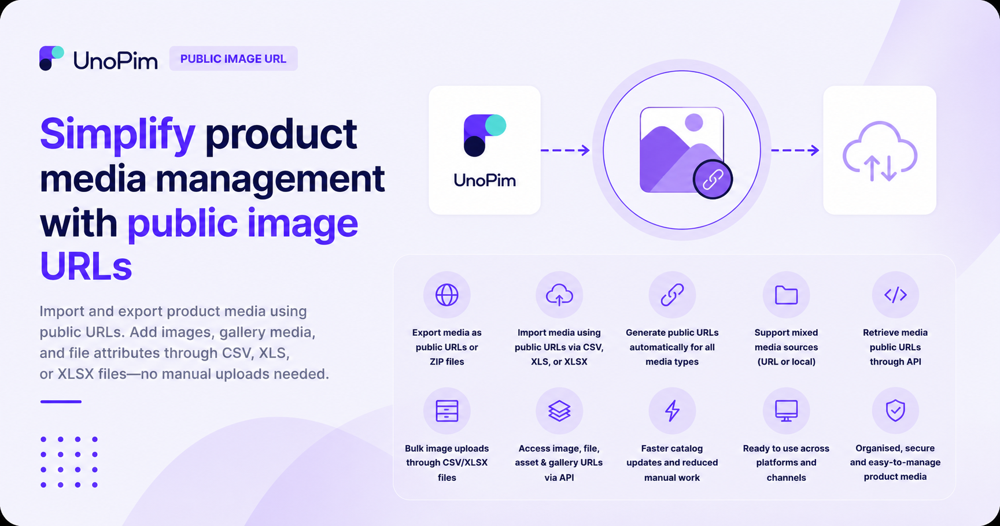

# UnoPim Public Image URL

The **UnoPim Public Image URL** extension simplifies product media management by letting you import and export product media using public URLs.

 

  

  

Instead of uploading files manually, you can add product images, gallery media, and file attributes directly through **CSV**, **XLS**, or **XLSX** files. During import, UnoPim automatically fetches the media from the provided public URLs and assigns each file to the correct product attribute.

After import, the media is available in UnoPim with a public URL under your domain, making it easier to manage, display, and share across other platforms.

The same flexibility applies during export. If product media was added through a public URL or uploaded from a local folder, the exported file will include the media using its public URL path.

This helps businesses speed up catalog updates, reduce manual work, and keep product media organised and ready for use.

## Features

- **Export product media as public URLs or ZIP files** so you can either share direct links or download media in bulk.
- **Import media using public URLs** for image, gallery, and file attributes through CSV, XLS, or XLSX files.
- **Generate public URLs automatically** for product image, gallery, and file media.
- **Support mixed media sources** whether files were added through a public URL or uploaded locally.
- **Retrieve product media as public URLs through the API** for easier external integration.
- **Handle bulk image uploads through CSV/XLSX files** for faster catalog management.
- **Access image, file, asset, and gallery URLs through API integration** where supported by the module.

## Why It Is Useful

With this extension, your product media is always ready to use, display, or share without extra manual handling. It is especially useful when you manage large catalogs and need to update images or files in bulk.

## Related Extensions

You can also explore these UnoPim modules:

- **UnoPim Shopify Connector** to connect your Shopify store with UnoPim and manage data transfer more easily.
- **UnoPim DAM (Digital Asset Management)** to organise and manage digital assets such as images, videos, and documents in one place.

> **Note:** This module also supports returning the product media type `image` attribute value as a public URL through the API.
