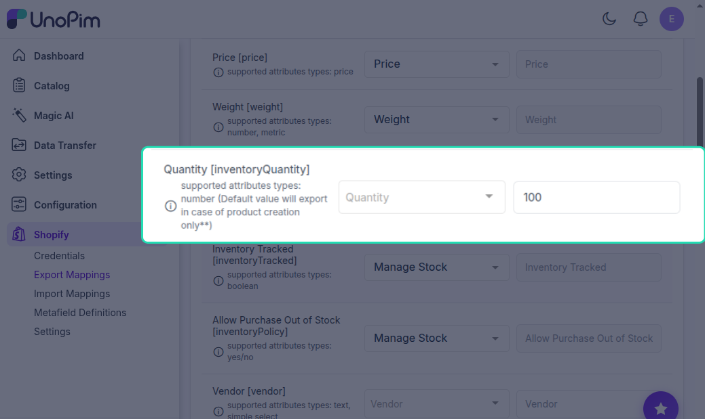

# Export Attribute Mapping

Before you can export products from UnoPim to Shopify, you need to tell the connector which UnoPim attribute maps to which Shopify product field. This is called **attribute mapping** — and you only need to set it up once.

---

## How to Access Export Mappings

Click the **Shopify icon** in the left sidebar of your UnoPim dashboard, then click on the **Export Mappings** tab.

On this screen, the left side lists all available Shopify product fields. For each field, use the dropdown on the right to select the matching UnoPim attribute.

---

## Available Field Mappings

Here's a breakdown of every Shopify field you can map, what it does, and when you'd use it:

| Shopify Field | Field Code | What it does |
|---|---|---|
| **Name** | `title` | The product title shown on your Shopify storefront |
| **Description** | `descriptionHtml` | Full product description — supports HTML formatting |
| **Price** | `price` | The selling price of the product |
| **Weight** | `weight` | Product weight used for shipping calculations |
| **Quantity** | `inventoryQuantity` | How many units are available in stock |
| **Inventory Tracked** | `inventoryTracked` | Turns on inventory tracking for the product |
| **Allow Purchase Out of Stock** | `inventoryPolicy` | Allows customers to still buy the product when stock hits zero |
| **Vendor** | `vendor` | The brand or supplier name |
| **Product Type** | `productType` | The category or type the product belongs to |
| **Tags** | `tags` | Keywords used for search and filtering in Shopify |
| **Barcode** | `barcode` | Product barcode or unique identifier for inventory scanning |
| **Compare Price** | `compareAtPrice` | The original price — shown as a strikethrough to highlight a discount |
| **SEO Title** | `metafields_global_title_tag` | Custom page title used by search engines |
| **SEO Description** | `metafields_global_description_tag` | Meta description shown in search engine results |
| **Handle** | `handle` | The URL-friendly slug for the product page (e.g. `blue-running-shoes`) |
| **Taxable** | `taxable` | Marks whether tax should be applied to this product |
| **Cost per Item** | `cost` | Cost of goods sold (COGS) — used for profit reporting |

---

## Using Fixed Values

Sometimes you don't want a field to pull from a UnoPim attribute — you just want every exported product to have the **same value** for that field. That's what the **Fixed Value** option is for.

**Example:** You want all exported products to have a quantity of `100` in Shopify, regardless of what's stored in UnoPim.

Here's how to do it:

1. Find the **Quantity** field in the mapping list.
2. **Deselect** the UnoPim attribute from the dropdown — the Fixed Value input will become editable once the attribute is cleared.
3. Type `100` in the Fixed Value field.
4. Save your mapping.

From now on, every product exported to Shopify will have its quantity set to `100` — no matter what value exists in UnoPim.

> **Tip:** Fixed values are useful for fields like **Taxable**, **Inventory Tracked**, or **Status** where you want a consistent default across your entire catalog.

---

Once your attribute mapping is configured, you're ready to set up media mappings. Continue to [Media & Unit Mapping](./media_mapping.md)