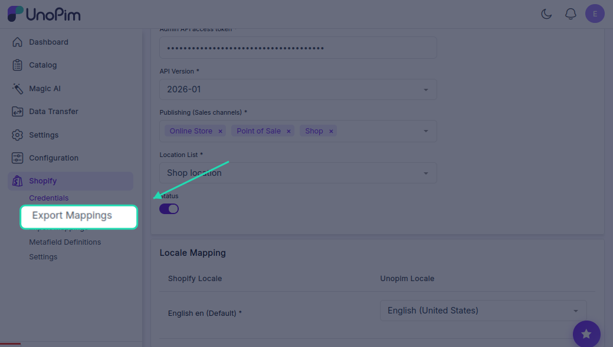
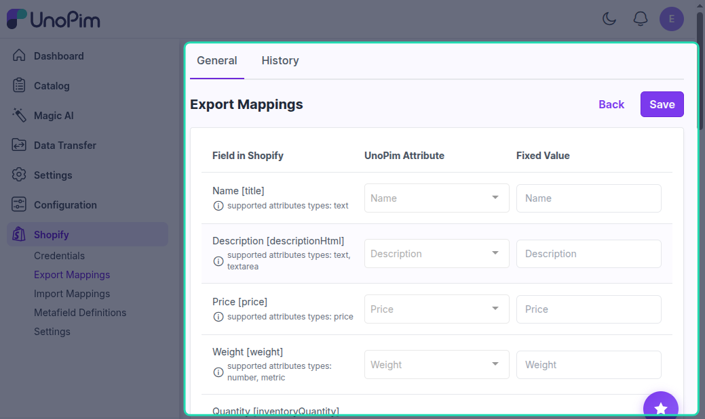

# Export Attribute Mapping

Before you can export products from UnoPim to Shopify, you need to tell the connector which UnoPim attribute maps to which Shopify product field. This is called **attribute mapping** — and you only need to set it up once.

---

## How to Access Export Mappings

Click the **Shopify icon** in the left sidebar of your UnoPim dashboard, then click on the **Export Mappings** tab.

On this screen, the left side lists all available Shopify product fields. For each field, use the dropdown on the right to select the matching UnoPim attribute.

---

## Available Field Mappings

Here's a breakdown of every Shopify field you can map, what it does, and which UnoPim attribute types it accepts:

| Shopify Field | Field Code | What it does | Supported attribute types |
|---|---|---|---|
| **Name** | `title` | The product title shown on your Shopify storefront. This field is required. | text |
| **Description** | `descriptionHtml` | Full product description — supports HTML formatting | text, textarea |
| **Price** | `price` | The selling price of the product | price |
| **Weight** | `weight` | Product weight used for shipping calculations | number, metric |
| **Inventory Tracked** | `inventoryTracked` | Turns on inventory tracking for the product | boolean |
| **Allow Purchase Out of Stock** | `inventoryPolicy` | Allows customers to still buy the product when stock hits zero | yes/no |
| **Vendor** | `vendor` | The brand or supplier name | text, simple select |
| **Product Type** | `productType` | The category or type the product belongs to | text, simple select |
| **Tags** | `tags` | Keywords used for search and filtering in Shopify | textarea, text, select, multiselect |
| **Barcode** | `barcode` | Product barcode or unique identifier for inventory scanning | text |
| **Compare Price** | `compareAtPrice` | The original price — shown as a strikethrough to highlight a discount | price |
| **SEO Title** | `metafields_global_title_tag` | Custom page title used by search engines | text |
| **SEO Description** | `metafields_global_description_tag` | Meta description shown in search engine results | text, textarea |
| **Handle** | `handle` | The URL-friendly slug for the product page (e.g. `blue-running-shoes`) | text |
| **Taxable** | `taxable` | Marks whether tax should be applied to this product | yes/no |
| **Cost per Item** | `cost` | Cost of goods sold (COGS) — used for profit reporting | price |

> **Warning:** **Handle** must be unique. If several products end up with the same handle, only the **last** one is exported — the rest are silently overwritten.

---

## Shopify Status

**Shopify Status** (`status`) is not an attribute mapping — it's a fixed setting. Whatever you choose here is applied to **every product you export**, not to one product at a time.

| Option | What it does |
|---|---|
| **Active** | The product is ready to sell and can be published to your sales channels |
| **Draft** | The product isn't ready to sell and stays hidden from customers — use this to review products before publishing |
| **Archived** | The product is no longer being sold and isn't available on any sales channel |
| **Unlisted** | The product is active, but customers need a **direct link** to reach it. It won't appear in search, collections, or product recommendations. |

---

## Unit Price

Some markets (notably the EU) require products to show a **unit price** — the price per standard unit of measure, like "€2.50 per litre". The **Unit Price** section maps the attributes that make this work.

| Field | What it does | What to choose |
|---|---|---|
| **Total amount** | The total quantity contained in the product | A number or decimal type attribute |
| **Total amount unit** | The unit that the total amount is measured in | A text or select type attribute |
| **Base measure** | The reference quantity the unit price is calculated against | A number you type in |
| **Base measure unit** | The unit for the base measure | Select from the dropdown |

> **Important:** The value of **Total amount unit** must match a valid Shopify unit — for example `ML`, `CL`, or `L`. Any other value is **not exported**, and the product ends up with no unit price at all.

**Example:** For a 750 ml bottle priced per litre, you'd set **Total amount** to `750`, **Total amount unit** to `ML`, **Base measure** to `1`, and **Base measure unit** to `L`.
