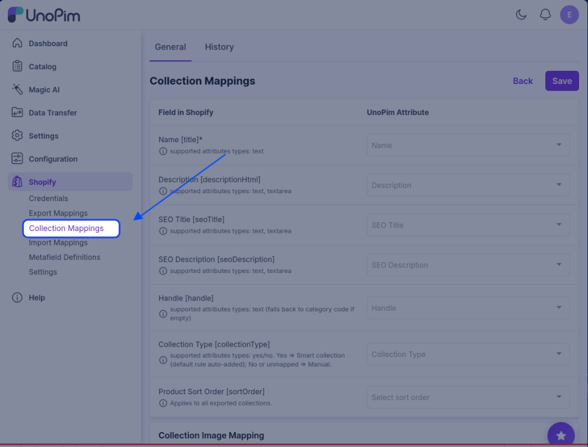
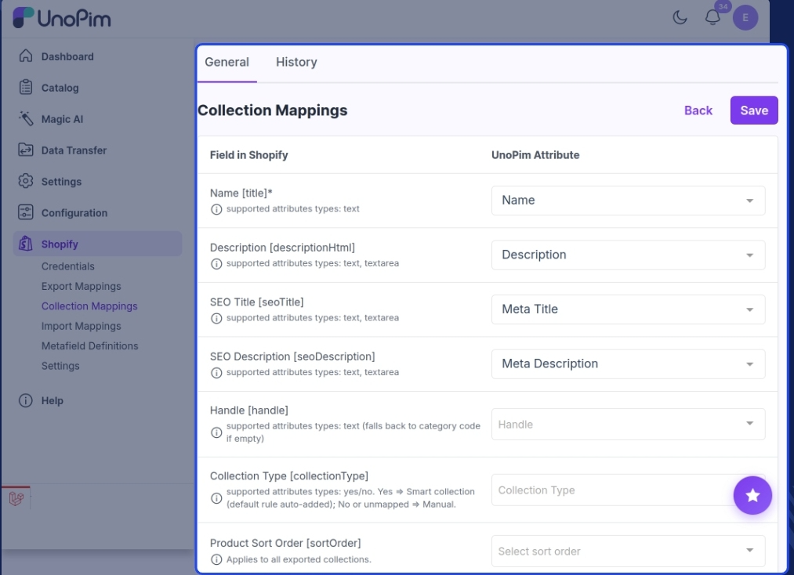
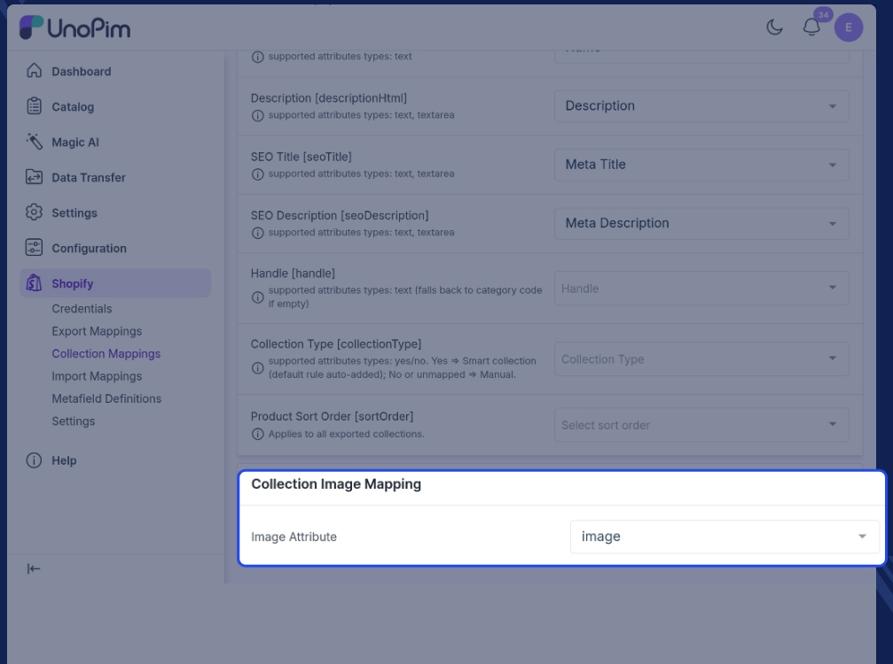

# Collection Attribute Mapping

Just like products, UnoPim categories are exported to Shopify as **collections**. Before you can export them, you need to tell the connector which UnoPim attribute maps to which Shopify collection field. This is called **collection mapping** — and you only need to set it up once.

---

## How to Access Collection Mappings

Click the **Shopify icon** in the left sidebar of your UnoPim dashboard, then click on the **Collection Mappings** tab.

On this screen, the left side lists all available Shopify collection fields. For each field, use the dropdown on the right to select the matching UnoPim attribute.

---

## Available Field Mappings

Here's a breakdown of every Shopify collection field you can map, what it does, and which attribute types it accepts:

| Shopify Field | Field Code | What it does | Supported attribute types |
|---|---|---|---|
| **Name** | `title` | The collection title shown on your Shopify storefront. This field is required. | text |
| **Description** | `descriptionHtml` | Full collection description — supports HTML formatting | text, textarea |
| **SEO Title** | `seoTitle` | Custom page title used by search engines | text, textarea |
| **SEO Description** | `seoDescription` | Meta description shown in search engine results | text, textarea |
| **Handle** | `handle` | The URL-friendly slug for the collection page. If left empty, the category code is used instead. | text |
| **Collection Type** | `collectionType` | Decides whether the collection is created as a Smart or Manual collection in Shopify | yes/no |
| **Product Sort Order** | `sortOrder` | The order products appear in inside the collection | — (applies to all exported collections) |

> **Note:** **Name** is the only mandatory field. The rest are optional — leave any of them unmapped and the connector simply skips that field on export.

---

## Smart vs Manual Collections

The **Collection Type** field controls how Shopify builds the collection:

| Mapped value | What Shopify creates |
|---|---|
| **Yes** | A **Smart collection** — a default rule is added automatically |
| **No**, or left unmapped | A **Manual collection** |

---

## Product Sort Order

**Product Sort Order** is a fixed setting rather than an attribute mapping — whatever you pick here applies to **every collection you export**, not to one collection at a time.

---

## Collection Image Mapping

At the bottom of the screen you'll find the **Collection Image Mapping** section. Use the **Image Attribute** dropdown to choose which UnoPim attribute holds the collection image.

Whatever image is stored in the selected attribute is uploaded to Shopify as the collection's banner image when the collection is exported.

> **Tip:** Leave the **Image Attribute** unmapped if your collections don't need banner images — the collection still exports fine without one.
