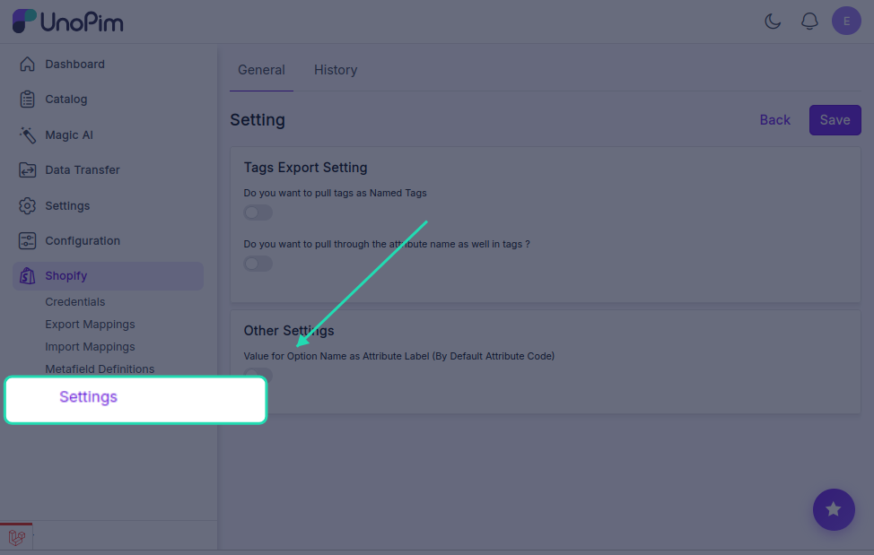
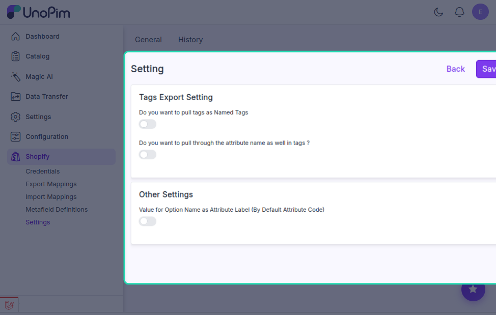

# Connector Settings — Tags Export

When you export products from UnoPim to Shopify, any tags associated with your products come along too. This settings page gives you control over **how those tags are formatted** when they appear in Shopify.

To access this, click the **Shopify icon** in the left sidebar and go to **Settings**.

---

## Tag Export Options

### Named Tags

By default, only the tag **value** is exported — for example, `Cotton`.

If you want the exported tag to also include the **attribute name** it came from, enable the **Named Tags** option. This adds context to your tags so it's clear what each one refers to when you look at them in Shopify admin.

---

### Pull Attribute Name in Tags

When **Named Tags** is enabled, you'll see this second option appear.

Turn this on if you want the **attribute name and value exported together as a single tag** — for example, instead of just `Cotton`, Shopify would receive `Material: Cotton` or `Material - Cotton`.

This is especially useful if you export tags from multiple attributes and want to easily tell them apart inside Shopify.

---

### Attribute Name Separator

Once the above option is enabled, you'll need to choose how the attribute name and value are joined together. Pick one of the following separators:

| Separator | Example output |
|---|---|
| **Dash** ( `-` ) | `Material - Cotton` |
| **Colon** ( `:` ) | `Material: Cotton` |
| **Space** ( ` ` ) | `Material Cotton` |

Choose whichever format fits your store's conventions or makes the tags easiest to read in Shopify admin.

> **Tip:** The colon format (`Material: Cotton`) tends to be the most readable at a glance, especially when browsing tags across a large product catalog.

