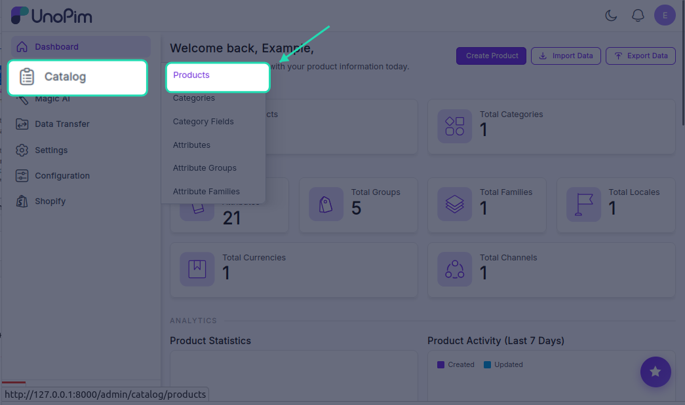
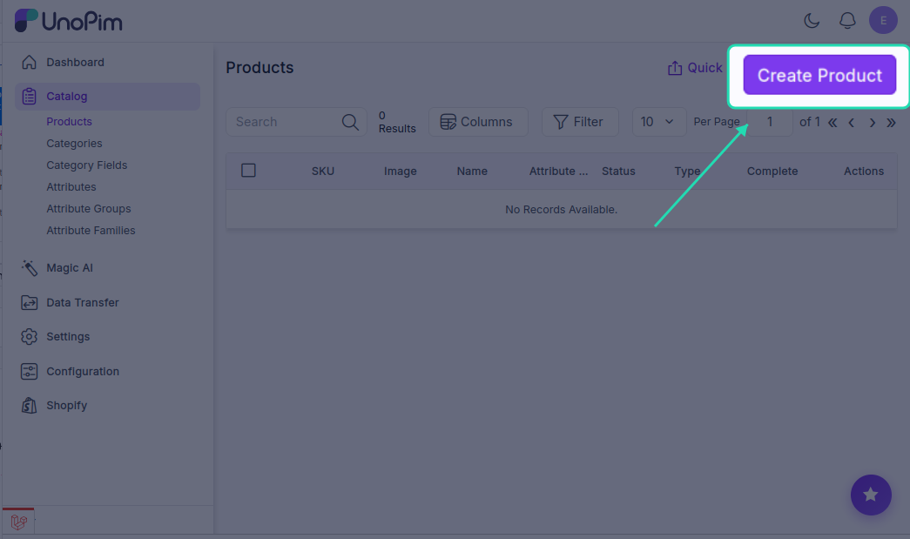
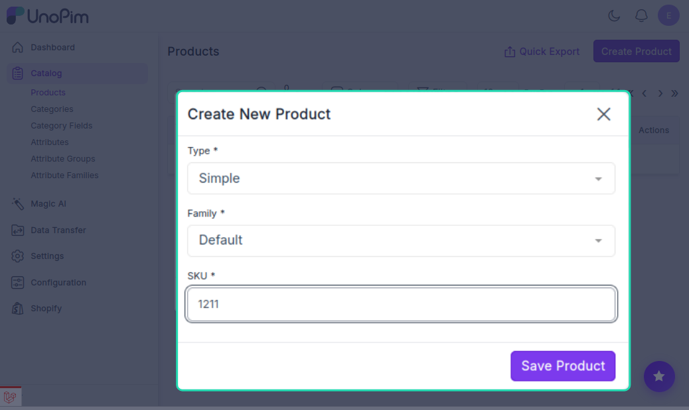
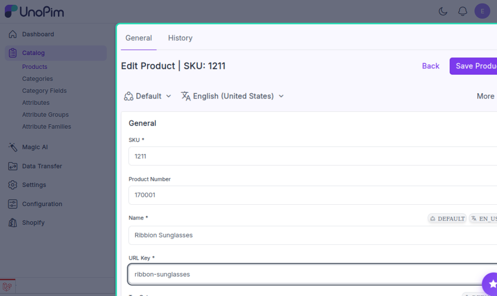
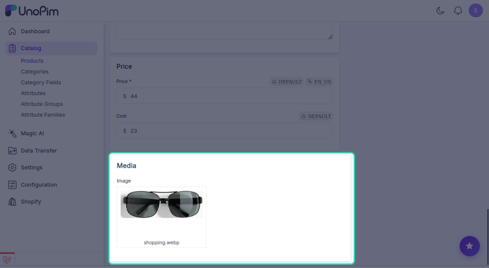
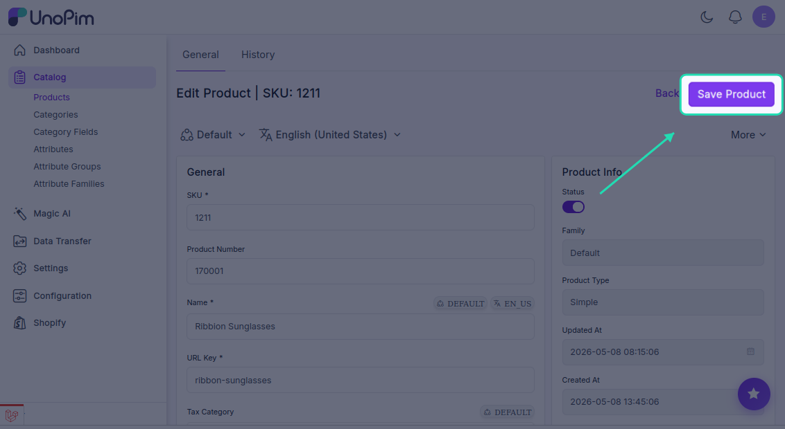

# Creating a Product in UnoPim

Before you can export anything to Shopify, your products need to exist in UnoPim first. Here's how to create one from scratch.

---

## Step 1 — Start a New Product

In the left sidebar, navigate to **Products** and click the **Create** button.

You'll be asked to choose a product type:

| Product Type | When to use |
|---|---|
| **Simple Product** | A straightforward, single product with no variations — e.g., a book, a poster, or a fixed-size item |
| **Configurable Product** | A product that comes in multiple variations — e.g., a T-shirt available in different colours and sizes |

Pick the type that matches what you're creating, then move on to the next step.

---

## Step 2 — Enter the Basic Info

Fill in the following required fields:

- **SKU** — a unique identifier for this product (e.g., `TSHIRT-BLU-M`). No two products can share the same SKU.
- **Family** — choose the attribute family this product belongs to. The family determines which attributes are available for this product.

Once done, click **Save**.

---

## Step 3 — Add Product Details

After saving, you'll land on the full product edit screen. This is where you fill in everything else:

- **Name** — the product title that will appear on Shopify
- **Description** — a detailed product description (HTML is supported)
- **Categories** — assign the product to one or more categories
- Any other attributes defined by the product family

---

## Step 4 — Upload Product Images

To add images, click on the **image attribute field** on the product page. This opens the file picker where you can upload one or more product photos.

> Uploading images will update the product's status — make sure your images are ready before saving.

**Click Save** once all details and images are added. Your product is now complete and ready to be exported to Shopify.

---

Once your product is saved and complete, it's ready to be exported to Shopify.