# Creating an Export Job

Once your products are ready in UnoPim and your mappings are configured, you can export everything to Shopify by creating an export job.

Go to **Data Transfer → Exports → Create Export**.

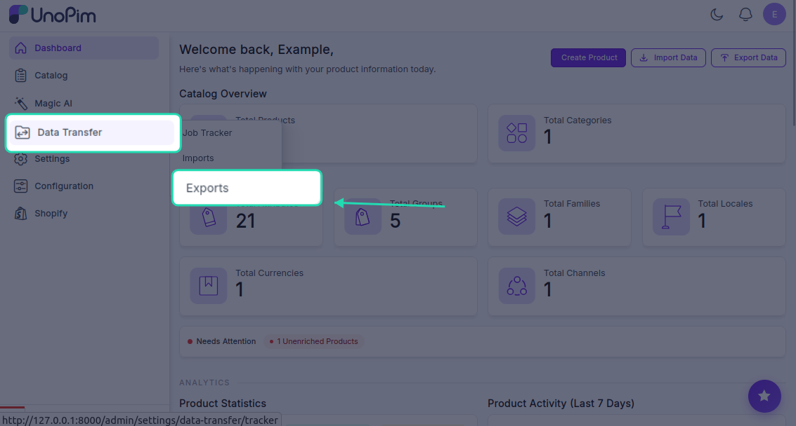

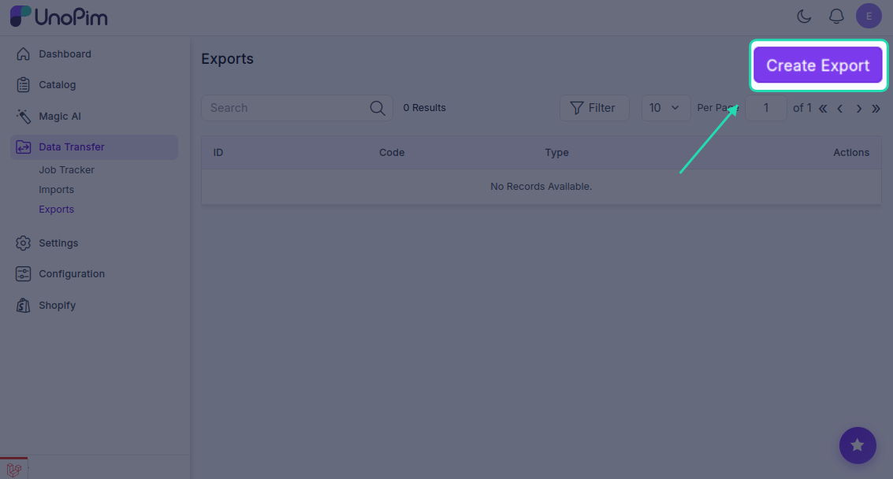

There are three types of export jobs available:

- **Shopify Category** — exports UnoPim categories to Shopify as Collections
- **Shopify Product** — exports simple or configurable products to Shopify
- **Shopify Metafield Definitions** — exports your metafield definitions to Shopify

---

## Export Categories

Exporting categories first is a good idea — it means your products can be assigned to the right collections as soon as they land in Shopify.

1. Click **Create Export**.

2. Enter a unique **Code** to identify this job (e.g., `shopify-category-export`), set the **Type** to `Shopify Category` & select your **shopify credentials**.

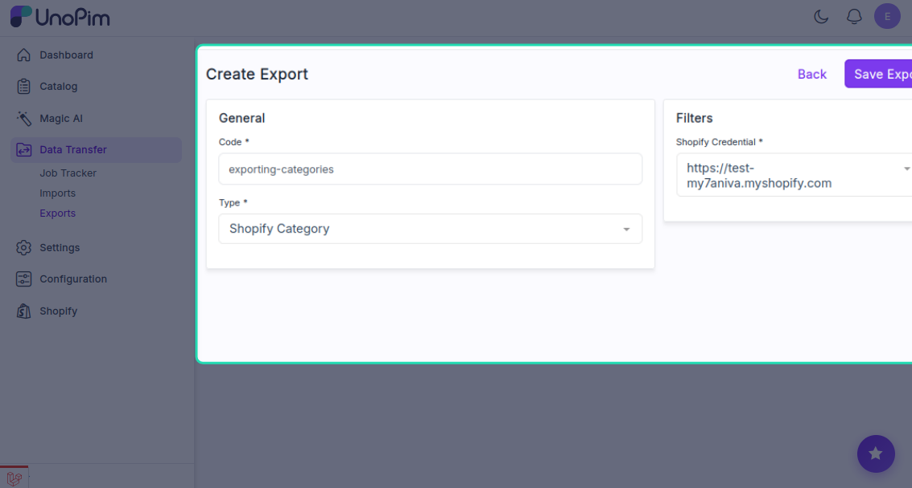

3. Click **Save Export**.

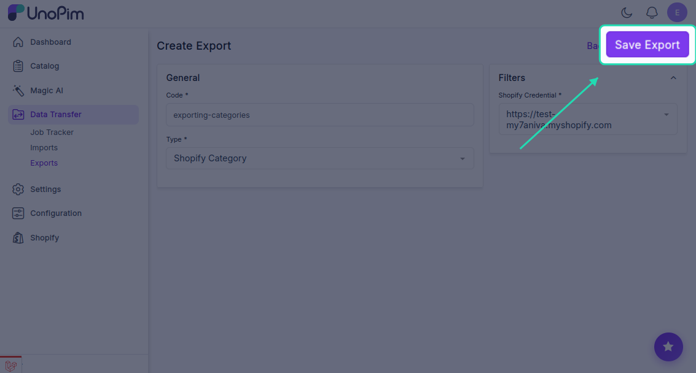

4. Click **Export Now** to start the export immediately.

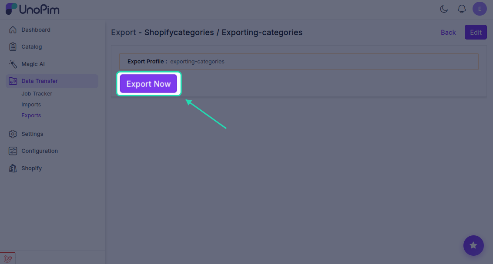

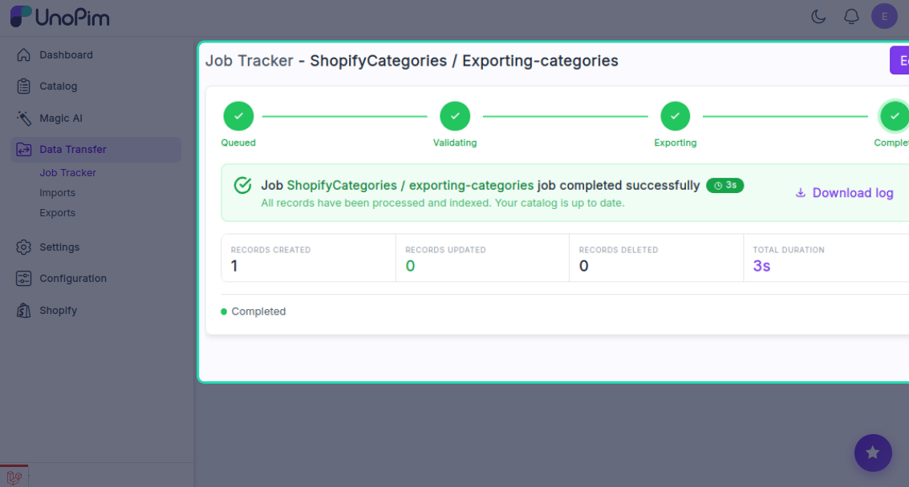

Your UnoPim categories will appear as **Collections** in your Shopify store once the job completes.

---

## Export Products

This job handles both simple products and configurable products with variants.

1. Click **Create Export**.

2. Enter a unique **Code** (e.g., `shopify-product-export`) &  set the **Type** to `Shopify Product`..

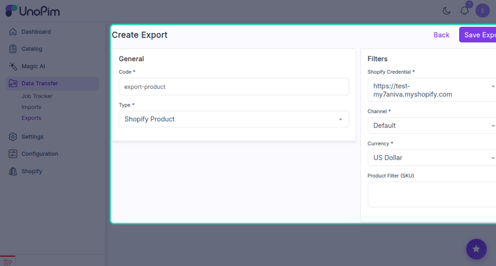

4. In the **Filters** panel, configure the following:

| Filter | What to do |
|---|---|
| **Store Credentials** | If you have multiple Shopify stores, select which store to export to |
| **Channel** | Select the channel your products belong to |
| **Currency** | Choose the currency for the exported product prices |
| **SKU** *(optional)* | Enter a specific SKU if you only want to export one product |

5. Click **Save Export**.

6. Click **Export Now** to start the export immediately.

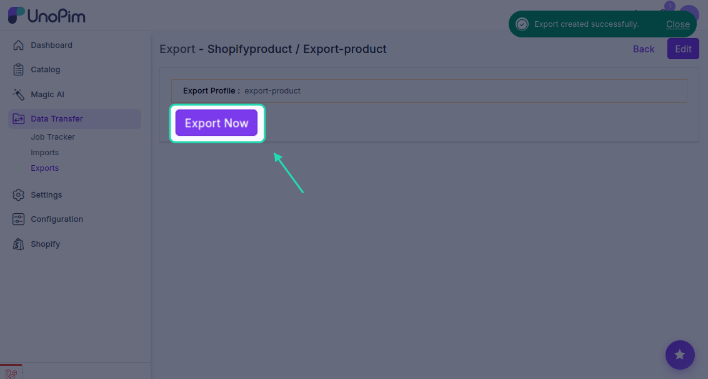

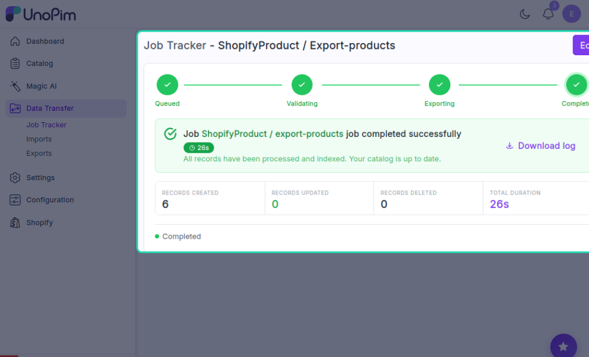

The export will begin immediately. You can watch the progress in real time — once it's done, the status will update to **Completed** and you'll see a count of how many products were successfully exported.

Click **Download Log** to get a detailed report of everything that was exported, skipped, or flagged.

> **Note:** Product inventory is only added to Shopify on the **first export**. Re-running the job later will update product details but will not override the inventory quantity in Shopify.

---

## Export Metafield Definitions

If you've set up metafield definitions in UnoPim and want to push them to Shopify:

1. Click **Create Export Profile**.

2. Enter a unique **Code** (e.g., `shopify-metafields-export`), set the **Type** to `Shopify Metafield Definitions` & Select your **Store Credentials**.

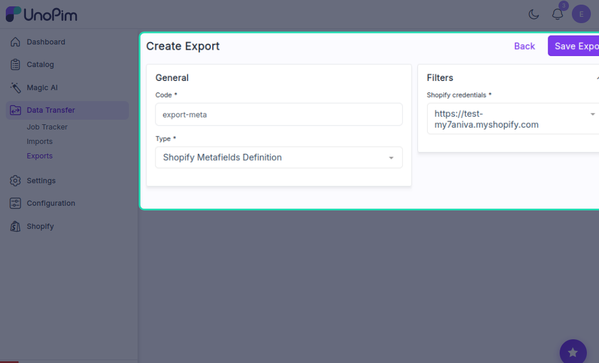

3. Click **Save**.

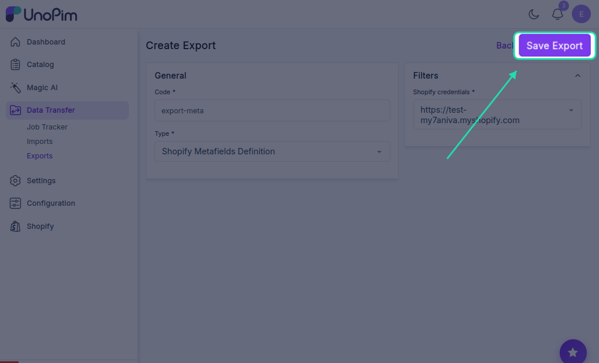

4. Click **Export Now** to start the export immediately.

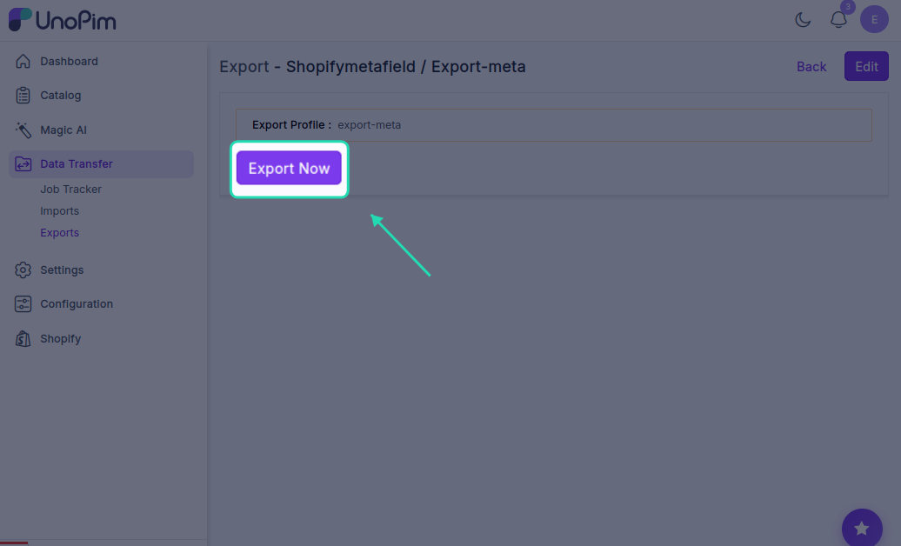

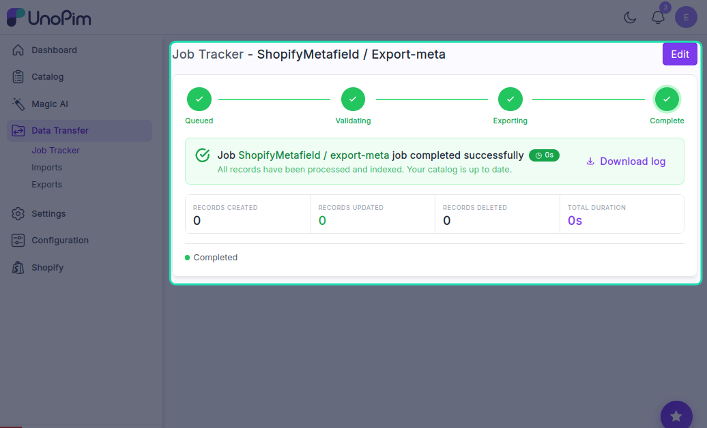

---

## Viewing Exported Products in Shopify

Once the export job completes, log in to your **Shopify admin panel** and go to **Products**. You'll find all the exported products there, complete with their details, images, prices, and descriptions — exactly as they were set up in UnoPim.

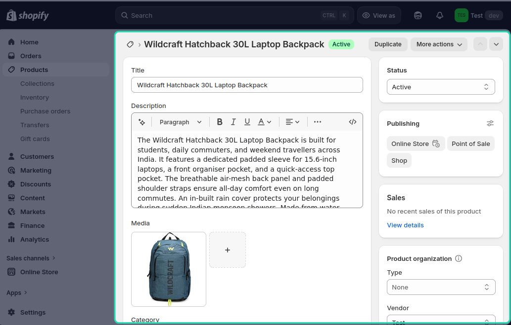

You can edit or update any product directly in Shopify if needed.

If you exported products with **multi-language content**, switch to the relevant locale in Shopify to verify that the translated values came through correctly.