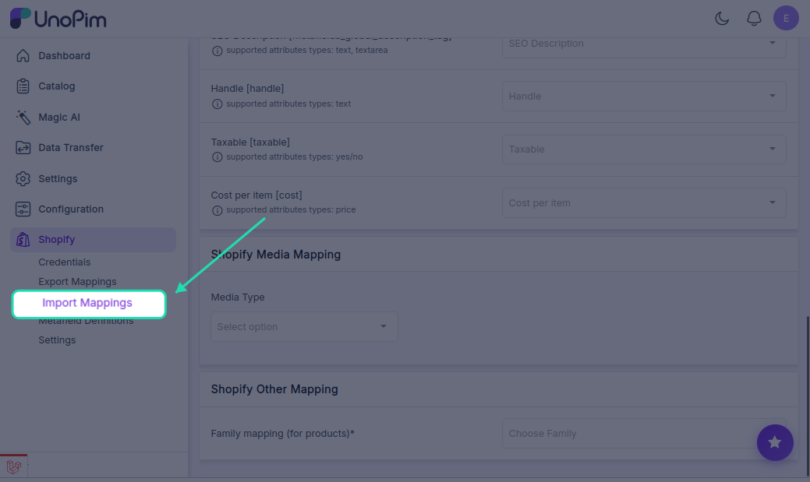
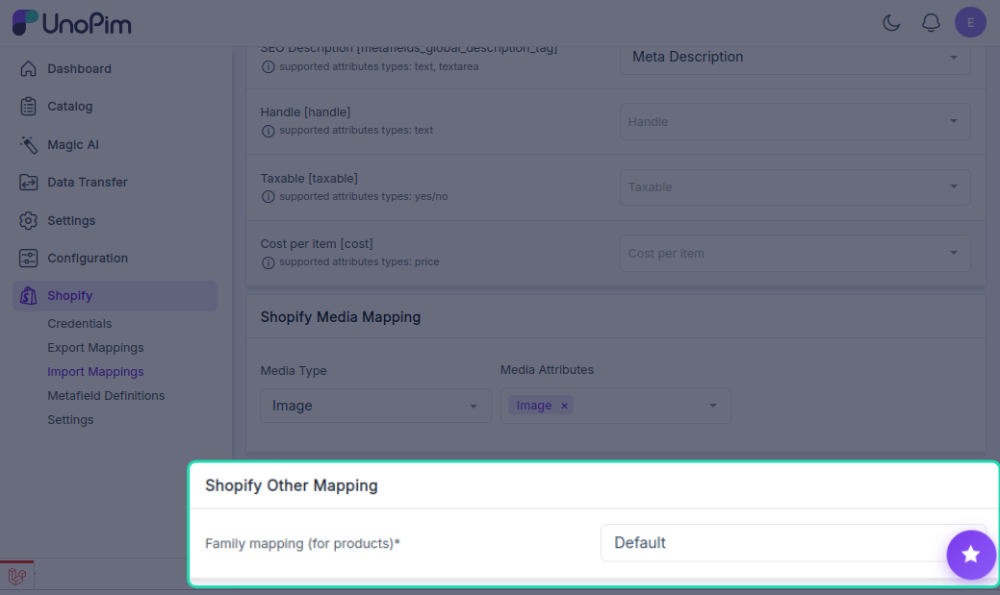

# Import Attribute Mapping

To bring product data from Shopify into UnoPim, you need to map each Shopify product field to the corresponding UnoPim attribute. This tells the connector exactly where each piece of data should land when an import runs.

---

## How to Access Import Mappings

Click the **Shopify icon** in the left sidebar of your UnoPim dashboard, then click the **Import Mappings** tab.

On the left side of the screen, you'll see all available Shopify product fields. Use the dropdown on the right of each field to select the UnoPim attribute you want it mapped to.

---

## Available Field Mappings

| Shopify Field | Field Code | What it does |
|---|---|---|
| **Name** | `title` | The product title shown on your Shopify storefront |
| **Description** | `descriptionHtml` | Full product description — supports HTML formatting |
| **Price** | `price` | The selling price of the product |
| **Weight** | `weight` | Product weight used for shipping calculations |
| **Quantity** | `inventoryQuantity` | How many units are available in stock |
| **Inventory Tracked** | `inventoryTracked` | Indicates whether inventory tracking is enabled |
| **Allow Purchase Out of Stock** | `inventoryPolicy` | Allows customers to buy the product even when stock is zero |
| **Vendor** | `vendor` | The brand or supplier name |
| **Product Type** | `productType` | The category or type the product belongs to |
| **Tags** | `tags` | Keywords used for search and filtering in Shopify |
| **Barcode** | `barcode` | Product barcode or unique identifier for inventory scanning |
| **Compare Price** | `compareAtPrice` | The original price shown as a strikethrough to highlight a discount |
| **SEO Title** | `metafields_global_title_tag` | Custom page title used by search engines |
| **SEO Description** | `metafields_global_description_tag` | Meta description shown in search engine results |
| **Handle** | `handle` | The URL-friendly slug for the product page (e.g. `blue-running-shoes`) |
| **Taxable** | `taxable` | Marks whether tax should be applied to this product |
| **Cost per Item** | `cost` | Cost of goods sold (COGS) — used for profit reporting |

---

## Other Mapping — Family Mapping

Below the field mappings, you'll find an **Other Mapping** section. This is an important setting for importing products that have variants.

### Family Mapping (Required for Products with Variants)

When importing products from Shopify into UnoPim, you must select a **product family** that the imported products will be assigned to — for example, `Accessories`, `Clothing`, or `Electronics`.

This ensures that products and their variants are imported correctly and placed under the right family structure in UnoPim.

> **Important:** If no family is selected here, variant products may not import correctly. Always make sure a valid product family is chosen before running a product import job.

