# Import Jobs

The UnoPim Shopify Connector works both ways. In addition to exporting products from UnoPim to Shopify, you can also **import data from Shopify back into UnoPim** — keeping both systems in sync.

To create an import job, go to **Data Transfer → Imports** and click **Create Import**.

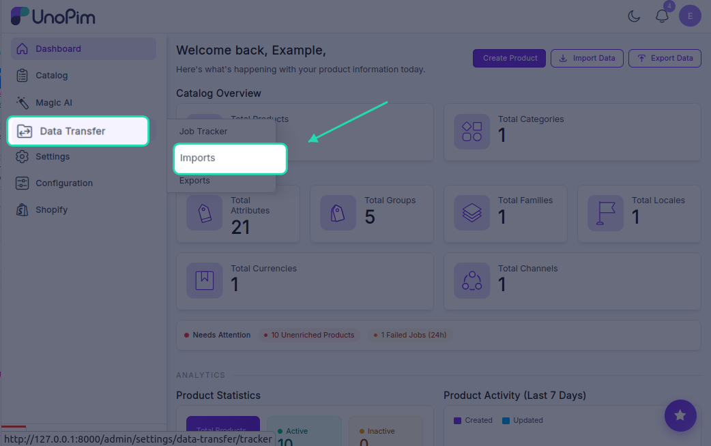

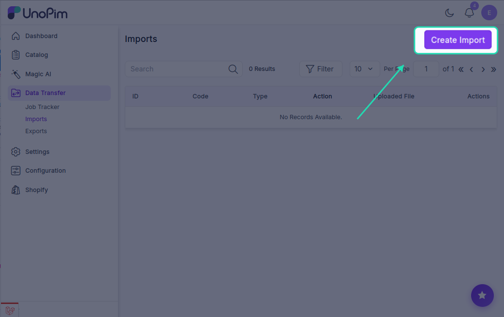

Five import job types are available:

---

## Shopify Product Import

Imports products from your Shopify store into UnoPim.

1. Enter a unique **Code** for this job.
2. Set **Type** to `Shopify Product`.
3. Under **Settings**, fill in:
   - **Shopify Credentials** — select the store you want to import from
   - **Channel** — choose the UnoPim channel to assign the products to
   - **Locale** — select the language/locale for the imported data
   - **Currency** — choose the currency for product pricing

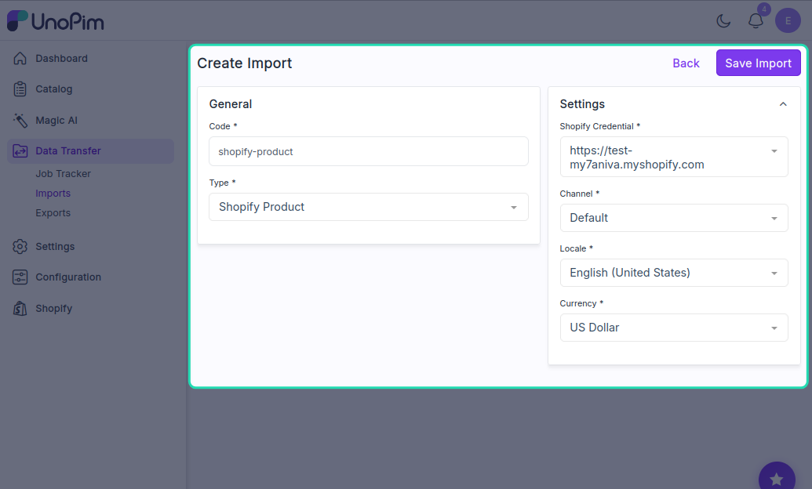

4. Click **Save Import**, then run the job by clicking **Import Now**.

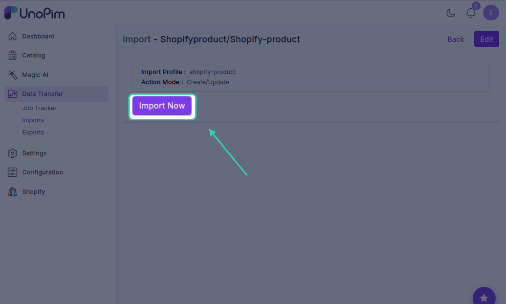

---

## Shopify Attribute Import

Imports product attributes from Shopify into UnoPim. Run this before importing products to make sure all attribute data is available.

1. Enter a unique **Code**.
2. Set **Type** to `Shopify Attribute`.
3. Under **Settings**, select:
   - **Shopify Credentials**
   - **Locale**

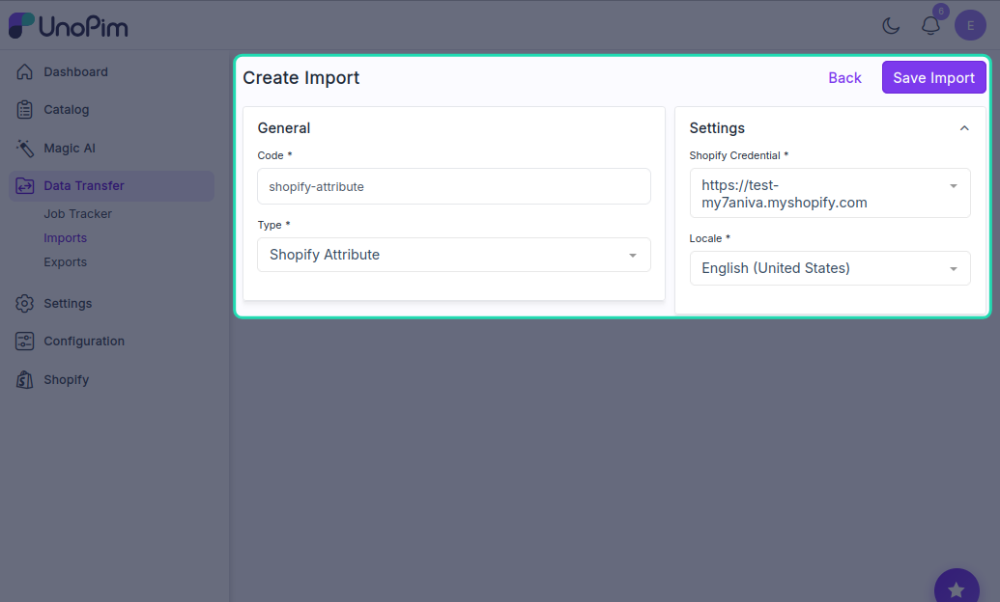

4. Click **Save Import**, then run the job by clicking **Import Now**.

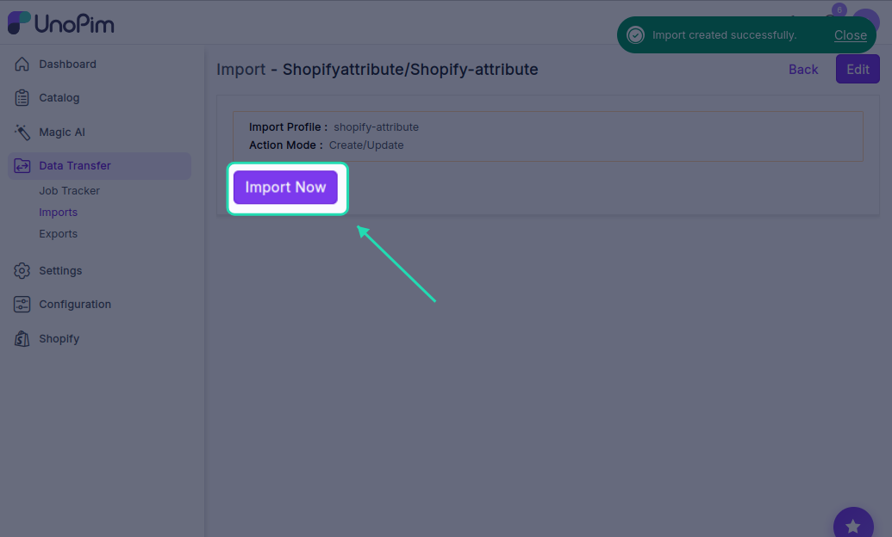

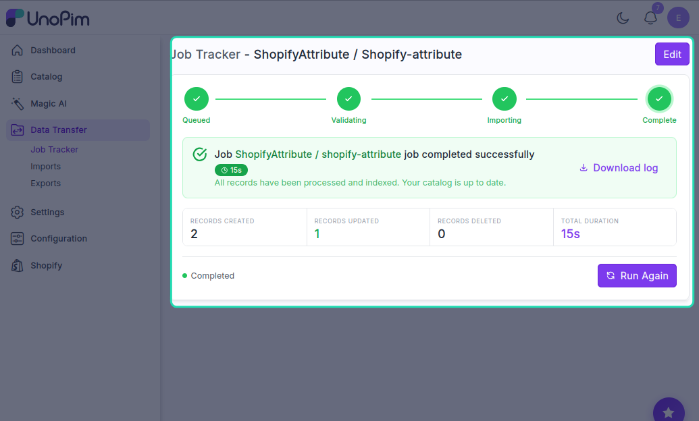

---

## Shopify Category Import

Imports Shopify collections into UnoPim as categories.

1. Enter a unique **Code**.
2. Set **Type** to `Shopify Category Import`.
3. Under **Settings**, select:
   - **Shopify Credentials**
   - **Locale**

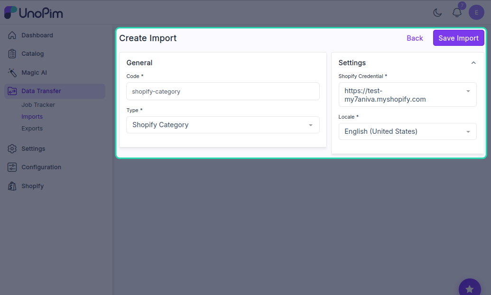

4. Click **Save Import**, then run the job by clicking **Import Now**.

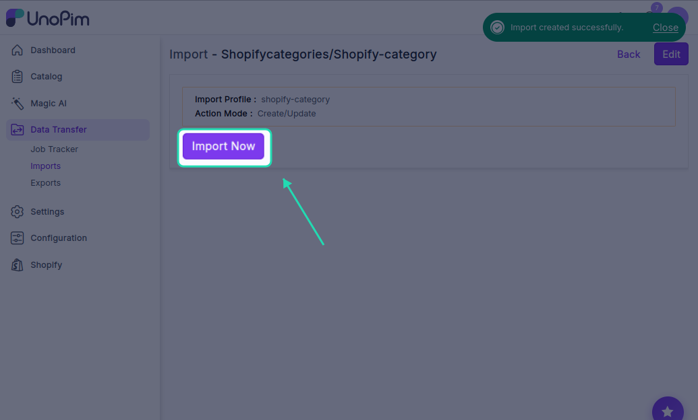

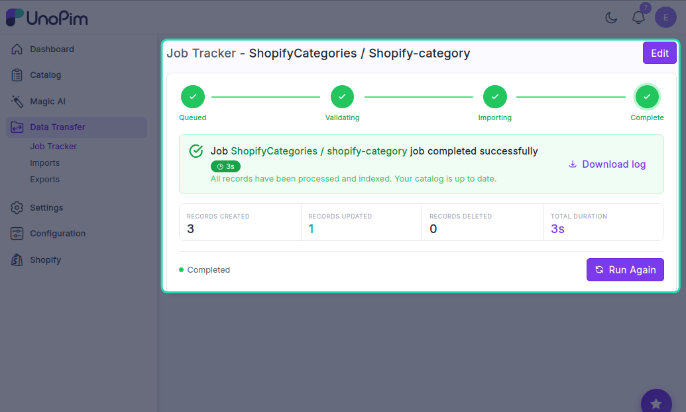

---

## Shopify Family Variant Attribute Assignment Import

This job maps Shopify variant attributes to the correct product families in UnoPim. It's needed when importing configurable products that have variants like size or colour.

1. Enter a unique **Code**.
2. Set **Type** to `Shopify Family Variant Attribute Assignment Import`.
3. Under **Settings**, select:
   - **Shopify Credentials**
   - **Locale**
   - **Attribute Group** — choose the group the variant attributes should be assigned to

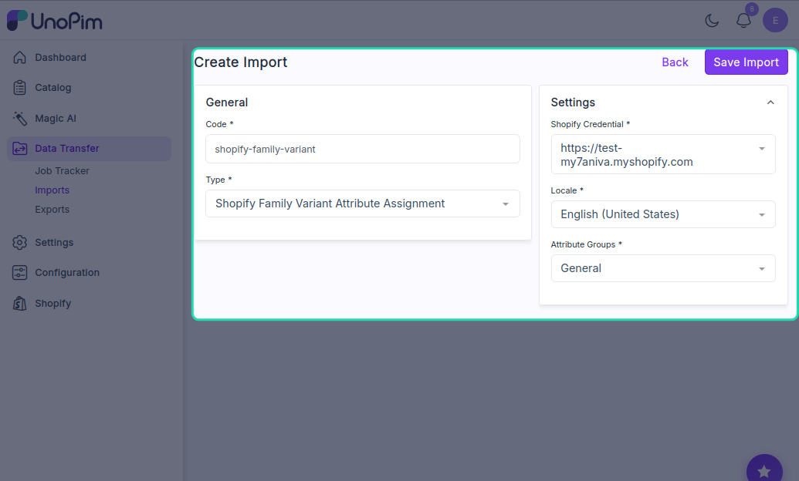

4. Click **Save Import**, then run the job by clicking **Import Now**.

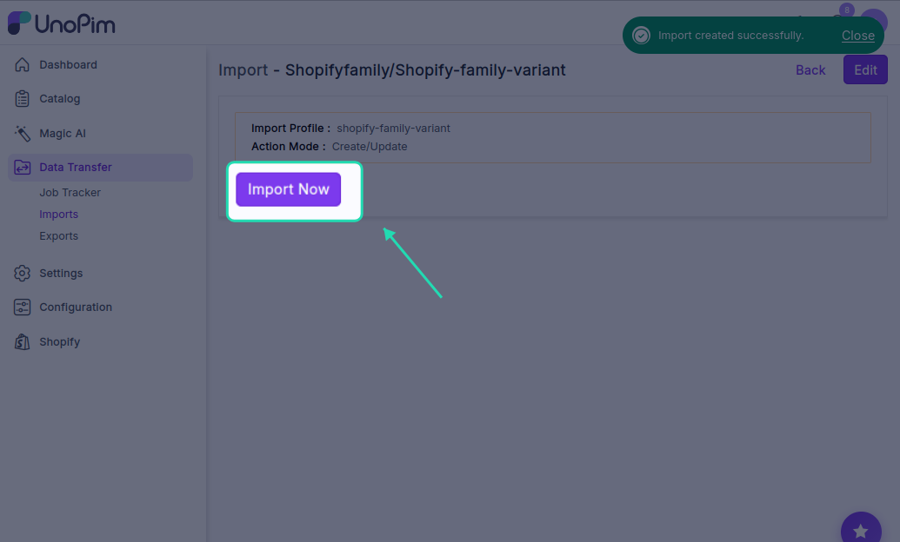

---

## Shopify Metafield Definitions Import

Imports existing Shopify metafield definitions into UnoPim so they can be managed and re-exported from the PIM.

1. Enter a unique **Code**.
2. Set **Type** to `Shopify Metafield Definitions`.
3. Under **Settings**, select:
   - **Shopify Credentials**
   - **Locale**

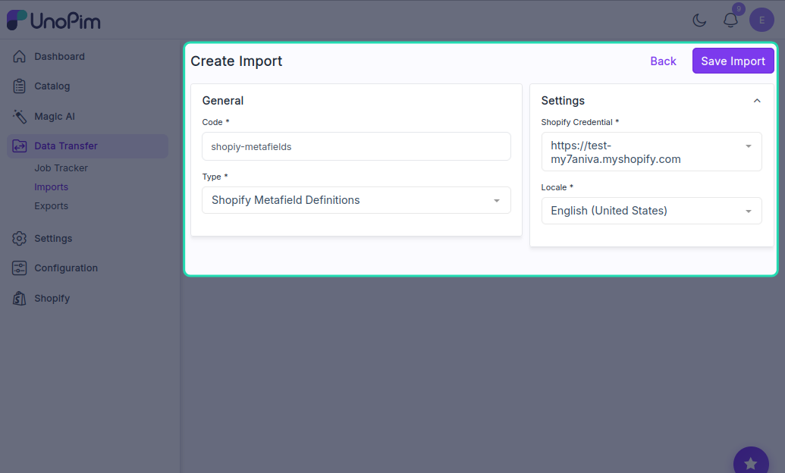

4. Click **Save Import**, then run the job by clicking **Import Now**.

---

> **Tip:** If you're setting up imports for the first time, run them in this order for best results: **Attributes → Categories → Family Variant Assignment → Products → Metafield Definitions**. This ensures all the supporting data is in place before products are imported.