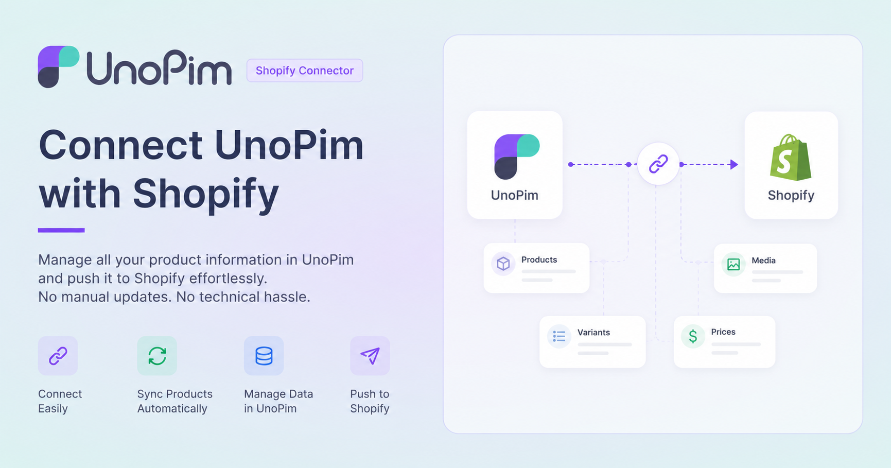

# UnoPim Shopify Connector
 

  

  

## What is the UnoPim Shopify Connector?

The **UnoPim Shopify Connector** is a free, open-source tool that connects your **Shopify store** with **UnoPim** — an open-source Product Information Management (PIM) system.

Without a PIM, managing product data across a store can get messy fast — updating descriptions, images, prices, and variants one by one is time-consuming and error-prone. This connector solves that by letting you manage all your product information in one place (UnoPim) and push it directly to Shopify whenever you're ready.

Whether you're adding new products, updating existing ones, or syncing data across multiple Shopify stores, the connector makes it effortless — with no technical expertise required for day-to-day use.

---

## What can it do?

- **Export** product data from UnoPim to Shopify — categories, simple products, and products with variants.
- **Import** data from Shopify back into UnoPim — categories, attributes, products, and more.
- Transfer key product details including title, description, images, SEO info, SKU, barcode, price, quantity, and weight.
- Keep your Shopify store up to date by simply re-running an export job whenever something changes.

---

## Features

### Export Categories as Shopify Collections
UnoPim categories are exported directly as **Collections** in Shopify. This keeps your store structure organized and mirrors how you've categorized products in your PIM.

### Export Products and Variants
Export both simple products and products with multiple variants (e.g., a T-shirt in different sizes and colors). For each variant, you can specify its own **price, SKU, quantity, barcode, and weight**.

### Send Multiple Product Images
You can map multiple image attributes from UnoPim and send them all to Shopify as product gallery images. Both individual image attributes and gallery-type attributes are supported.

### Map UnoPim Attributes to Shopify Fields
Not all product fields have the same name in every system. The connector lets you **map your UnoPim attributes to the corresponding Shopify product fields**, so the right data lands in the right place every time.

### Map Product Units
If your products have measurements — like weight, volume, or dimensions — you can map the correct units under **Export Mapping**. This ensures Shopify receives accurate unit data alongside the values.

### Metafield Definitions Support
Shopify supports **metafields** — custom data fields that go beyond standard product information (e.g., material type, warranty info, care instructions). You can create and manage metafield definitions directly in UnoPim and export them to Shopify. Supported types include:

- Single line text
- Multi-line text
- Color
- Rating
- URL
- JSON
- Weight
- Volume
- Dimension
- boolean
- Date
- Number

These are exported without needing any additional mapping setup.

### Multi-Language Support
Export your product data in **multiple languages**. If you manage a multilingual catalog in UnoPim, the connector handles locale-specific content and sends it to the corresponding Shopify translations.

### Multiple Shopify Stores
Connect **more than one Shopify store** to the same UnoPim instance by providing separate credentials for each store. Manage everything centrally without switching between systems.

### Sync Updates Easily
Already exported your products? No problem. Simply re-run the export job at any time to **push updates** from UnoPim to Shopify — no manual edits needed on the Shopify side.

### Import Jobs
The connector is not just for exporting. You can also pull data **from Shopify into UnoPim** using the following import job types:

| Import Type | What it does |
|---|---|
| **Shopify Category** | Imports Shopify collections as UnoPim categories |
| **Shopify Attribute** | Imports Shopify product attributes into UnoPim |
| **Shopify Family Variant Attribute Assignment** | Maps variant attributes to the correct UnoPim product families |
| **Shopify Product** | Imports Shopify products into UnoPim |
| **Shopify Metafield Definitions** | Imports existing Shopify metafield definitions into UnoPim |

---

## Requirements

Before you begin, make sure the following are in place:

| Requirement | Detail |
|---|---|
| **UnoPim Version** | v2.0.0 |
| **Shopify API Version** | 2026-01 |
| **Shopify Plan** | Any plan with Admin API access |
| **Shopify Admin Access** | Needed to create a custom app and generate API credentials |
| **Terminal / Server Access** | Required to run installation commands |

---

<!-- ## In this guide

- [Installation](./installation.md)
- [Configuration](./configuration.md)
- [Export & Import Jobs](./usage.md) -->