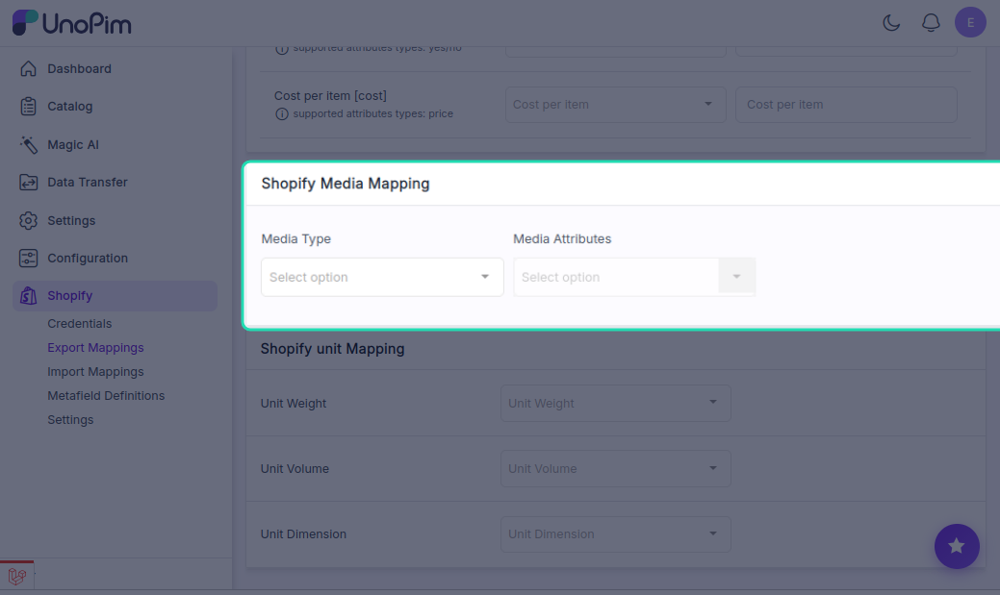
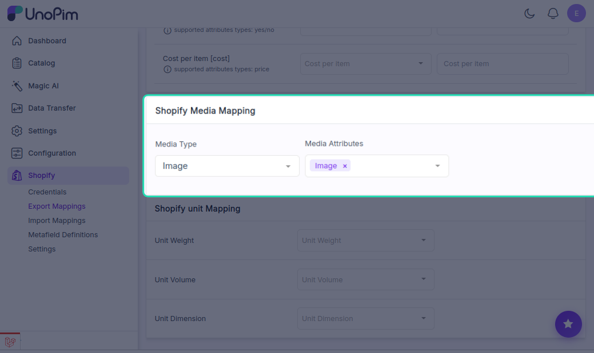
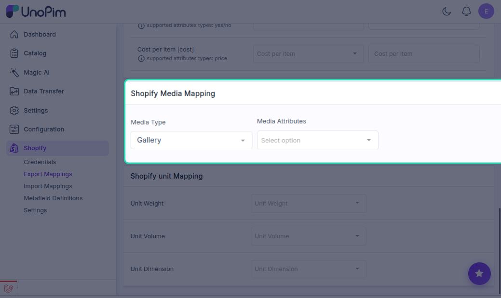
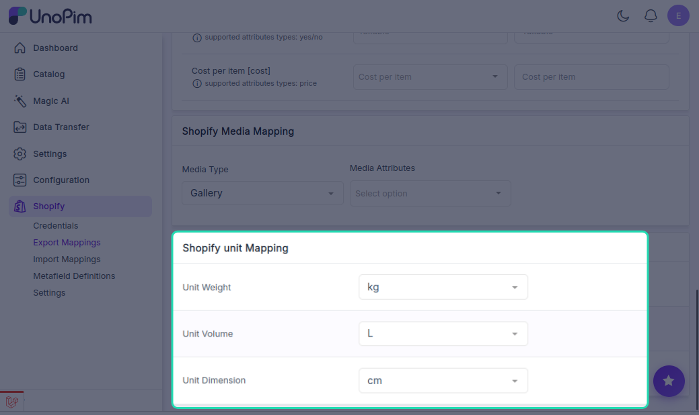

# Media & Unit Mapping

---

## Media Mapping

UnoPim supports **Media Mapping** for Shopify, giving you full control over how product images are exported to — or imported from — your Shopify store.

### How to Set Up Media Mapping

1. Click the **Shopify icon** in the left sidebar.
2. Go to **Export Mappings** (or **Import Mappings** if you're importing).
3. Set the **Mapping Type** to **Media Mapping**.
4. Under the **Media Type** field, choose the option that matches how your images are stored in UnoPim.

---

### Media Type Options

#### Image

Choose **Image** when your product photos are stored as **separate image attributes** in UnoPim — for example, a front view, back view, and zoom view each stored in their own attribute.

- You can map multiple UnoPim image-type attributes at once.
- During export, all mapped images are sent to Shopify as individual product images.

**Best for:** Products where images are managed as distinct attributes (front, back, detail, etc.)

---

#### Gallery

Choose **Gallery** when all product images are grouped together inside a **single gallery-type attribute** in UnoPim.

- During export, all images within the gallery attribute are sent to Shopify together.

**Best for:** Products where all images live in one gallery field rather than separate attributes.

---

## Unit Mapping

If your products have physical measurements — like weight, volume, or dimensions — the connector lets you map the correct units so Shopify displays and uses them accurately for shipping and product display.

### How to Set Up Unit Mapping

1. Click the **Shopify icon** in the left sidebar.
2. Go to **Export Mappings**.
3. Scroll down to the **Shopify Unit Mapping** section.

---

### Available Unit Types

#### Weight
Maps the unit used for product weight. Once mapped, the weight unit appears next to the product's weight value on Shopify.

Common units: `g`, `kg`, `oz`, `lb`

#### Volume
Maps the unit used for volume-based measurements. Useful for liquid products or shipping setups that calculate based on volume.

Common units: `ml`, `l`, `cm³`, `in³`

#### Dimension
Maps the unit used for product dimensions such as height, width, and depth. Required for shipping methods that use dimensional weight.

Common units: `cm`, `mm`, `inches`

---

### Pairing Units with Metafields

For each unit type — weight, volume, or dimension — you can also create a matching **Shopify Metafield Definition** to store the unit value alongside the measurement. This ensures Shopify reads both the number and the correct unit together.

**Example:** If you want to export volume in litres:

1. Map the unit under **Unit Volume** in Export Mappings.
2. Create a metafield definition (e.g., `volume.litre`) under **Metafield Definitions**.

Shopify will then display the volume value with the correct unit on the product page.

> **Tip:** Always pair a unit mapping with a metafield definition when dealing with volume or dimensions — this keeps your data structured and avoids unit mismatches on the Shopify storefront.