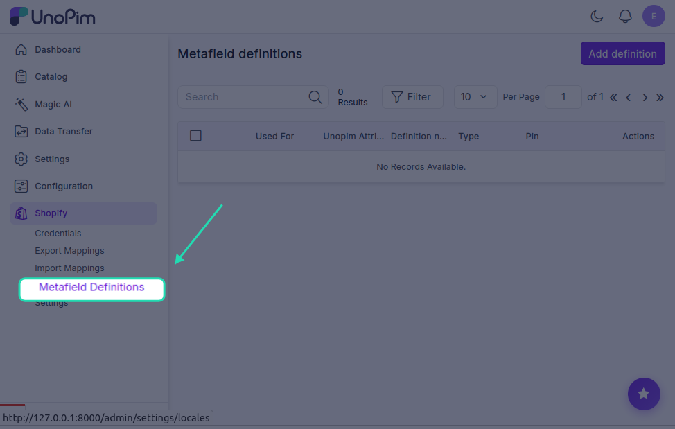
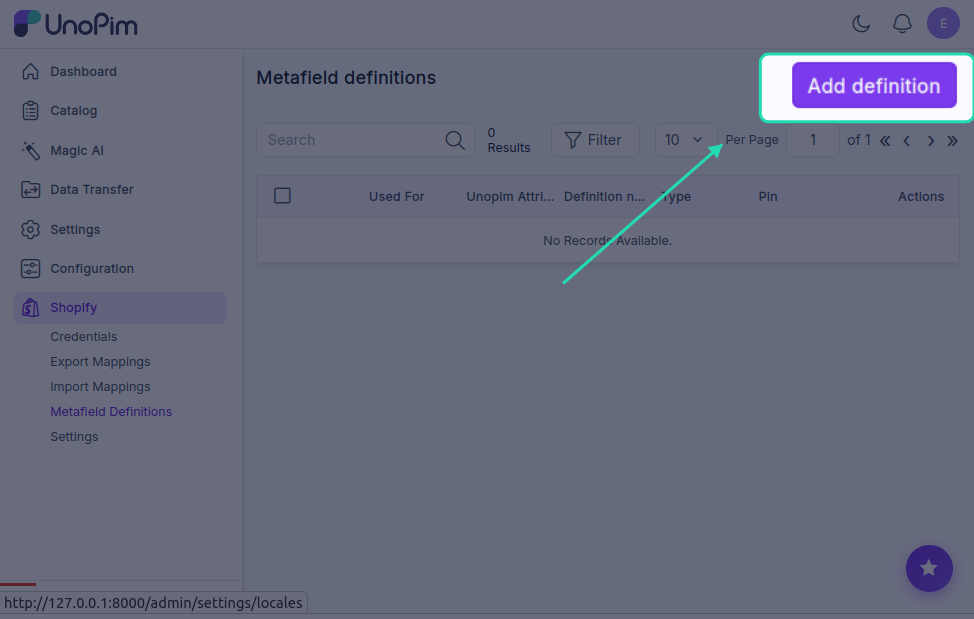
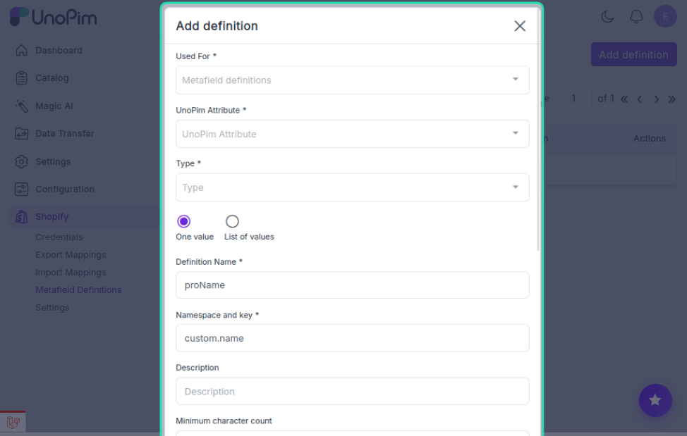

# Add & Manage Shopify Metafield Definitions

Shopify **metafields** let you store custom product data that goes beyond the standard fields — things like material composition, warranty details, care instructions, or any other product-specific information your store needs.

With the UnoPim Shopify Connector, you can create and manage these metafield definitions directly from UnoPim and export them to Shopify — no need to set them up manually in Shopify admin.

---

## How to Add a Metafield Definition

1. Click the **Shopify icon** in the left sidebar.
2. Click on **Metafield Definitions**.

3. Click the **Add Definition** button in the top-right corner.

Fill in the fields as described below.

---

## Field Descriptions

### Used For
Select the Shopify entity this metafield belongs to — either **Products** or **Variants**. This tells UnoPim where to apply the metafield during export.

---

### UnoPim Attribute
Choose the UnoPim attribute you want to link to this metafield. When a product is exported, the value from this attribute will be sent to Shopify as the metafield value.

---

### Type
Select the data type for the metafield value. Available options are:

| Type | When to use |
|---|---|
| **Single line text** | Short text values like a material name or colour code |
| **Multi-line text** | Longer descriptions or notes |
| **Color** | Hex colour values |
| **Rating** | Numerical rating values |
| **URL** | Links or reference URLs |
| **JSON** | Structured or complex data |

---

### Definition Name
A user-friendly label for the metafield — for example, `Material`, `Warranty Info`, or `Color Code`. This is what appears in your UnoPim interface.

---

### Namespace and Key
This is the unique identifier Shopify uses to reference the metafield via its API.

Format: `namespace.key` — for example, `custom.color`

- The **namespace** groups related metafields together and prevents naming conflicts.
- The **key** is the specific identifier within that namespace.

> **Tip:** Use a consistent namespace like `custom` or your brand name across all your metafields to keep them organised.

---

### Description *(Optional)*
Add an internal note to describe what this metafield is for. This is only visible inside UnoPim — it helps your team understand the purpose of each definition at a glance.

---

### Minimum / Maximum Character Count *(Optional)*
Set length limits to enforce data consistency. For example, an SEO title field might have a maximum of 60 characters to avoid search engine truncation.

---

### Pin
When enabled, the metafield appears in the **Metafields** section of the Shopify product/variant edit screen — making it easy to view or manually edit in Shopify admin.

> If not pinned, the metafield will still sync correctly via the API — it just won't be visible in the Shopify UI by default.

---

### Filtering for Products
Enable this if you want the metafield to be available as a **filter on your Shopify storefront** — for example, letting customers filter products by material or colour.

> This option only works for product-type metafields.

---

### Smart Collections
When enabled, this metafield can be used as a **condition rule in Shopify Smart Collections** — allowing you to automatically group products based on the metafield's value.

**Example:** Create a Smart Collection that automatically includes all products where `custom.material` equals `Organic Cotton`.

---

### Storefront Access (Read)
Enables this metafield to be read via the **Shopify Storefront API**. This is required if you want to display the metafield's value on a custom Shopify theme or a headless storefront.

**Example:** If you want to display a `custom.fabricComposition` field on your product page, you must enable this option — otherwise the Storefront API will not return it.

---

## Saving and Exporting

Once all fields are filled in, click **Save**. Your metafield definition is now stored in UnoPim.
