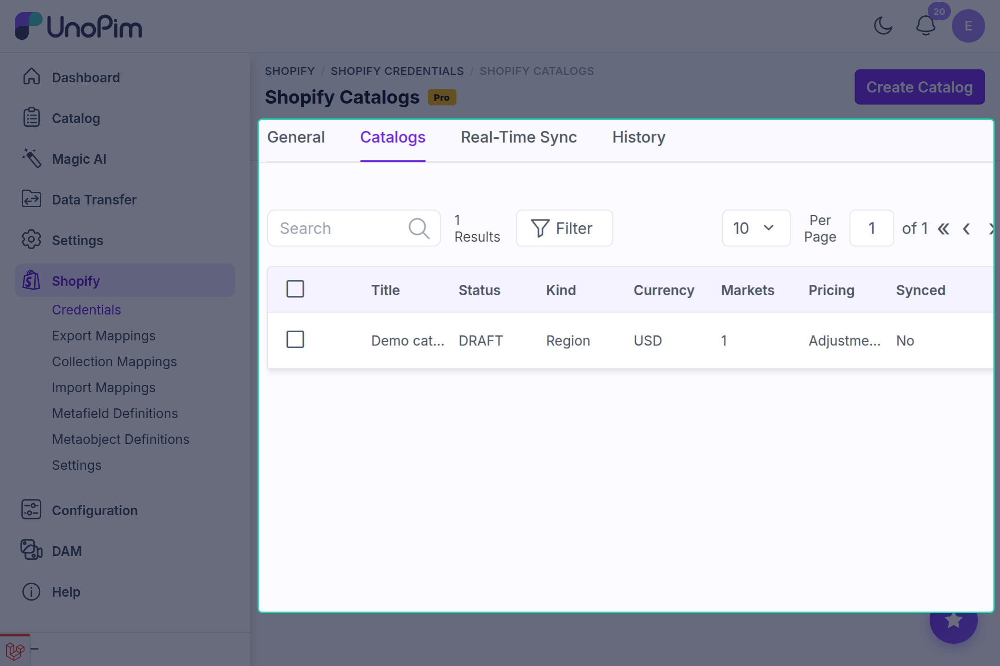
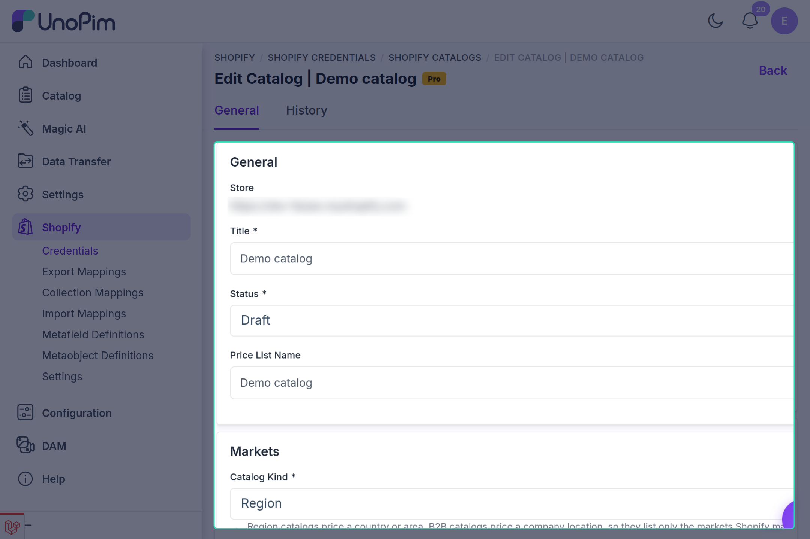
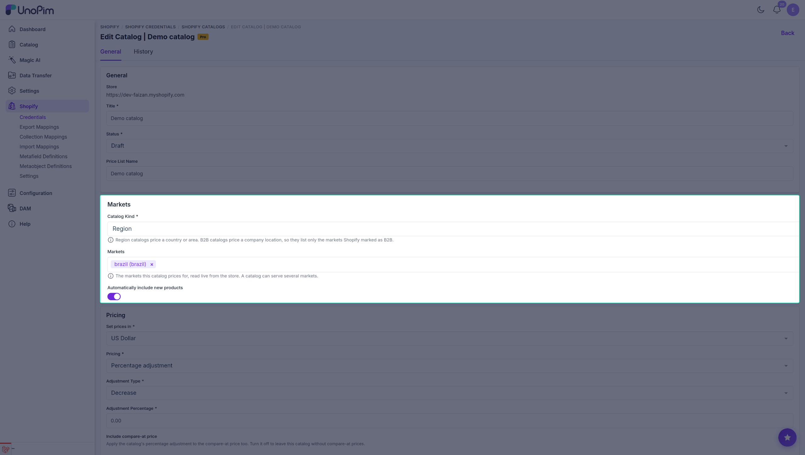
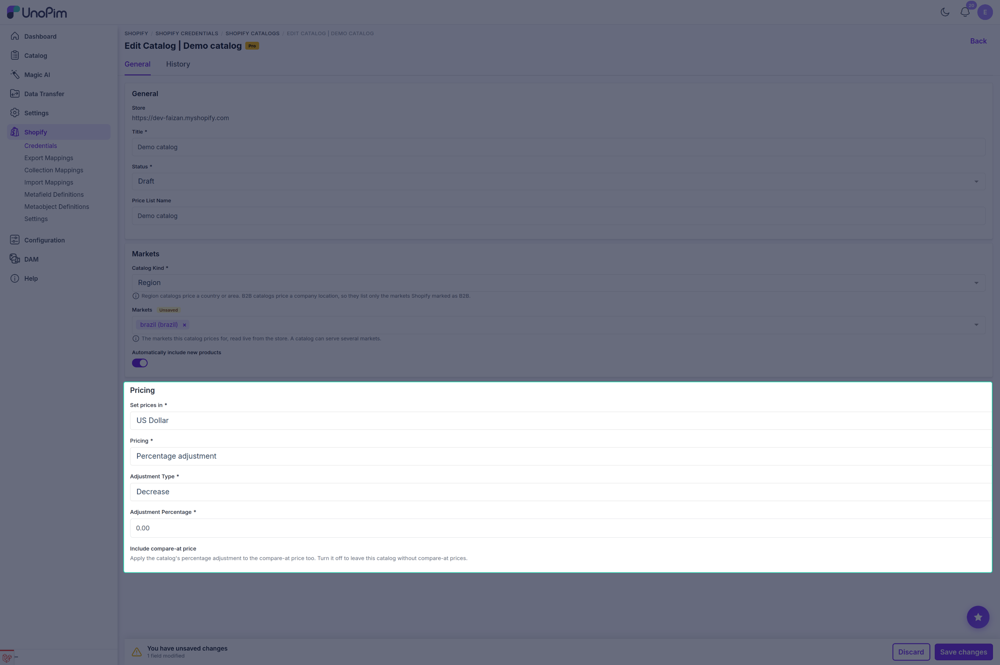

# Catalogs & Catalog Prices

A **catalog** in Shopify is how one store sells the same product at a different price to a different audience - a region, a country, or a B2B company location. Shopify stores this as a *catalog* attached to one or more *markets*, with a *price list* behind it.

Shopify Pro lets you build and maintain those catalogs from UnoPim, and push prices into them from your UnoPim price attributes.

> [!IMPORTANT]
> Catalogs and catalog prices work with both **Manual** (custom app) and **SaaS** Shopify credentials.

---

## Where catalogs live

Catalogs belong to a credential, because a catalog belongs to one store.

Go to **Shopify → Credentials**, edit the credential for the store you want, and open the **Catalogs** tab.



The grid shows the title, status, kind, currency, markets, pricing strategy, and whether the catalog has been synced to Shopify yet.

---

## Creating a catalog

Click **Create Catalog**. The form is in three parts.



### General

| Field | What to enter |
|---|---|
| **Store** | Read-only - the shop URL of the credential you are on. |
| **Title** | The catalog name, as it will appear in Shopify. Must be unique for the store. |
| **Status** | `Active`, `Draft` or `Archived`. Only an Active catalog prices anything for buyers. |
| **Price List Name** | Optional. The name of the Shopify price list behind this catalog. Leave it empty and the catalog title is used. |

### Markets



| Field | What to enter |
|---|---|
| **Catalog Kind** | `Region` prices a country or area. `B2B` prices a company location, so the market list shows only markets Shopify has marked as B2B. |
| **Markets** | The markets this catalog prices for, read live from your store. One catalog can serve several markets. |
| **Automatically include new products** | When on, products added to the store later are included in this catalog without you touching it again. |

> [!NOTE]
> Changing **Catalog Kind** reloads the market list, because a region market and a B2B market are not interchangeable. If you pick markets and then switch the kind, re-pick them.

### Pricing



| Field | What to enter |
|---|---|
| **Set prices in** | The currency this catalog's price list is denominated in. Shopify requires one on every price list. |
| **Pricing** | `Percentage adjustment` or `Fixed prices from UnoPim`. |

**If you chose Percentage adjustment:**

| Field | What to enter |
|---|---|
| **Adjustment Type** | `Decrease` or `Increase`. |
| **Adjustment Percentage** | How much, as a percentage of the product's base Shopify price. |
| **Include compare-at price** | When on, the same percentage is applied to the compare-at price too. Turn it off to leave this catalog without compare-at prices. |

**If you chose Fixed prices from UnoPim:**

| Field | What to enter |
|---|---|
| **Price Attribute** | The UnoPim price attribute this catalog sells at - a dealer price, a wholesale price, and so on. Leave it empty to use the price attribute from the export mapping. |
| **Include compare-at price** | When on, a compare-at price is sent alongside. |
| **Compare At Price Attribute** | The UnoPim price attribute shown struck through beside this catalog's price. Leave it empty to use the compare-at price from the export mapping. |

Click **Save Catalog**. The catalog is stored in UnoPim; it reaches Shopify on the next catalog export.

---

## Percentage adjustment vs fixed prices

This is the decision that matters most, so it is worth being explicit:

- **Percentage adjustment** - Shopify does the maths. The catalog price is always the store price minus (or plus) your percentage. You maintain nothing per product. Good for "EU is 10% higher" or "wholesale is 25% off".
- **Fixed prices from UnoPim** - you decide each price yourself in UnoPim, per product, in that catalog's currency. The value overrides whatever the percentage would have produced. Good for price lists that do not follow a formula.

> [!WARNING]
> With **fixed prices**, Shopify holds a price on the **variant**, not on the product. A variant that has no value in the catalog's currency is skipped and the job log says so:
>
> ```
> Catalog india-market skipped SKU sku-002-red-xl: it has no price in INR.
> ```
>
> Fill that currency on the variants you want priced, not only on the configurable parent.

---

## Sending catalogs to Shopify

Catalogs reach Shopify through an export job of type **Shopify Catalog**.

1. Go to **Data Transfer → Exports → Create Export**.
2. Enter a **Code** (for example `shopify-catalog-export`) and set **Type** to `Shopify Catalog`.
3. Pick the **Shopify credentials** for the store whose catalogs you want to publish.
4. Click **Save Export**, then **Export Now**.

The job creates the catalog, its publication and its price list in Shopify, attaches the chosen markets, and marks the catalog as **Synced** in the grid.

If Shopify refuses something, the reason is written back onto the catalog and shown in a red strip at the bottom of the edit form.

---

## Sending catalog prices

Catalog **prices** are not sent by the catalog export - they ride along with the **product** export.

Run your normal **Shopify Product** export for the same credential. After the products are synced, Pro runs a catalog price phase that writes the fixed prices into each catalog's price list.

The job log tells you exactly what happened:

```
Catalog india-market skipped SKU sku-003-green-l: it has no price in INR.
Shopify rejected the prices for catalog india-market: <reason from Shopify>
```

A catalog using a **percentage adjustment** needs no price phase at all - Shopify derives every price itself.

---

## Importing catalogs from Shopify

If the catalogs already exist in Shopify, you can pull them into UnoPim instead of re-entering them.

1. Go to **Data Transfer → Imports → Create Import**.
2. Set **Type** to `Shopify Catalog` and pick the credential.
3. Save and run the import.

Each Shopify catalog lands in the Catalogs tab of that credential, already marked as synced.

---

## Importing catalog prices

The **Shopify Catalog Price** import type pulls the prices out of a catalog's price list and writes them onto your UnoPim products.

| Field | What to do |
|---|---|
| **Shopify credentials** | The store to read from. |
| **On Existing Price** | `Keep the UnoPim price` leaves a product alone if it already has a value in that currency. `Overwrite with the Shopify price` replaces it. |

The import needs a price attribute on the **import mapping** - without one it is skipped and the log says:

```
Catalog price import was skipped: the import mapping has no price attribute.
```

A SKU that is not in UnoPim is skipped and named in the log too.

---

## Troubleshooting

| What you see | What it means |
|---|---|
| `Shopify returned no usable response while pricing catalog :name.` | Run the catalog export first and confirm that its price list was created successfully. |
| `Catalog :name has no market, so Shopify has nothing to price for.` | Pick at least one market on the catalog. |
| `Catalog :name has no currency, and Shopify requires one on every price list.` | Set **Set prices in**. |
| `Catalog :name uses a percentage adjustment but has no adjustment type.` | Choose `Decrease` or `Increase`. |
| `This store already has a catalog with that title.` | Titles are unique per store - rename it. |
| `it has no price in <currency>` | The variant carries no value for the catalog's currency. Fill it on the variant. |
