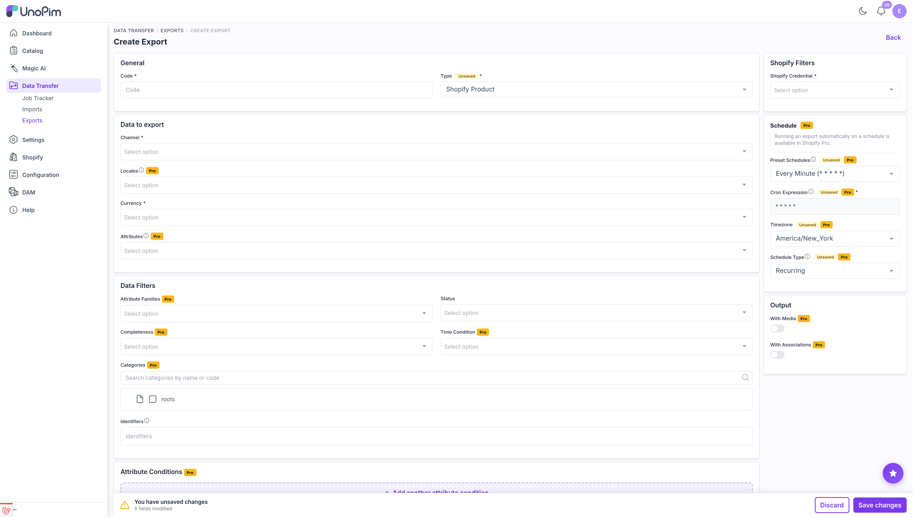

# Advanced Export Filters

The connector on its own lets you narrow a product export by **channel, currency, SKU and status**. Shopify Pro adds the rest of UnoPim's filter set to the Shopify export, so you can send exactly the slice of the catalog you mean to - and nothing else.

Open **Data Transfer → Exports → Create Export**, set **Type** to `Shopify Product`, and the **Filters** panel now carries these extra fields.

---

## The filters

| Filter | What it does |
|---|---|
| **Locales** | Localizable attributes are exported once per selected locale. Leave empty to export every locale of the channel. |
| **Attributes** | Only the selected attributes are exported. Leave empty to export every attribute in the family. |
| **Attribute Families** | Export only products belonging to the chosen families. |
| **Categories** | Export only products in the chosen categories. |
| **Completeness** | `No condition`, `Complete on at least one selected locale`, or `Complete on all selected locales`. |
| **Time Condition** | `No date condition`, `Updated over the last N days`, `Updated between two dates`, or `Updated since last export`. |
| **Attribute Conditions** | Build your own rules on any attribute - see below. |
| **With Media** | Off suppresses images, videos and files entirely, so only text data is sent. |
| **With Associations** | Include UnoPim associations (related, up-sell, cross-sell) in the export. |

---

## Locales

Without this filter, every locale your channel supports is exported, which means every translation is pushed to Shopify on every run.

Pick the locales you actually publish and the export gets smaller and faster. The list is limited to the locales the selected **Channel** supports.

---

## Attributes

Use this when you only want a subset of the product data to reach Shopify - for instance a metafield-heavy catalog where you want to push descriptions but leave the technical attributes alone.

> [!NOTE]
> Title, status and the variant axis attributes are always sent regardless of this filter, because Shopify cannot accept a product without them.

---

## Attribute Families and Categories

Both work the same way: pick one or more, and only products that belong to them are exported.

These pair well with multiple export profiles - one per brand, per family, or per catalog section - each with its own schedule.

---

## Completeness

| Option | Who gets exported |
|---|---|
| **No condition on completeness** | Everything the other filters match. |
| **Complete on at least one selected locale** | Products whose required attributes are filled for at least one of the selected locales. |
| **Complete on all selected locales** | Products complete in every selected locale. |

This is the filter that keeps half-finished products out of a live store.

---

## Time Condition

| Option | Extra field | What it exports |
|---|---|---|
| **No date condition** | - | Everything. |
| **Updated products over the last N days** | **Number of days** | Products changed in that window. |
| **Updated products between two dates** | **Start date**, **End date** | Products changed in that range. |
| **Updated products since last export** | - | Products changed since this profile last ran. |

**Updated since last export** is the one to reach for on a [scheduled export](./pro-scheduled-exports): a nightly job that only sends what actually changed, instead of re-pushing the whole catalog every night.

---

## Attribute Conditions

This is the most flexible filter. Instead of picking from a fixed list, you build rules against your own attributes - for example *brand is Nike*, or *stock is greater than 0*, or *launch_date is before today*.

Add a condition, choose the attribute, choose the operator, and enter the value. Add as many as you need - a product must satisfy all of them to be exported.

SKU is not offered here, because the export already has a dedicated SKU field.

---

## With Media

Turning **With Media** off is not just cosmetic - no files are uploaded to Shopify at all, and file-type metafields are dropped from the payload. Use it when you want a fast text-only refresh, or when the images are managed on the Shopify side.

---

## A practical setup

A catalog of any size usually ends up with two or three profiles rather than one:

| Profile | Filters | Schedule |
|---|---|---|
| **Nightly delta** | Time Condition = *since last export* | Daily at 2 AM |
| **Full refresh** | Completeness = *complete on all locales* | Weekly on Monday |
| **New family launch** | Attribute Families = *the new family* | Run manually |
