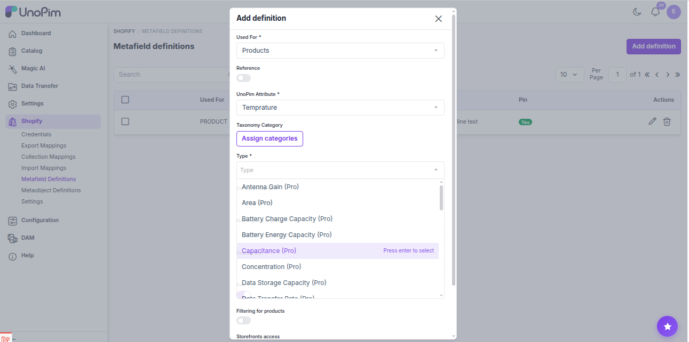
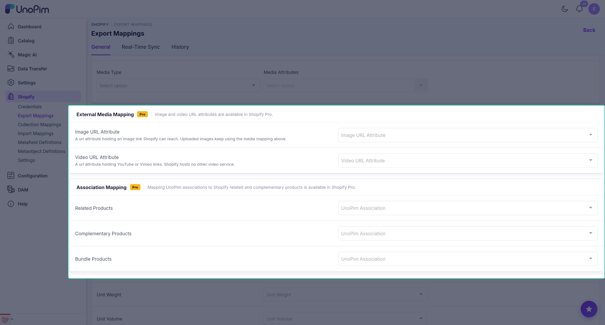

# Advanced Mapping

Shopify Pro extends the mapping screens the connector already ships. Nothing moves - the same **Export Mapping**, **Import Mapping** and **Metafield** screens simply gain fields that were greyed out with a *Pro* badge before.

Three things are added:

- **Money and measurement metafield types**
- **Association mapping** - related, complementary and bundle products
- **External media mapping** - image and video URL attributes

---

## Money and measurement metafield types

Go to **Shopify → Meta Fields → Create** (or edit an existing definition). The **Type** dropdown now offers two more Shopify metafield types.

### Money

A **money** metafield stores an amount with a currency, exactly as Shopify models a price.

Pick **Money** as the type, then select a UnoPim **price attribute** as the source. Price attributes only appear in this list with Pro installed - the connector on its own does not offer them for metafields.

Use it for things like a recommended retail price, a dealer price, or a deposit amount that should live next to the product rather than replace its price.

### Measurement

A **measurement** metafield stores a value with a unit - weight, volume or dimension.

Pick **Measurement** as the type and choose a UnoPim measurement attribute. The unit, the minimum and the maximum are read from the attribute, so the definition exported to Shopify carries the same validation you set in UnoPim.

> [!NOTE]
> The metafield definition screen also picks up the extra measurement types Pro adds, complete with a unit selector, numeric input and their validation rules.

---

## Association mapping

UnoPim associations describe how products relate to each other. Shopify has its own versions of that idea, and Pro maps one onto the other.

Go to **Shopify → Export Mappings** and scroll to **Association Mapping**.

| Shopify concept | What to map |
|---|---|
| **Related products** | The UnoPim association type holding products a shopper might also like. |
| **Complementary products** | The UnoPim association type holding products that go with this one. |
| **Bundle products** | The UnoPim association type whose members make up a Shopify product bundle. |

Each dropdown lists the **association types active in your UnoPim instance**, so a custom type you created yourself appears here alongside the built-in ones.

Once mapped, the associations ride along with the normal **Shopify Product** export - there is no separate job.

### Importing associations back

Associations come back the other way too. When a Shopify product import runs, the related, complementary and bundle relationships are written onto the matching UnoPim products using the same mapping, so a store that already organises its products this way does not need to be re-linked by hand.

Bundles are resolved after the whole import completes, because every component has to exist in UnoPim before the bundle can point at it.

---

## External media mapping

Normally the connector uploads your UnoPim images and files to Shopify. Sometimes the media already lives somewhere public - a CDN, a DAM with public URLs, a supplier's server - and re-uploading it is wasted work.

**External media mapping** lets you hand Shopify a URL instead.

On **Shopify → Export Mappings**, find the media section:

| Field | What to map |
|---|---|
| **External Image Attribute** | A UnoPim text attribute holding a publicly reachable image URL. |
| **External Video Attribute** | A UnoPim text attribute holding a publicly reachable video URL. |

> [!IMPORTANT]
> The attribute must be a text attribute with **URL validation**. A code that is missing, mistyped, or not URL-validated is discarded when the mapping is saved, rather than stored and failed against later at export time.

The URL has to be reachable from the public internet - Shopify fetches it itself. A URL on a local network or behind a login will not work.

---

## Where each setting is saved

| Setting | Screen |
|---|---|
| Money / measurement metafield types | **Shopify → Meta Fields** |
| Association mapping | **Shopify → Export Mappings** |
| External image / video attributes | **Shopify → Export Mappings** |
| Import-side association handling | **Shopify → Import Mappings** |

All four are plain mapping configuration - saving them changes nothing in Shopify on its own. The next export or import is what carries them across.
