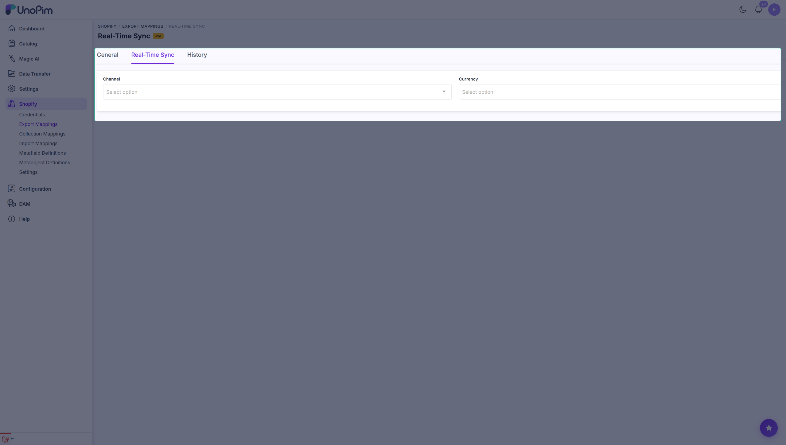
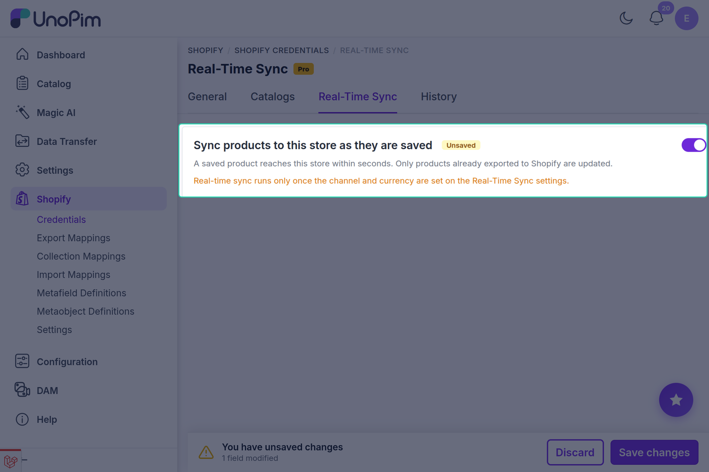

# Real-Time Sync

Real-time sync pushes a product to Shopify **within seconds of it being saved in UnoPim** - no export job, no waiting for a schedule. Edit a description, hit Save, and the change is on its way to the store.

It is deliberately narrow in scope: it **updates products that are already in Shopify**. It does not create new ones. A product still has to be exported once, the normal way, before real-time sync will keep it fresh.

---

## What triggers a push

| Action in UnoPim | Pushed |
|---|:---:|
| Create a product | ✅ |
| Edit and save a product | ✅ |
| Bulk edit products | ✅ |
| Edit a variant of a configurable product | ✅ *(the whole product is re-sent)* |

Saves that arrive close together are grouped into a single push, so bulk editing forty products does not fire forty separate calls at Shopify.

---

## Step 1 - Set the channel and currency

Real-time sync has to know which channel and currency to read a product's values in, because a save does not tell it. This is set once, globally.

Go to **Shopify → Export Mappings** and open the **Real-Time Sync** tab.

| Field | What to do |
|---|---|
| **Channel** | The channel whose values are sent. |
| **Currency** | The currency the price is read in. |

Click **Save**.

> [!NOTE]
> Set both or neither. Saving one alone is rejected with *"Choose both a channel and a currency, or clear both."*

---

## Step 2 - Turn it on for a store

Real-time sync is enabled per credential, so you can keep one store live and another manual.

Go to **Shopify → Credentials**, edit the credential, and open the **Real-Time Sync** tab.

Switch on **Sync products to this store as they are saved** and click **Save**.

The page then confirms the state:

- **Real-time sync is on.**
- **Real-time sync is off.**

---

## When it refuses to turn on

Two things must be in place first, and the screen tells you which one is missing:

| Message | What to fix |
|---|---|
| *Real-time sync runs only once this credential has a default locale.* | Open the credential and set its default locale. |
| *Real-time sync runs only once the channel and currency are set on the Real-Time Sync settings.* | Go back to Step 1 and fill both. |

> [!WARNING]
> If a credential's default locale is later removed, real-time sync is switched **off** for it automatically and a warning is written to the log. It does not silently keep running against a broken configuration.

---

## Turning the settings off again

The channel and currency on the Real-Time Sync settings cannot be cleared while a credential is still using them. You will see:

> Turn real-time sync off for these credentials first: *(names)*

Switch those credentials off, then clear the settings.

---

## Real-time sync vs scheduled exports

They solve different problems and work well together:

| | Real-time sync | [Scheduled export](./pro-scheduled-exports) |
|---|---|---|
| **Fires on** | A product being saved | A clock |
| **Scope** | The product that changed | Everything the filters match |
| **Creates new products** | No | Yes |
| **Best for** | Keeping live products correct, minute to minute | Publishing new products, catching anything missed |

A common setup is real-time sync on, plus a nightly scheduled product export as a safety net.

---

## Requirements

- A **queue worker** must be running - the push is a background job.
- The product must **already exist in Shopify** with a valid mapping.
- The credential needs a **default locale**.
- The **Channel** and **Currency** must be set on the Real-Time Sync settings.
