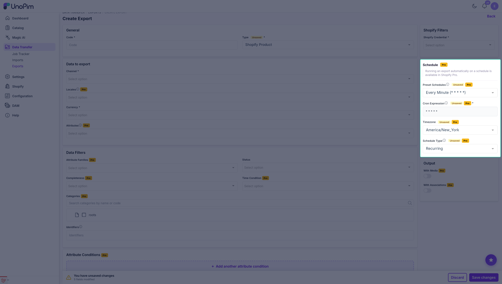

# Scheduled Exports

Without Pro, an export runs when you click **Export Now**. With Pro, an export profile can carry a **schedule** - a cron expression that UnoPim runs on its own, as often as every minute.

> [!IMPORTANT]
> A schedule only fires if your server cron is calling `php artisan schedule:run` every minute **and** a queue worker is running. See [Pro Installation](./pro-installation#enable-the-server-scheduler).

---

## Which exports can be scheduled

| Export type | Schedulable |
|---|:---:|
| Shopify Product | ✅ |
| Shopify Category | ✅ |
| Shopify Metafield Definitions | ✅ |
| Shopify Metaobject | ✅ |
| Shopify Catalog | ✅ |

---

## Setting a schedule

Open **Data Transfer → Exports → Create Export** (or edit an existing profile) and pick a Shopify export type. A **Schedule** card appears below the filters.



| Field | What to do |
|---|---|
| **Preset Schedules** | Pick a ready-made schedule, or **Custom** to write your own cron expression. |
| **Cron Expression** | Filled automatically by the preset. Editable only when the preset is **Custom**. |
| **Timezone** | The timezone the expression is evaluated in. Pick the one your business runs on, not the server's. |
| **Schedule Type** | **Recurring** keeps running on every match. **One-Time** runs once and then stops. |

Click **Save Export**. The schedule is stored with the profile - there is no separate screen to visit.

### The presets

| Preset | Cron expression |
|---|---|
| Disabled | *(no schedule)* |
| Every Minute | `* * * * *` |
| Every 5 Minutes | `*/5 * * * *` |
| Every 15 Minutes | `*/15 * * * *` |
| Every 30 Minutes | `*/30 * * * *` |
| Hourly | `0 * * * *` |
| Daily at Midnight | `0 0 * * *` |
| Daily at 6 AM | `0 6 * * *` |
| Weekly on Monday | `0 0 * * 1` |
| Monthly | `0 0 1 * *` |
| Custom | *(you write it)* |

Choosing a preset fills the **Cron Expression** field with the expression it names and locks it, so the two can never drift apart. Choosing **Custom** hands the field back to you.

### Writing a custom expression

Standard five-field cron: minute, hour, day of month, month, day of week.

```
┌───────────── minute (0-59)
│ ┌───────────── hour (0-23)
│ │ ┌───────────── day of month (1-31)
│ │ │ ┌───────────── month (1-12)
│ │ │ │ ┌───────────── day of week (0-6, Sunday = 0)
│ │ │ │ │
* * * * *
```

Examples:

| Expression | When it runs |
|---|---|
| `0 2 * * *` | Every day at 2:00 AM |
| `30 8 * * 1-5` | Weekdays at 8:30 AM |
| `0 */4 * * *` | Every four hours |
| `0 0 1,15 * *` | The 1st and 15th of each month |

---

## Turning a schedule off

Set **Preset Schedules** back to **Disabled** and save. The stored cron expression is dropped with it, so an old expression can never come back to life when you re-enable the schedule later.

---

## Recurring vs One-Time

- **Recurring** - the export runs every time the expression matches, indefinitely. This is what you want for "keep Shopify in step with UnoPim".
- **One-Time** - the export runs on the first match and the schedule then stops itself. Useful for a planned migration or a launch at a fixed hour.

---

## Checking that it works

1. Confirm the dispatcher is registered:

   ```bash
   php artisan schedule:list
   ```

   You should see `shopify:exports:dispatch-scheduled` running every minute.

2. Set a profile to **Every Minute**, save, and wait.

3. Open **Data Transfer → Exports** and watch the profile's run history - a new run appears without anyone clicking **Export Now**.

---

## Troubleshooting

| What you see | What to check |
|---|---|
| Schedule saved but nothing ever runs | The server crontab entry for `schedule:run` is missing, or the queue worker is not running. |
| The run starts but never finishes | Queue worker stopped, or it is running old code - run `php artisan queue:restart`. |
| **Cron Expression** stays empty after picking a preset | Hard-refresh the page once; if it persists, run `php artisan optimize:clear`. |
| The export runs at the wrong hour | **Timezone** on the profile does not match what you expected - it is evaluated in that timezone, not the server's. |
