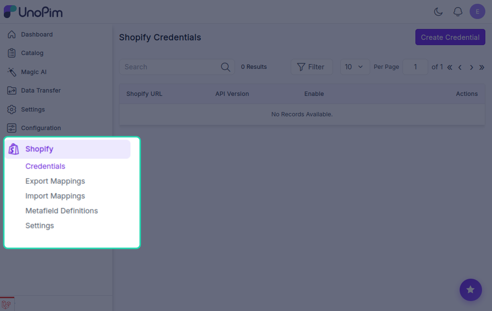
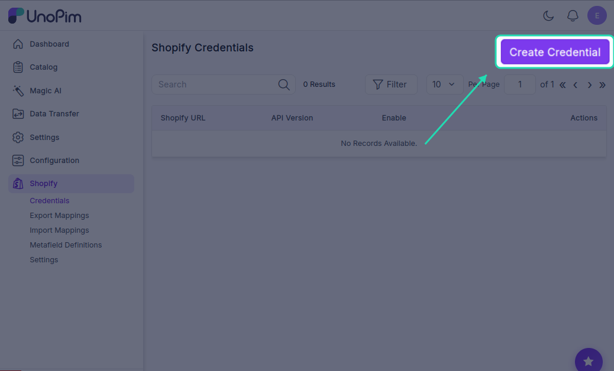
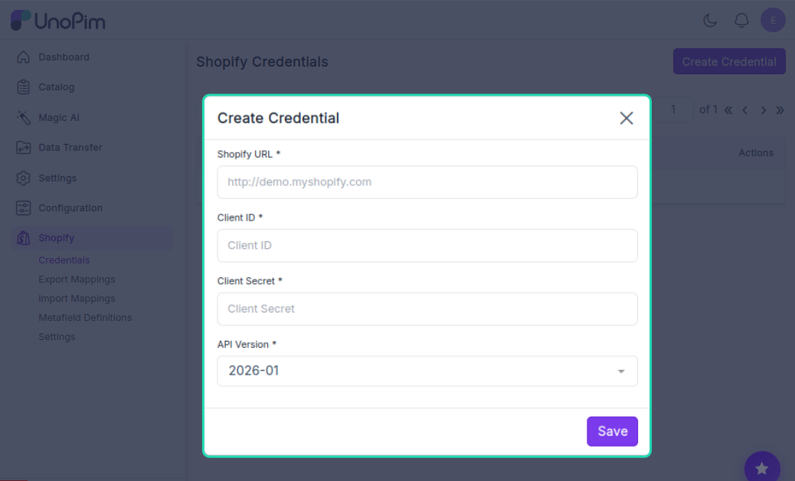
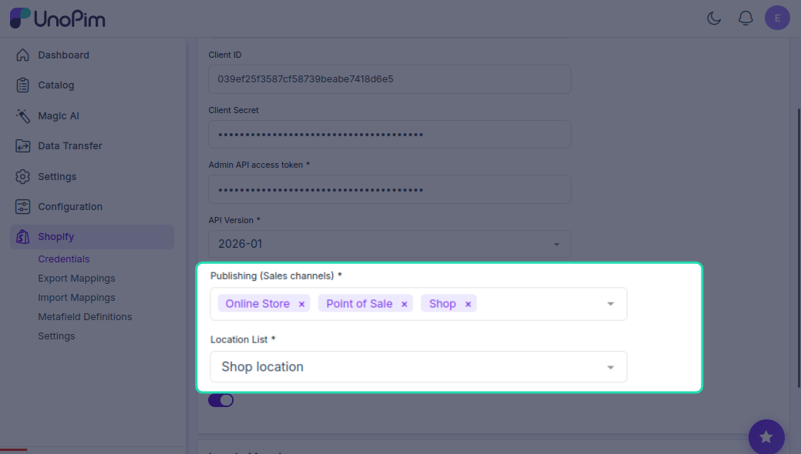
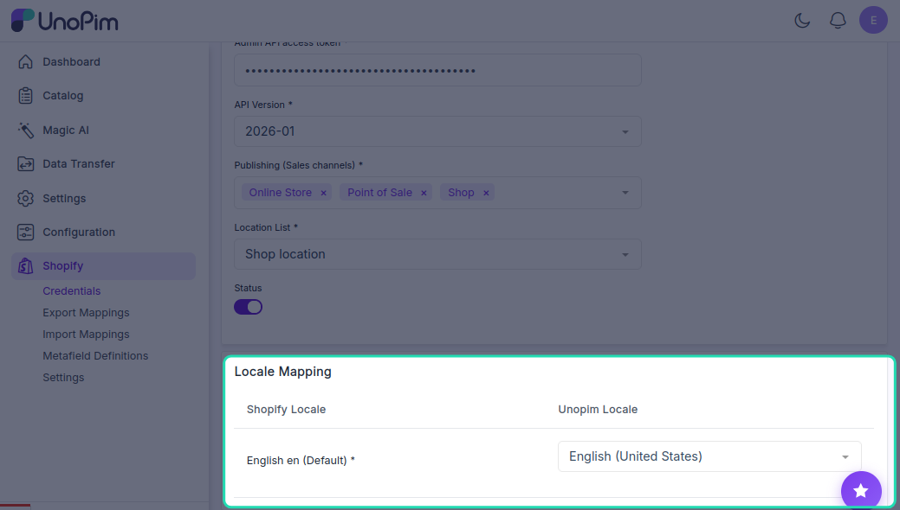
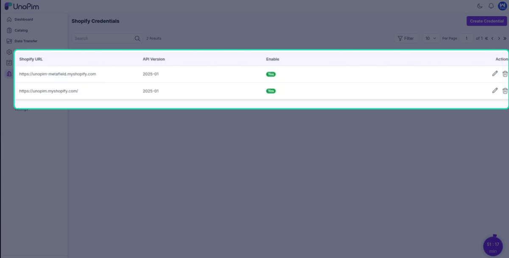

# Setting Up UnoPim Credentials

Once the connector is installed, the next step is to connect your Shopify store to UnoPim. This is done by adding your Shopify credentials inside the UnoPim dashboard.

---

## Step 1 — Open the Shopify Section

After installation, you'll notice a new **Shopify icon** in the left sidebar of your UnoPim dashboard. Click on it to open the connector.

---

## Step 2 — Create New Credentials

Go to the **Credentials** tab and click **Create Credentials**.

Fill in the following details:

| Field | What to enter |
|---|---|
| **Shopify URL** | Your Shopify store URL (e.g. `mystore.myshopify.com`) |
| **Admin API access token** | The access token you copied from your Shopify app |
| **API Version** | Select `2026-01` |

> **Note:** The UnoPim Shopify Connector currently supports **API version 2026-01**. Make sure you select this version.

Click **Save** once all fields are filled in.

---

## Step 3 — Update the Credential Settings

After saving, you'll be redirected to the credential edit screen. Complete the remaining fields:

**Publishing (Sales Channels)**
Select which Shopify sales channels your products should be published to once exported.

**Location List**
Choose the inventory location that will be used when syncing stock quantities.

**Status**
Set the default status for exported products — either active or draft.

> **Note:** The **Sales Channels** and **Location List** options are fetched directly from your Shopify store. If you don't see them in the dropdown, make sure they have been created in Shopify first before setting up credentials here.

---

## Step 4 — Map Your Locales

If your Shopify store supports multiple languages, all available Shopify locales are fetched automatically. You just need to map each Shopify locale to the corresponding locale in UnoPim.

---

## Connecting Multiple Shopify Stores

You can connect **more than one Shopify store** to the same UnoPim instance. Simply repeat the steps above and create a separate set of credentials for each store.

