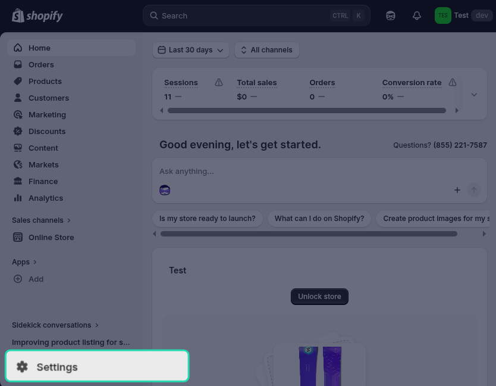
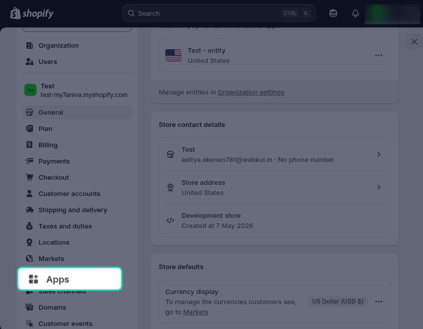
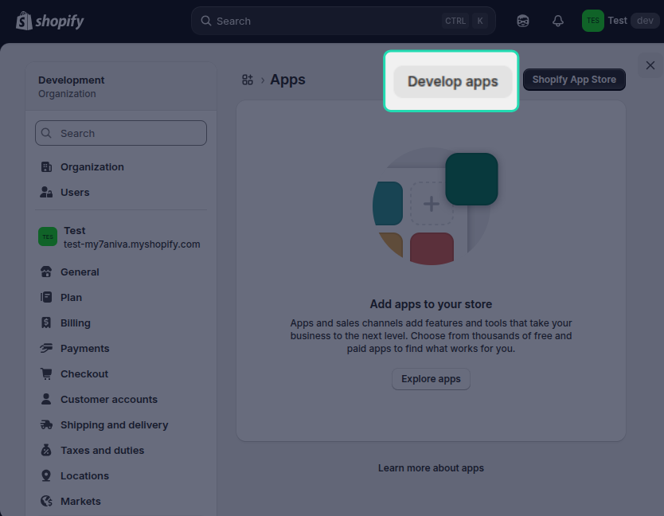
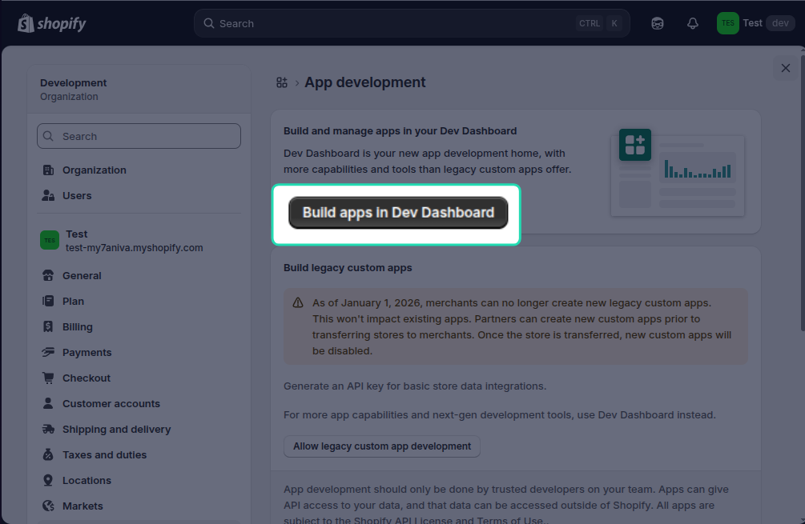
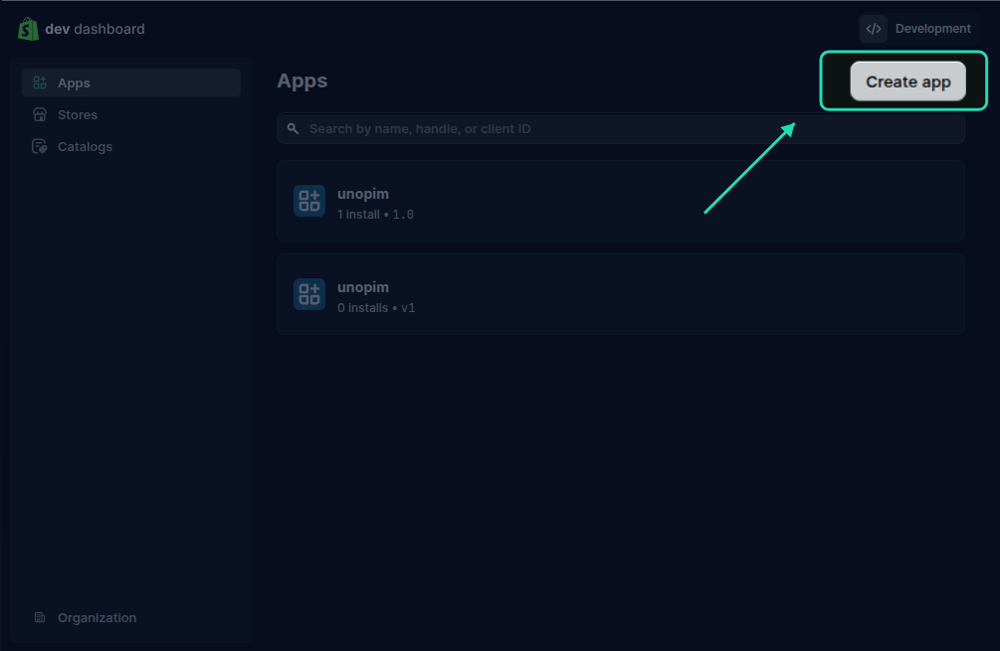
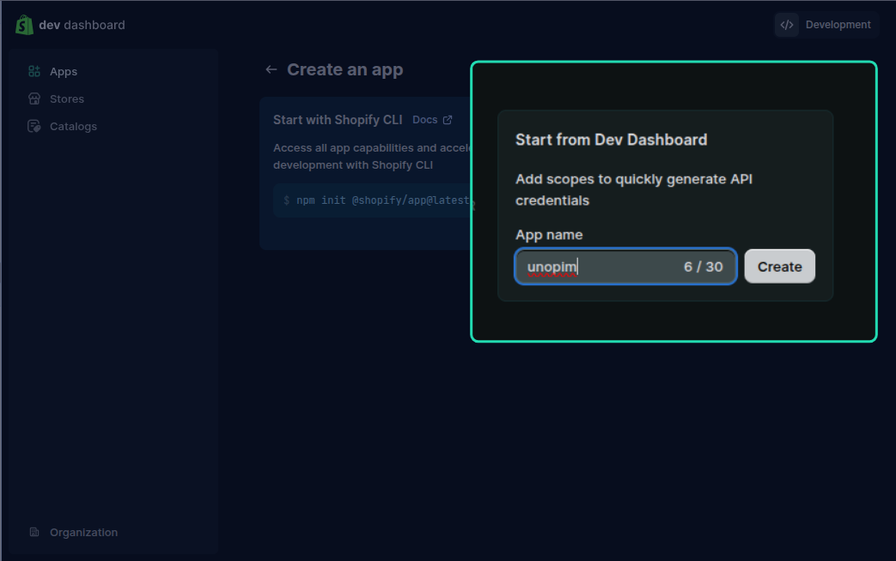
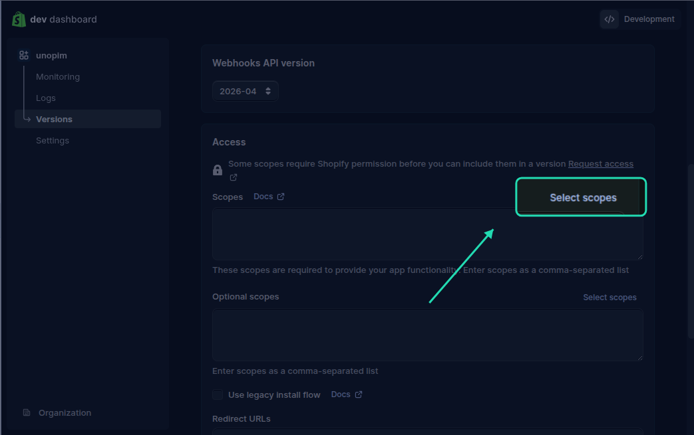
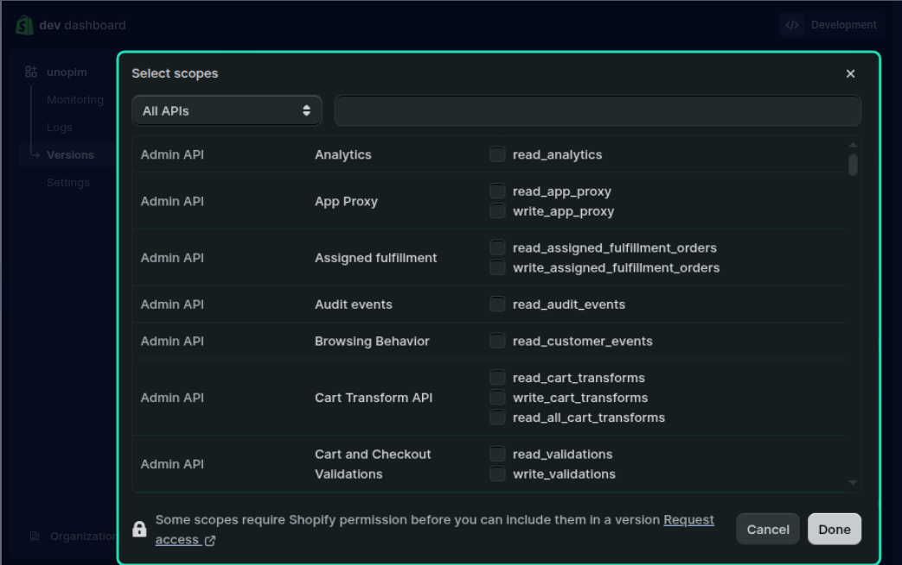
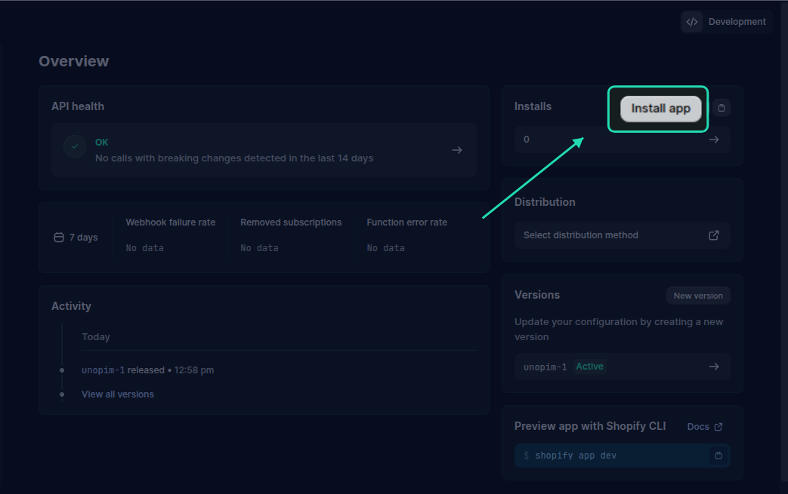
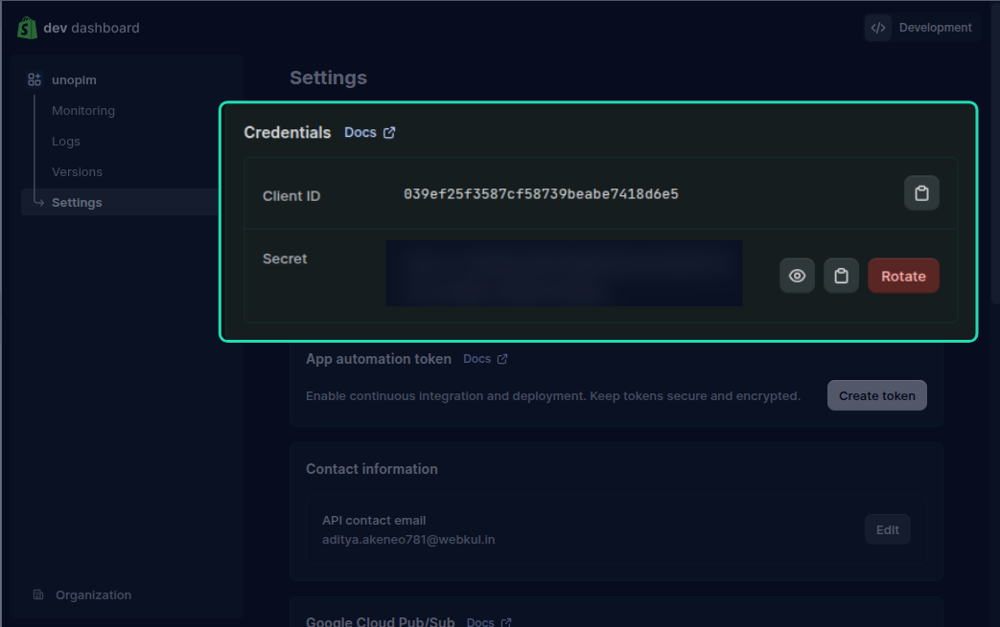

# Before You Begin — Shopify API Credentials

Before installing the UnoPim Shopify Connector, you need to do one thing on the Shopify side: **create a custom app and get your API access token**. This is what allows UnoPim to talk to your Shopify store securely.

The whole process takes about 5 minutes. Just follow the steps below.

---

## Step 1 - Open Your Shopify Settings

Log in to your Shopify admin panel and click **Settings** at the bottom of the left sidebar.

## Step 2 — Go to Apps 

In the Settings menu, click **Apps** from the left-hand side.

## Step 3 — Open the Developer Section

On the Apps page, look for **Develop apps** in the left-hand menu and click on it.

## Step 4 — Build apps in Dev Dashboard 

Click Build apps in Dev Dashboard.

## Step 5 — Create a New App

You'll be taken to the Dev Dashboard, which lists all your existing apps.

Click Create app in the top-right corner.

## Step 6 — Name Your App

Enter an App name — something like **UnoPim Connector**. Then click Create.

### Step 7 — Configure API Scopes

Once the app is created, the version tab will appear. Scroll down and you will find Access scopes. Click Select scopes.

You need to enable **read and write** access for the following. Use the copy button on any row to copy that scope's permissions, or **Copy all** to grab every permission at once.

<ScopeTable :scopes="[
  { name: 'Shop locales', permissions: ['write_locales', 'read_locales'] },
  { name: 'Fulfillment services', permissions: ['write_fulfillments', 'read_fulfillments'] },
  { name: 'Inventory', permissions: ['write_inventory', 'read_inventory'] },
  { name: 'Product listings', permissions: ['write_product_listings', 'read_product_listings'] },
  { name: 'Products', permissions: ['write_products', 'read_products'] },
  { name: 'Translation', permissions: ['write_translations', 'read_translations'] },
  { name: 'Sales Channel', permissions: ['write_channels', 'read_channels'] },
  { name: 'Location', permissions: ['write_locations', 'read_locations'] },
  { name: 'Publications', permissions: ['write_publications', 'read_publications'] },
  { name: 'Files', permissions: ['write_files', 'read_files'] }
]" />

> **Important:** Make sure you select **both** the read and write checkboxes for each scope listed above. UnoPim requires full read and write access to sync data correctly. Selecting only read access will cause exports to fail.

Once all scopes are selected, click **Save**.

---

### Step 8 — Install the App 
After saving the scopes, go back to the app's **home page**. You'll see an **Install** app button — **click it**.

This step links the app to your Shopify store and activates the API credentials.

## Step 9 — Copy Your Access Token

Once installed, go to Settings inside your app. Here you'll find Credentials with two important pieces of information:

Client ID — your app's public identifier
Client Secret — your app's private key

Copy both and store them somewhere safe — you'll need to enter them in UnoPim during the credentials setup step.

> **Note:** Keep your Client Secret private. Never share it publicly or commit it to version control.

---

You're all set on the Shopify side. Head over to [Installation](./installation.md) to continue setting up the connector in UnoPim.