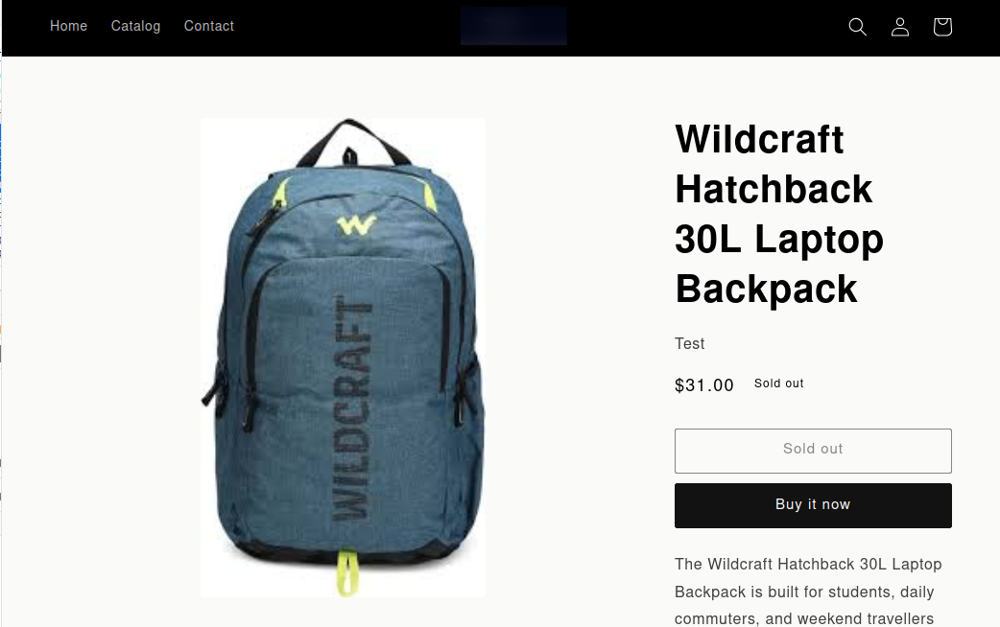

# Viewing Your Products on the Shopify Storefront

Once an export job finishes, your products are live. Head over to your Shopify storefront and open any exported product — you'll see the product name, price, images, and description exactly as they were set up in UnoPim.

No manual publishing needed. If the product status was set to **Active** during export, it goes straight to your storefront and is visible to customers right away.

---

## What Customers See

On the product page, customers will see:

- **Product name** — pulled from the title field mapped in UnoPim
- **Price** — including compare-at price if a discount was set
- **Images** — all images exported via your media mapping
- **Description** — full product description, including any HTML formatting

---

> **Tip:** If a product isn't showing up on the storefront, check that its status was set to **Active** during export and that it has been assigned to at least one sales channel in Shopify.