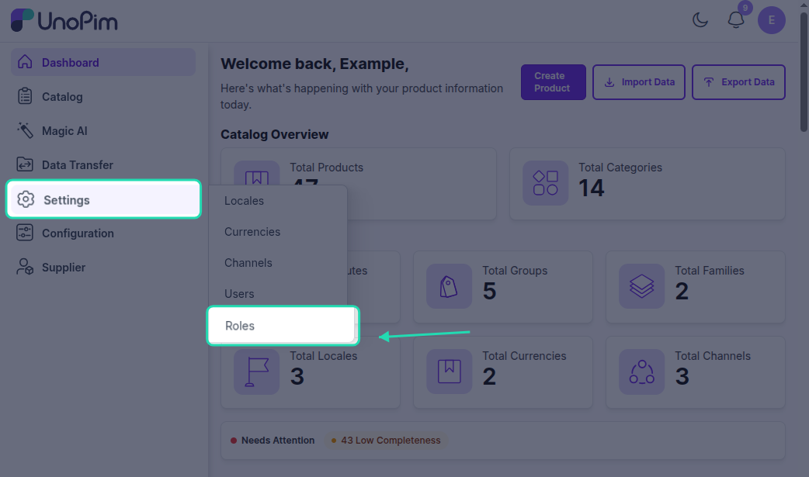
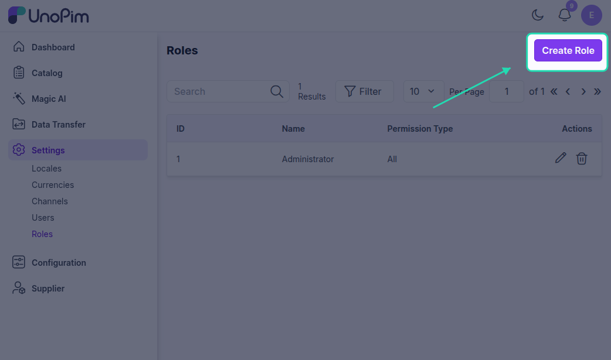
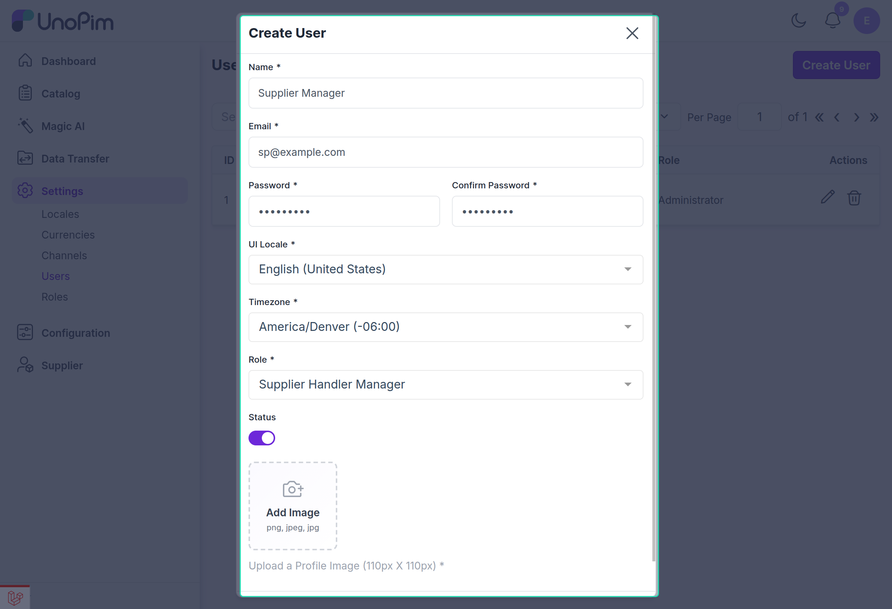
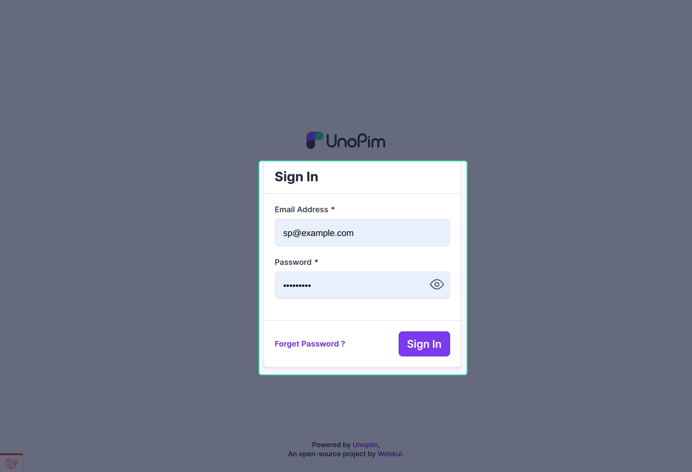
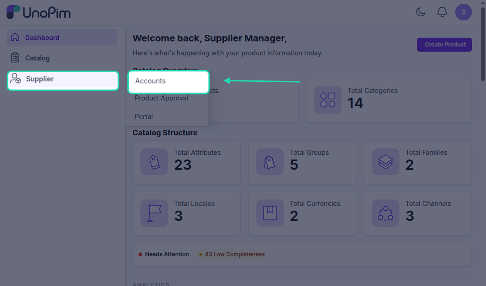
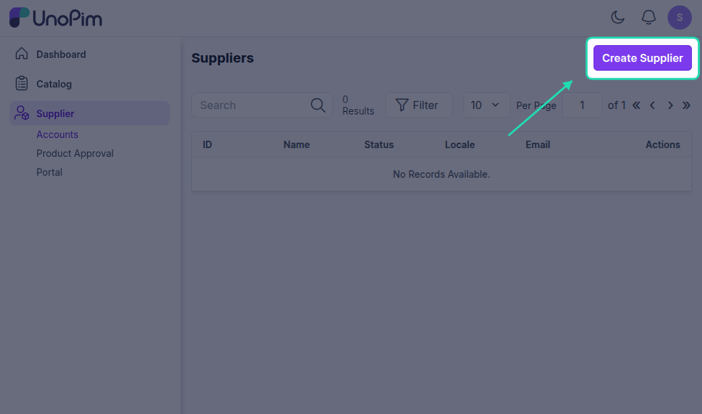
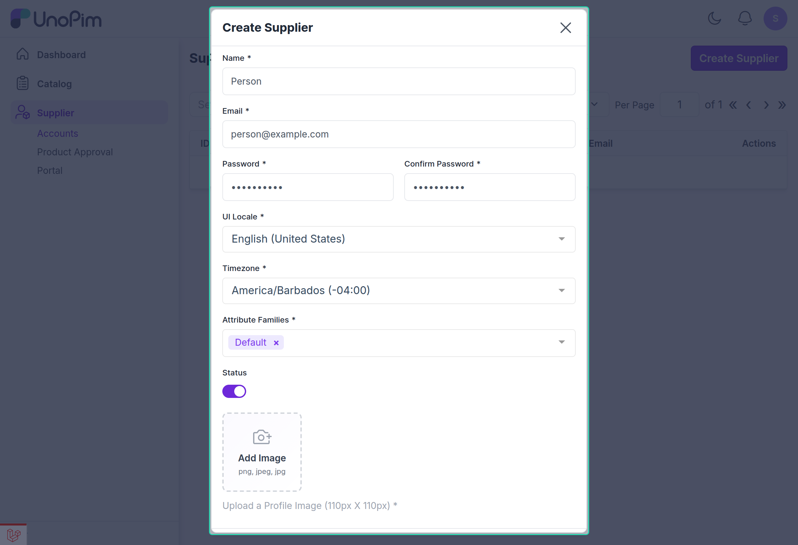
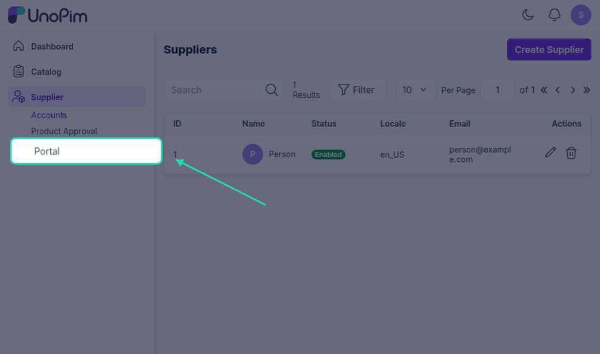
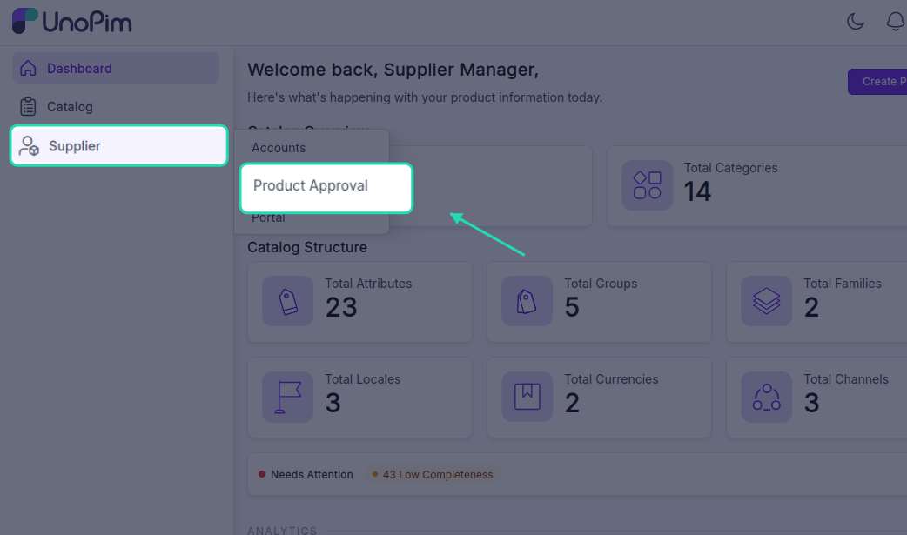
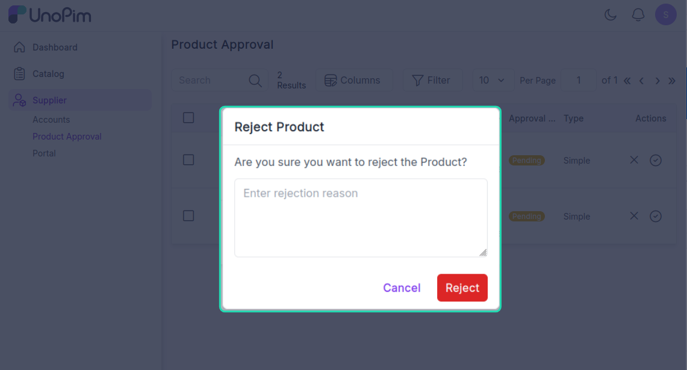

# Admin Guide

This guide covers everything your team needs to do to set up and manage the Supplier Data Portal — from creating roles and users, to reviewing and approving supplier products.

---

## Step 1 — Create a Supplier Handler Role

Before anything else, you need a role that grants the right permissions for managing suppliers and reviewing their products.

Go to **Settings → Roles → Create Role** and set up a new role. Assign the following permissions:

| Permission | What it allows |
|---|---|
| Create, edit, and delete supplier accounts | Full supplier account management |
| Access the Supplier Portal Management | View and manage the supplier portal |
| Approve, Mass Approve, or Reject supplier products | Product review and approval actions |
| Access the Product Approval Page | View products awaiting review |
| Access the main UnoPim Dashboard | General dashboard access |
| Access the Catalog | View the product catalog |

Click **Save** once the permissions are assigned.

> **Note:** A Super Admin automatically has access to all supplier management features and does not need a custom role.

---

## Step 2 — Assign the Role to a Handler User

Create a new UnoPim user or update an existing one, and assign the role you just created. This user becomes your **Supplier Handler** — responsible for managing supplier accounts and reviewing submitted products.

Go to **Settings → Users → Create User** (or edit an existing user) and select the Supplier Handler role from the role dropdown.

---

## Step 3 — Log In as the Supplier Handler

Log in to UnoPim using the Supplier Handler's credentials. Once logged in, the handler will have access to:

- Supplier management
- Product approval page
- Dashboard views relevant to their role

---

## Step 4 — Create Supplier Accounts

Now you can start adding your suppliers. Go to **Supplier → Accounts → Create Supplier** and fill in the required details:

- **Supplier details** — name, contact information, and other required fields
- **Attribute Family** — assign the product family this supplier will use when submitting products
- **Status** — set to **Enabled** so the supplier can log in

Repeat this process for each supplier you want to onboard. All created accounts will appear in the **Supplier Accounts** listing.

---

## Step 5 — Share Login Credentials with the Supplier

Once a supplier account is created, share the following with your supplier:

- **Supplier Portal URL** — the link to their dedicated login page
- **Username** — their account username
- **Password** — their account password

The supplier will use these to access the portal and start submitting products.

---

## Step 6 — Review and Approve Products

When a supplier submits products, they appear on the **Product Approval Page** for your review. Navigate there to see all products awaiting action.

You have three options for each product:

### Approve One by One
Open the product's edit view, verify the details, and click **Approve**.

### Mass Approve
Select multiple products from the list and use the **Mass Approve** action to approve them all at once — useful when reviewing large batches from a supplier.

### Reject with Comments
If a product doesn't meet your requirements, select **Reject** and leave a comment explaining what needs to be changed. The supplier will see the rejection and your comments directly on their product edit page, so they know exactly what to fix before resubmitting.

---

## Step 7 — Final Approval and Catalog

Once a product is approved, it automatically appears on the **UnoPim Catalog Product Page** and becomes part of your official catalog. The supplier's dashboard updates to reflect the new status as well.

> **Tip:** You can recheck a product at any time by navigating back to the Product Approval Page — rejected and resubmitted products will reappear there for a second review.