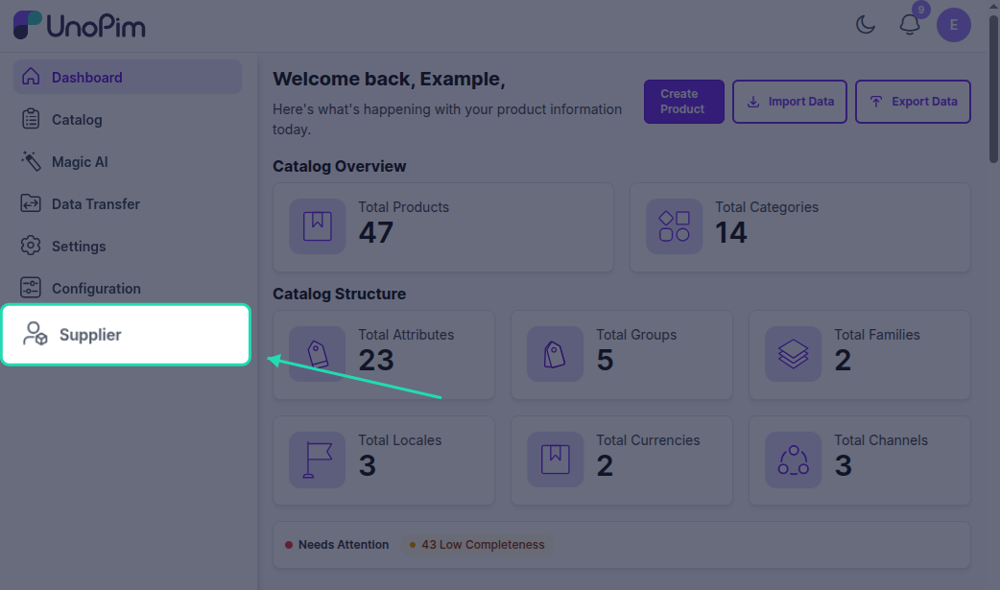

# Installation

## Steps

### 1. Merge the extension files

Unzip the Supplier Data Portal package and copy the `packages/` folder into your Unopim project root, merging with any existing `packages/` directory.

### 2. Register the service provider

Open `bootstrap/providers.php` and add:

```php
use Webkul\Supplier\Providers\SupplierServiceProvider;

return [
    // ...existing providers...
    SupplierServiceProvider::class,
];
```

> [!NOTE]
> This registers `SupplierServiceProvider` in Laravel so the extension can bootstrap its services, routes, and package configuration during application startup.

### 3. Update Composer autoload

In `composer.json`, add the namespace under `autoload.psr-4`:

```json
"autoload": {
    "psr-4": {
        "Webkul\\Supplier\\": "packages/Webkul/Supplier/src"
    }
}
```

### 4. Run the installer

```bash
composer dump-autoload
php artisan supplier:install
```

| Command | Purpose |
|---|---|
| `composer dump-autoload` | Regenerates Composer's autoloader mapping to include the newly added namespace. |
| `php artisan supplier:install` | Runs the package installer, including required database migrations and seeders. |

### 5. Build front-end assets

If icons or UI elements are missing, build the supplier front-end assets:

```bash
cd packages/Webkul/Supplier
npm install
npm run build
```

| Command | Purpose |
|---|---|
| `cd packages/Webkul/Supplier` | Changes into the Supplier package directory before running npm commands. |
| `npm install` | Installs frontend dependencies for the Supplier package. |
| `npm run build` | Builds Supplier frontend assets so icons and UI components render correctly. |

### 6. Verify

- Open `http://your-domain.com/supplier/login` - you should see the supplier login page.
- Open the Unopim admin panel - a **Supplier** section should appear in the sidebar.


