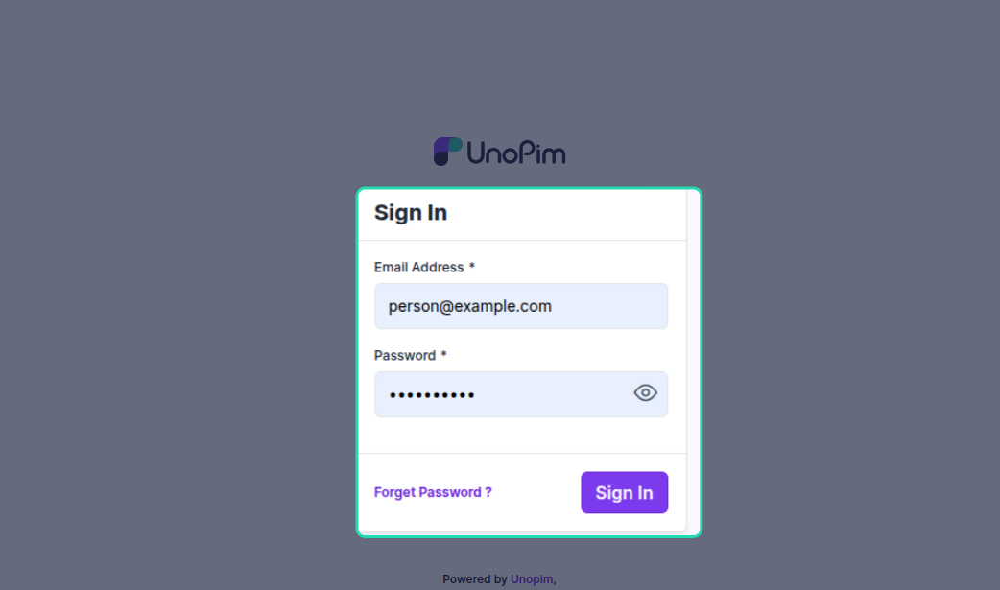
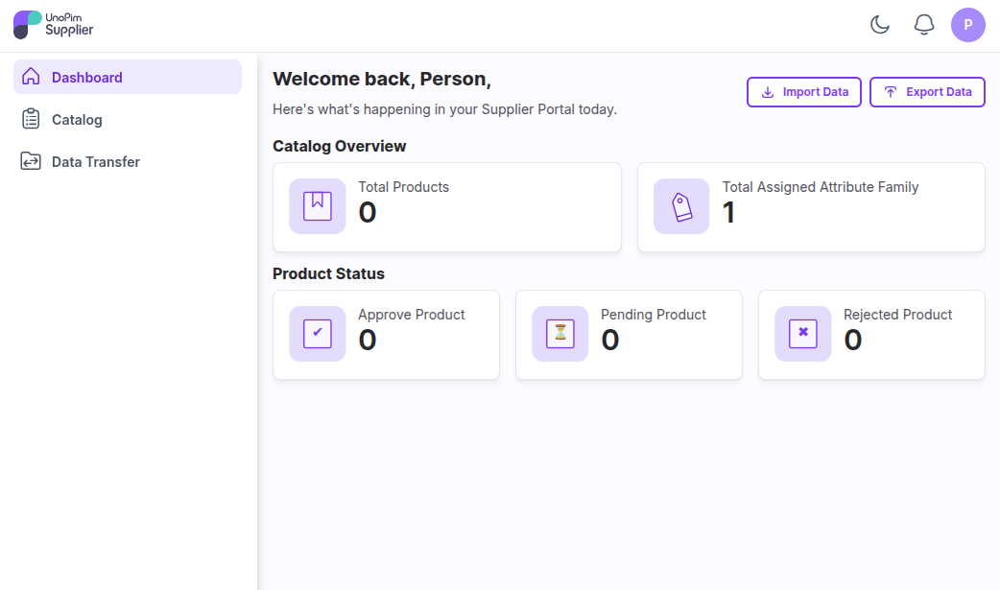
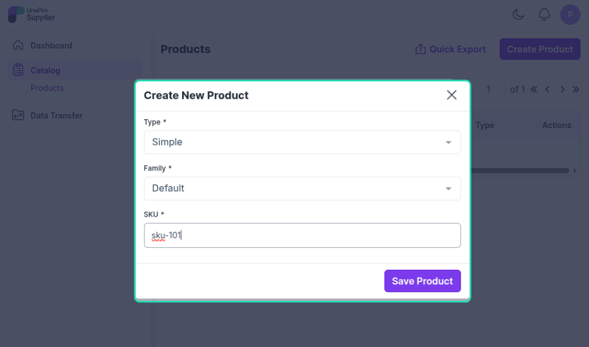
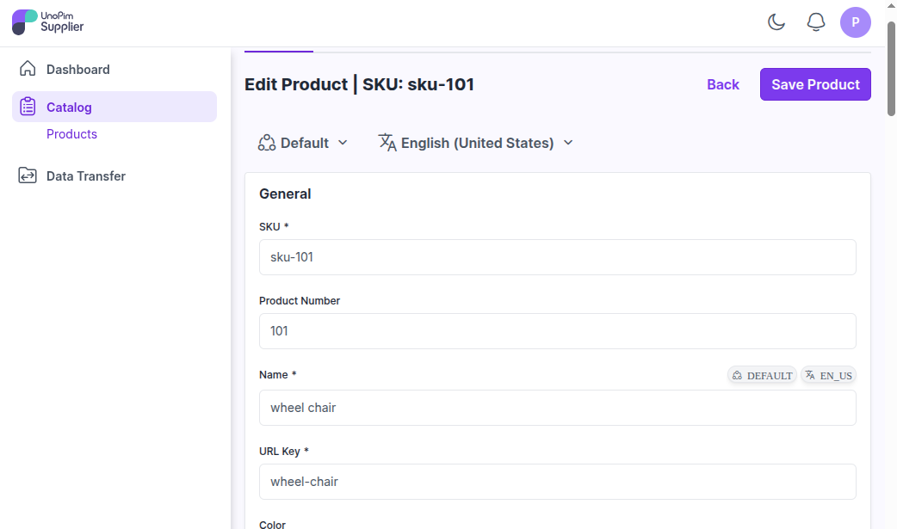
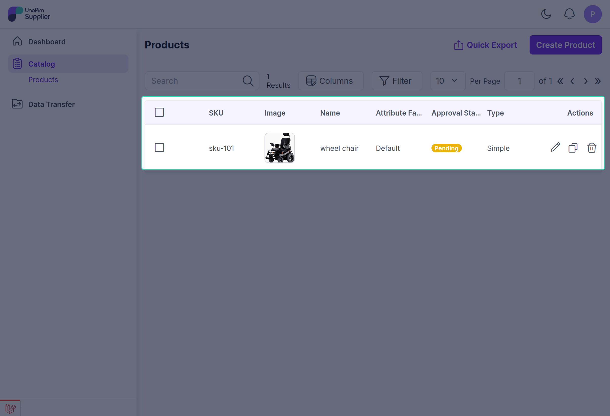
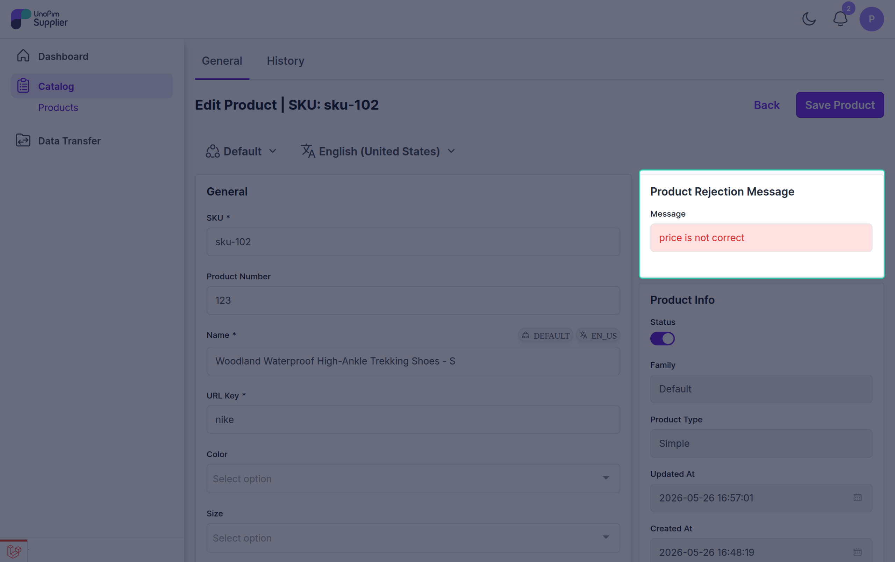

# Supplier Guide

This guide is for **suppliers** — the people or companies submitting product data through the UnoPim Supplier Data Portal. You don't need to know anything about UnoPim's full admin panel. Your portal is a separate, focused space just for submitting and managing your products.

---

## Step 1 — Log In to the Supplier Portal

Use the login URL, username, and password shared with you by your handler or admin. This takes you to your own dedicated supplier dashboard — separate from the main UnoPim admin area.

---

## Step 2 — Your Dashboard

When you first log in, your dashboard will show an overview of your product activity:

| Metric | What it means |
|---|---|
| **Total Products** | All products you have submitted |
| **Approved Products** | Products approved and added to the catalog |
| **Pending Products** | Products submitted and waiting for review |
| **Rejected Products** | Products that need changes before they can be approved |
| **Assigned Attribute Family** | The product type/family you've been set up to submit |

This dashboard updates automatically every time the status of one of your products changes.

---

## Step 3 — Submit Products

You have two ways to add products to the portal:

### Create a Single Product

Click **Create Product** to add one product at a time. Fill in the required fields based on your assigned attribute family and submit.

### Import Multiple Products

If you have a large number of products to submit, use the **Import** option. Prepare your product data in one of the following formats:

- `.XLS`
- `.XLSX`
- `.CSV`

Upload the file and run the import job. All imported products will be moved to the **Review** stage automatically — no manual submission needed for each one.

---

## Step 4 — Track Your Product Status

After submitting, you can track the status of each product from your dashboard or product list:

| Status | What it means |
|---|---|
| **Pending** | Your product has been submitted and is waiting for the handler to review it |
| **Approved** | Your product has been approved and is now part of the catalog |
| **Rejected** | Your product needs changes — see the comments for details |

---

## Step 5 — Handle Rejections

If one of your products is rejected, here's what to do:

1. Open the rejected product from your product list.
2. Go to the **edit page** — you'll see the handler's comments explaining what needs to be fixed.
3. Make the necessary changes based on the feedback.
4. **Resubmit** the product for review.

The handler will review your updated product and either approve it or provide further feedback.

> **Tip:** Read the rejection comments carefully before making changes — they tell you exactly what the handler is looking for.

---

## What Happens After Approval?

Once your product is approved, it appears in the main UnoPim Catalog. Your dashboard will automatically update to reflect this. You don't need to do anything further for approved products unless the handler requests changes.