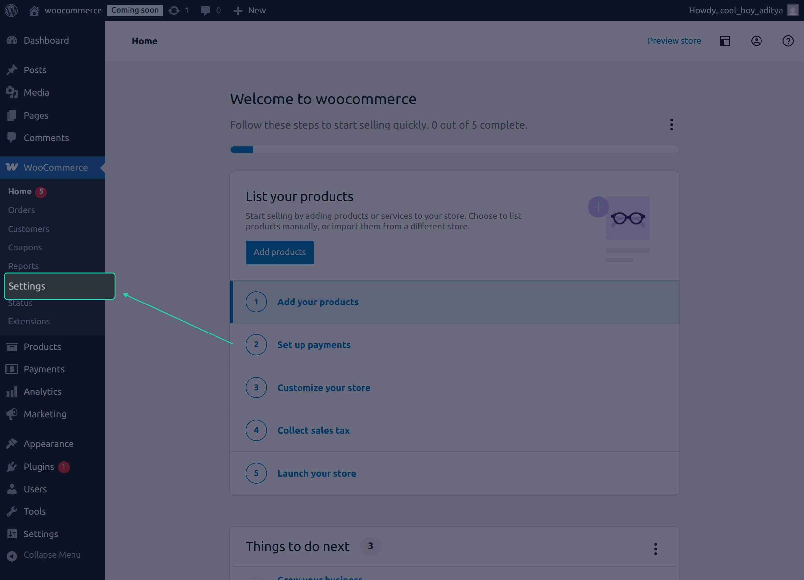
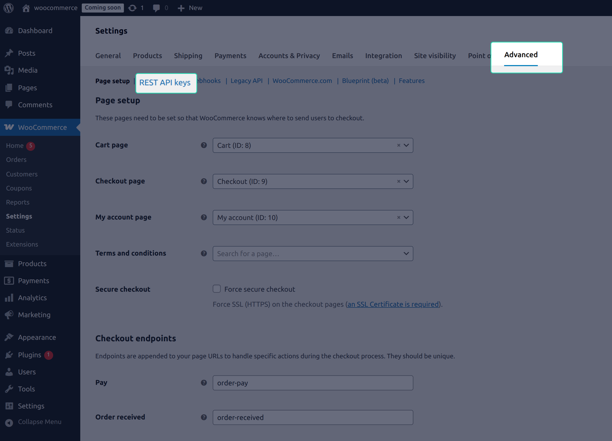
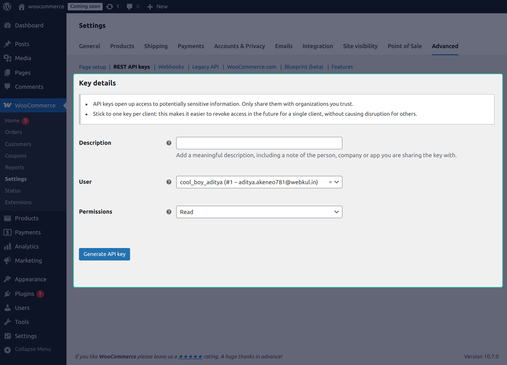

# Generating WooCommerce API Credentials

Before connecting WooCommerce to UnoPim, you need to generate an API key from your WooCommerce store. This key allows UnoPim to securely communicate with WooCommerce on your behalf.

The whole process takes just a couple of minutes. Follow the steps below.

## Step 1  Open WooCommerce Settings

Log in to your WordPress admin panel and go to **WooCommerce → Settings**.

## Step 2  Go to the REST API Section

From the Settings page, click the **Advanced** tab in the top navigation bar. Then click on **REST API** from the sub-menu.

This page lists all existing API keys for your store. You'll create a new one here.

## Step 3  Add a New Key

Click the **Add Key / Create API Key** button.

Fill in the following details on the form that appears:

| Field | What to enter |
|---|---|
| **Description** | A label to identify this key  e.g., `UnoPim Integration` |
| **User** | Select the WordPress user this key belongs to  Admin is selected by default |
| **Permissions** | Select **Read/Write** |

> **Important:** UnoPim requires **Read/Write** permission to export and import data between the two platforms. Selecting **Read Only** will cause exports to fail.

---

## Step 4  Generate the API Key

Once all fields are filled in, click **Generate API Key**.

WooCommerce will generate and display three items:

| Item | What it's used for |
|---|---|
| **Consumer Key** | Used to authenticate UnoPim with your WooCommerce store |
| **Consumer Secret** | Used alongside the Consumer Key for secure authentication |
| **Barcode** | A visual reference for the key  not used in UnoPim |

> **Important:** This is the **only time** WooCommerce will display the Consumer Secret in full. Copy both the **Consumer Key** and **Consumer Secret** immediately and store them somewhere safe. If you lose the secret, you'll need to delete this key and generate a new one.

---

## What You Now Have

You'll need the following two values to set up credentials in UnoPim:

- **Consumer Key**
- **Consumer Secret**

