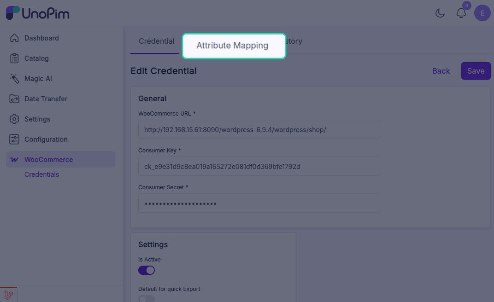
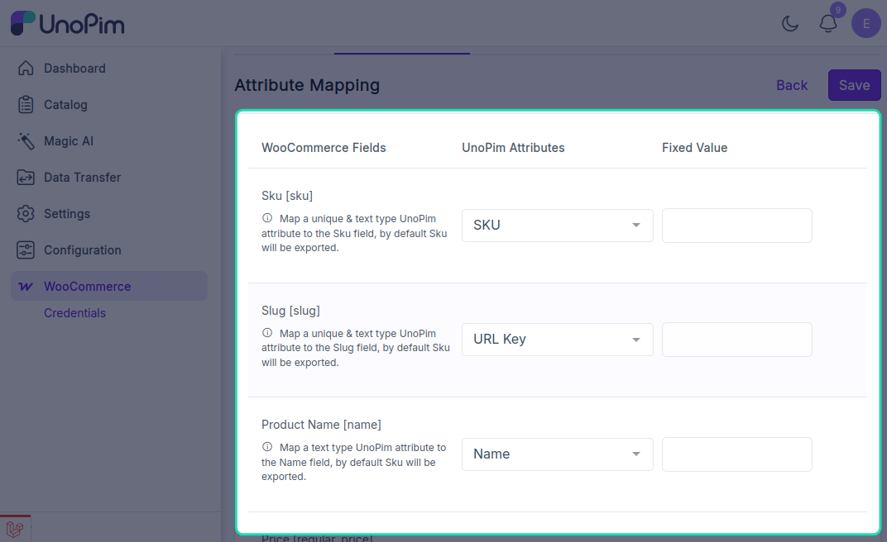
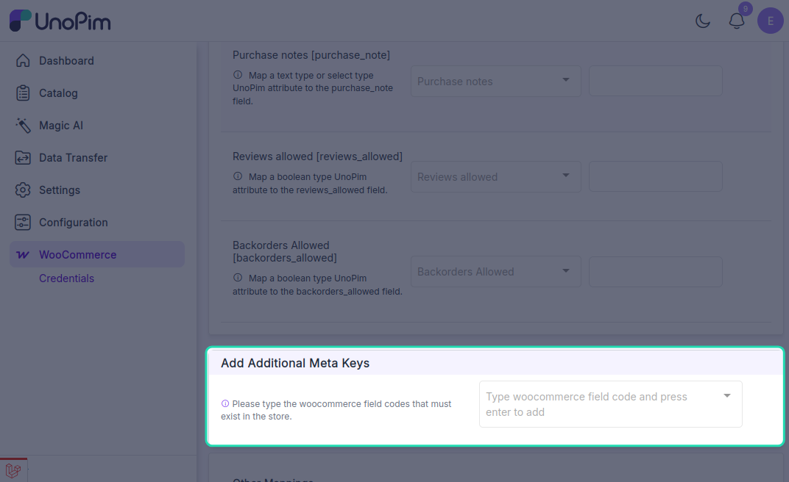
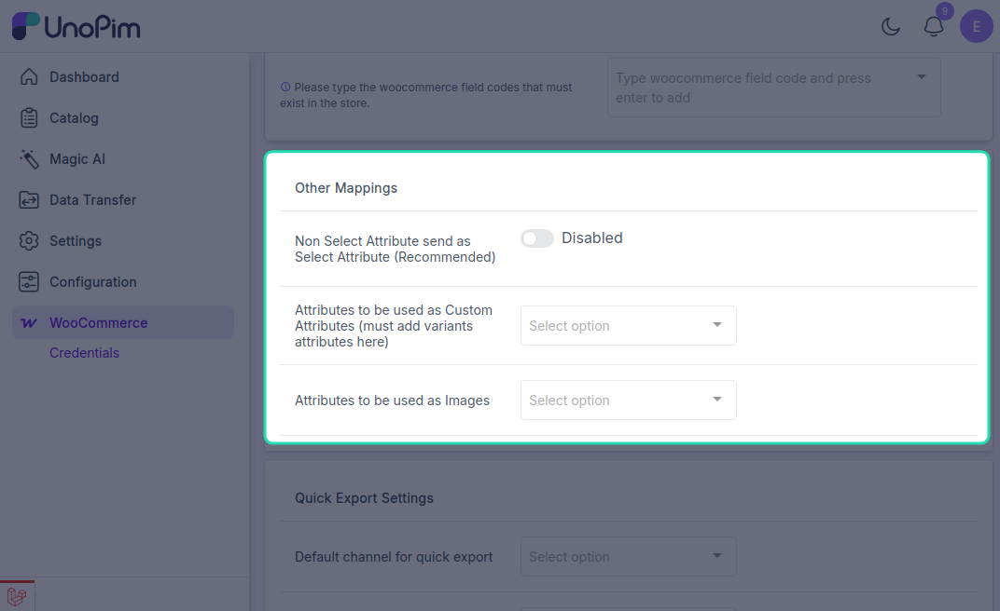
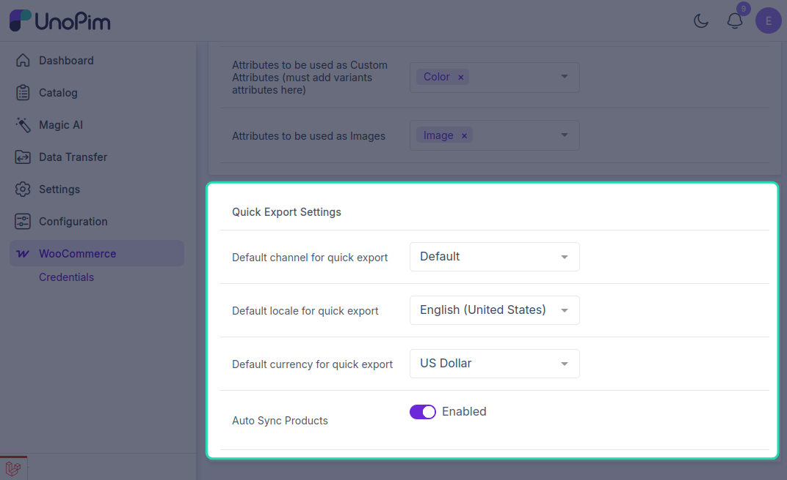

# Attribute Mapping in UnoPim

Attribute mapping allows users to connect WooCommerce product fields with the correct UnoPim attributes. This ensures that product data is transferred into the right fields during synchronization.

While setting up the mapping, users need to select the UnoPim attribute that matches each WooCommerce product information field.

## Default WooCommerce Fields Available for Mapping

By default, the following WooCommerce fields can be mapped with UnoPim attributes:

- **SKU `[sku]`**: Unique identifier for each product, used for inventory and tracking.
- **Slug `[slug]`**: URL-friendly version of the product name used in permalinks.
- **Product Name `[name]`**: The title of the product displayed to customers.
- **Price `[regular_price]`**: Standard selling price of the product.
- **Description `[description]`**: Full product description shown on the product page.
- **Short Description `[short_description]`**: Brief product summary typically shown near the top of the product page.
- **Weight `[weight]`**: Physical weight of the product, commonly used for shipping calculations.
- **Length `[length]`**: Product length dimension used for shipping or display.
- **Width `[width]`**: Product width dimension used for packaging or logistics.
- **Height `[height]`**: Product height dimension used in physical handling.
- **Quantity `[stock_quantity]`**: Available stock quantity for the product.
- **Is Featured? `[featured]`**: Indicates whether the product is marked as featured in the store.
- **Purchase Notes `[purchase_note]`**: Message sent to customers after purchase, usually for instructions or follow-up information.
- **Reviews Allowed `[reviews_allowed]`**: Defines whether customers can leave reviews for the product.
- **Backorders Allowed `[backorders_allowed]`**: Defines whether the product can be ordered when it is out of stock.

> **Note:** For the WooCommerce **Quantity `[stock_quantity]`** field, map a UnoPim **text-type attribute**.

## Add Additional Meta Keys

The connector also allows users to add custom WooCommerce fields through **Additional Meta Keys**.

In this section, users can enter a WooCommerce field code and press **Enter** to add it as a new mapping field. After that, they can assign the appropriate UnoPim attribute to the newly added field.

## Other Mappings

Under **Other Mappings**, the admin can configure the following options:

- **Non-Select attribute sent as Select attribute (recommended)**: Use this option when a WooCommerce field should be handled as a select-type value during synchronization.
- **Attribute to be used as a custom attribute**: Use this option to define which UnoPim attributes should be treated as custom attributes in WooCommerce. Variant attributes must also be added here.
- **Attribute to be used as Images**: Use this option to select the UnoPim attribute that should be used for product images.

This section is also used to add additional keywords required for mapping behavior.

## Quick Export Settings

Under **Quick Export Settings**, the admin needs to configure the following default values:

- Select the default **channel** for quick export.
- Select the default **locale**.
- Select the default **currency**.
- Enable **Auto Sync Products** if products should be synced automatically from UnoPim to WooCommerce when they are created, updated, or deleted.

For **Quick Export**, enabling auto sync is not required. The admin only needs to assign the default values for **channel**, **locale**, and **currency** in the attribute mapping, and then enable **Quick Export** in the credential settings.

After completing the mapping configuration, click **Save** to store the settings.
