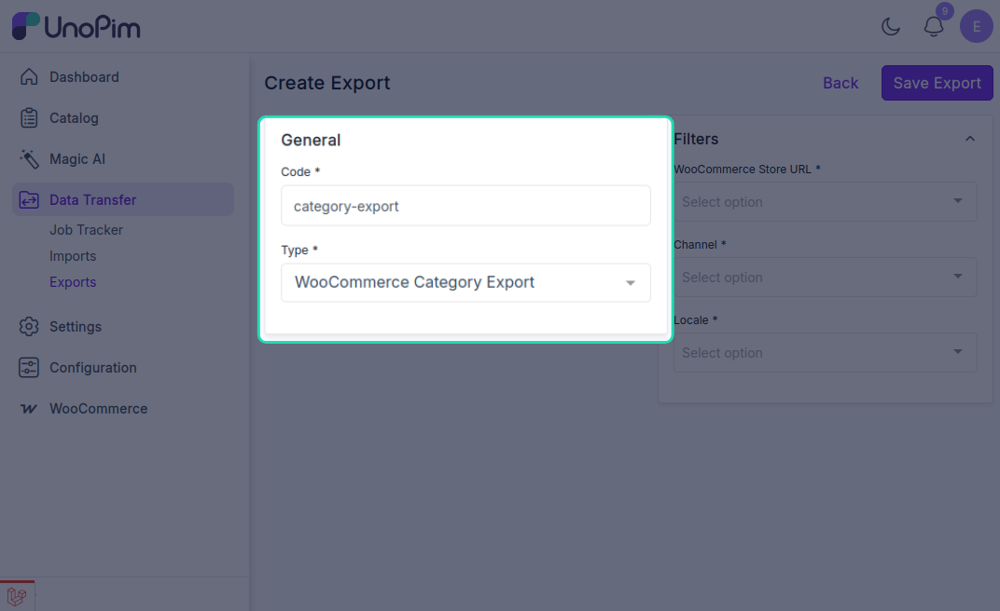
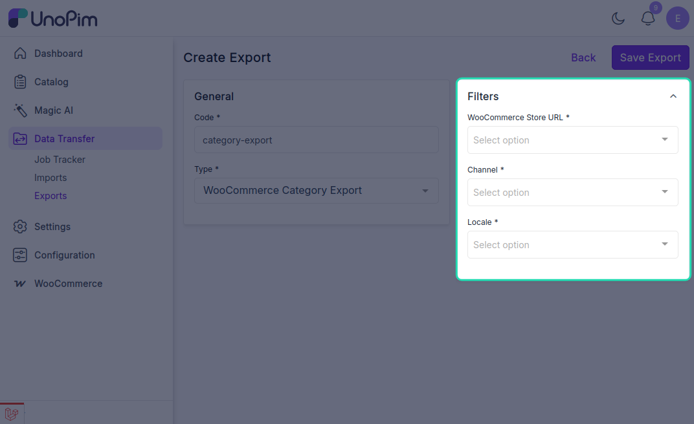
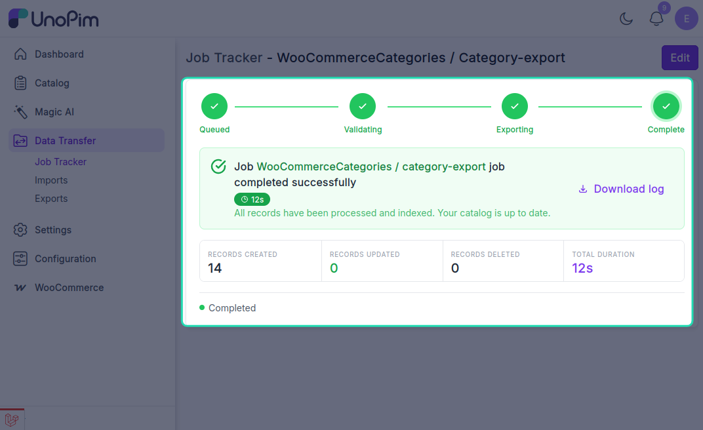

# Category Export

The UnoPim WooCommerce Connector allows users to export category data from UnoPim to WooCommerce through dedicated export jobs.

## Open the Export Jobs Section

To create a category export job, go to:

`Data Transfer > Exports`

From the Exports page, click **Create Export** in the top-right corner.

## Create a Category Export Job

While creating the export job, the user needs to:

- Enter the **Export Job Code**.
- Select **WooCommerce Category Export** as the export job type.

## Category Export Filters

After selecting the category export job type, configure the available filters as required for your store and catalog data.

Typically, the user needs to select:

- **WooCommerce Store URL**: Select the required WooCommerce store credentials.
- **Channel**: Select the channel to use for the export.
- **Locale**: Select the required locale.

## Save and Run the Export Job

After filling in the required details, click **Save Export** to create and save the export job.

Once the job is run, the export progress can be viewed from the **Job Tracker**.

After the export completes successfully, the categories will be available in the connected WooCommerce store.
