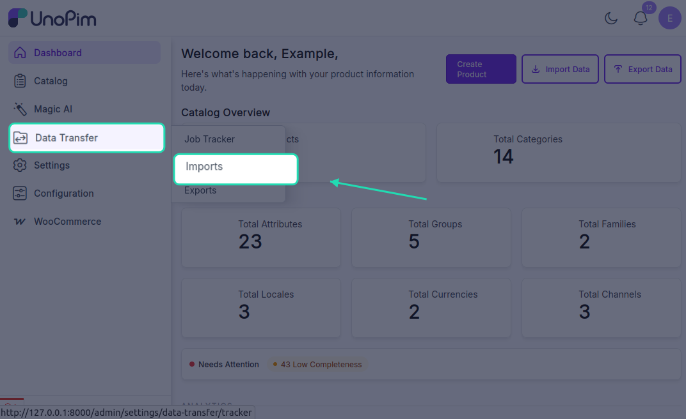
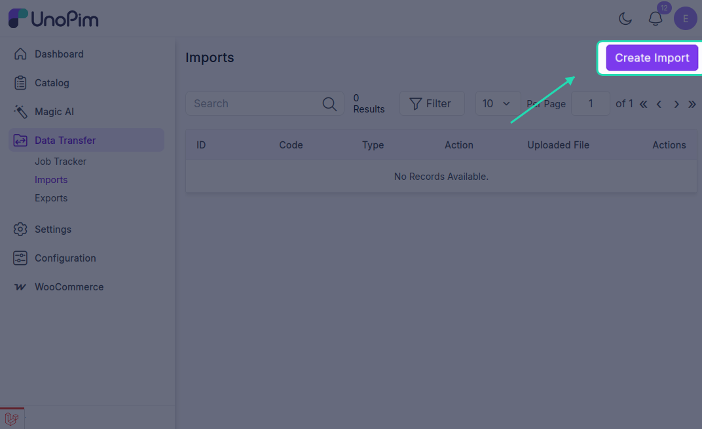
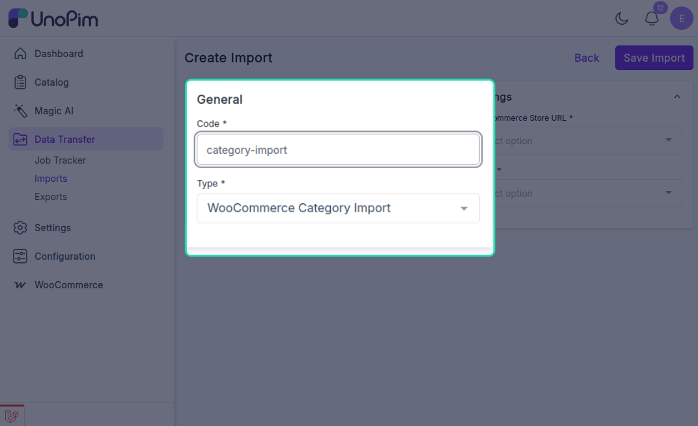
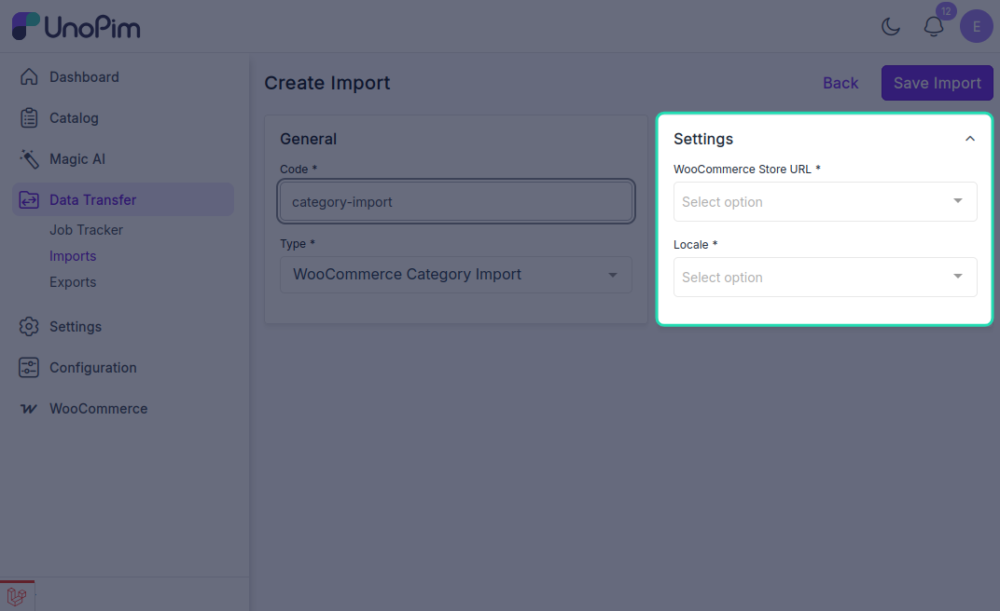
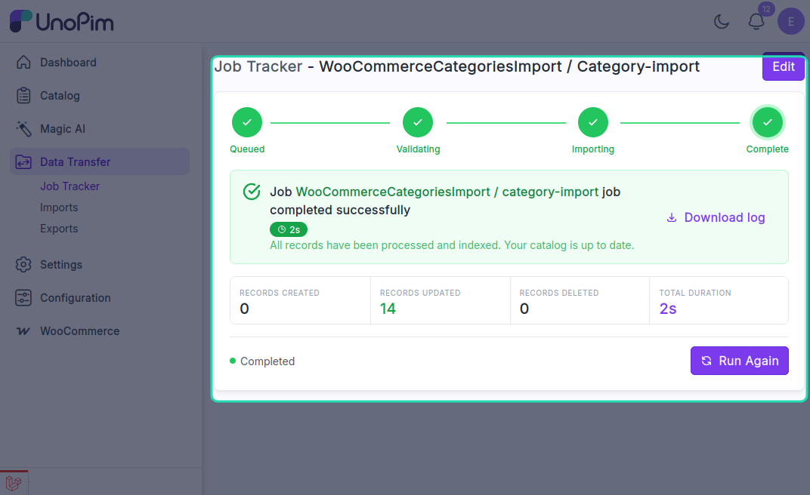

# Category Import

The UnoPim WooCommerce Connector allows users to import WooCommerce categories into UnoPim by creating an import profile.

## Open the Import Section

To create an import job, go to:

`Import > Create Import Profile`

From there, click **Create Import** to open the import setup form.

## Create a Category Import Job

While creating the import job, the user needs to:

- Enter the **Code**.
- Select **WooCommerce Category Import** as the import type.

## Category Import Settings

Under **Settings**, configure the following:

- **WooCommerce Store URL**: Select the required WooCommerce store credentials.
- **Locale**: Select the locale to be used during import.

After entering the required values, click **Save Import** to save the import profile.

Once the job is executed, the imported categories will be available in UnoPim.

