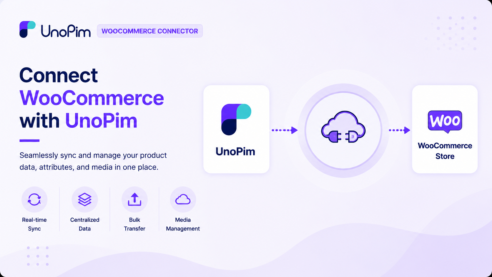

# UnoPim WooCommerce Connector

The **UnoPim WooCommerce Connector** links your **WooCommerce store** with **UnoPim**  a powerful Product Information Management (PIM) system  so you can manage all your product data from one place and keep both platforms in sync automatically.

 

  

  

If you're tired of updating product information in WooCommerce and UnoPim separately, this connector solves that. Make your changes once in UnoPim and let the connector handle the rest  categories, attributes, products, and variations all stay consistent across both platforms without manual effort.

## How It Works

The connector works in **both directions**:

- **Export (UnoPim → WooCommerce)**  push your product catalog from UnoPim to your WooCommerce store.
- **Import (WooCommerce → UnoPim)**  pull existing WooCommerce data into UnoPim to centralise your catalog management.
- **Auto Sync**  any product you create, update, or delete in UnoPim is automatically reflected in WooCommerce in real time  no manual export needed.

## Features

### Export (UnoPim → WooCommerce)
- Export **categories** from UnoPim to WooCommerce.
- Export **attributes** and **attribute terms** from UnoPim to WooCommerce.
- Export **products** including variations and attribute values.
- **Quick Export**  run a fast product export job for selected products without a full catalog run.

### Import (WooCommerce → UnoPim)
- Import **categories** from WooCommerce into UnoPim.
- Import **attributes** and **attribute terms** from WooCommerce into UnoPim.
- Import **products** from WooCommerce into UnoPim.

### Sync & Credentials
- **Auto Sync**  product creates, updates, and deletes in UnoPim are automatically pushed to WooCommerce.
- **Multiple credentials**  connect more than one WooCommerce store to the same UnoPim instance.

