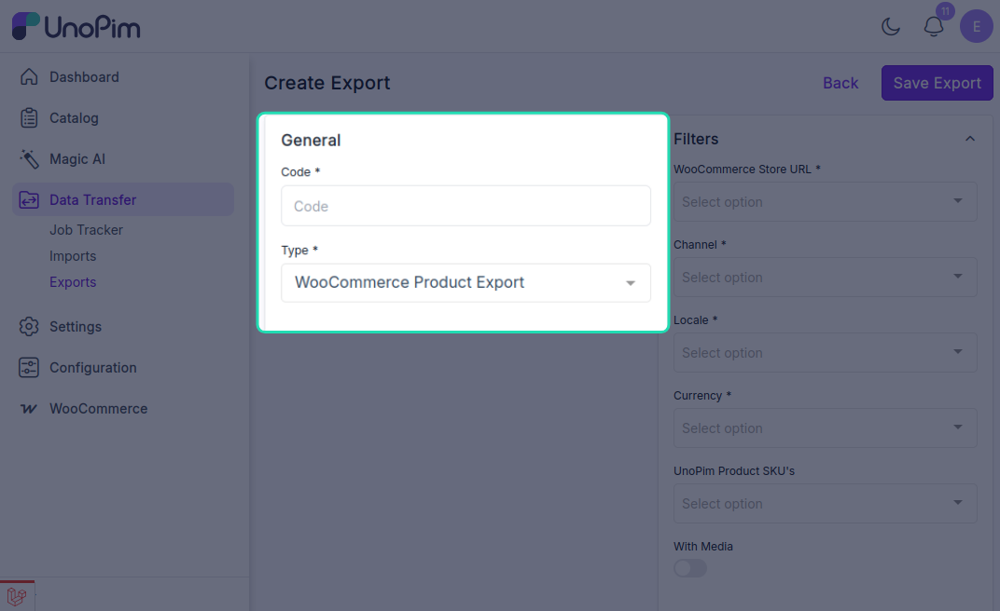
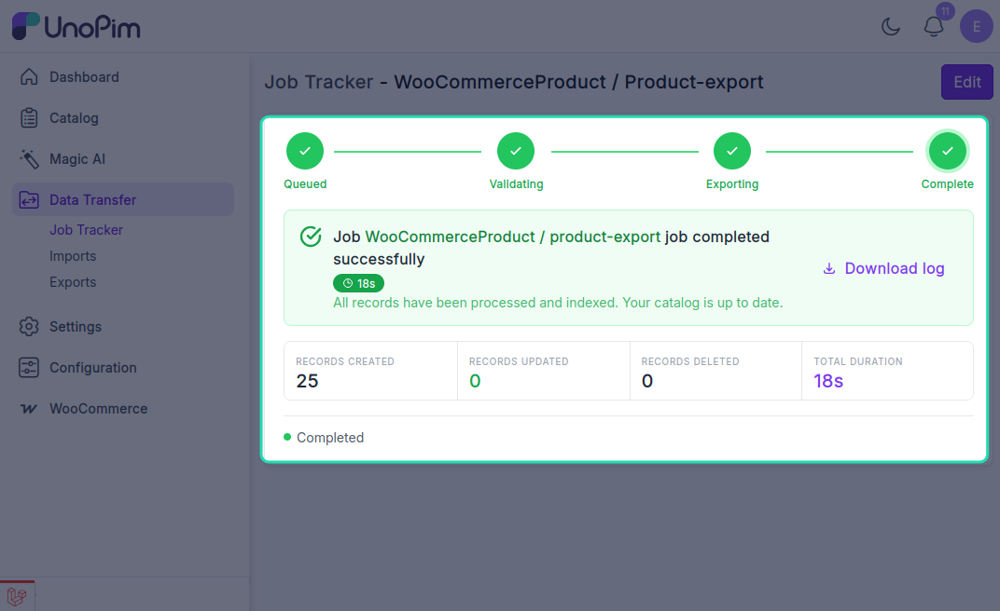

# Product Export

The UnoPim WooCommerce Connector allows users to export product data from UnoPim to WooCommerce through dedicated export jobs.

## Open the Export Jobs Section

To create a product export job, go to:

`Data Transfer > Exports`

From the Exports page, click **Create Export** in the top-right corner.

## Create a Product Export Job

While creating the export job, the user needs to:

- Enter the **Export Job Code**.
- Select **WooCommerce Product Export** as the export job type.

## Product Export Filters

After selecting the product export job type, configure the following filters as needed:

- **WooCommerce Store URL**: Select the required WooCommerce store credentials.
- **Channel**: Select the channel for exporting.
- **Locale**: Select the required locale.
- **Currency**: Select the required currency.
- **UnoPim Product SKU**: Enter the SKU of the specific product that needs to be exported.
- **With Media**: Enable this option if product images should also be exported to WooCommerce.

## Save and Run the Export Job

After filling in the required details, click **Save Export** to create and save the export job.

Once the export job is run, the user can monitor its progress from the **Job Tracker**.

After the export completes successfully, the products will be visible in the connected WooCommerce store.
