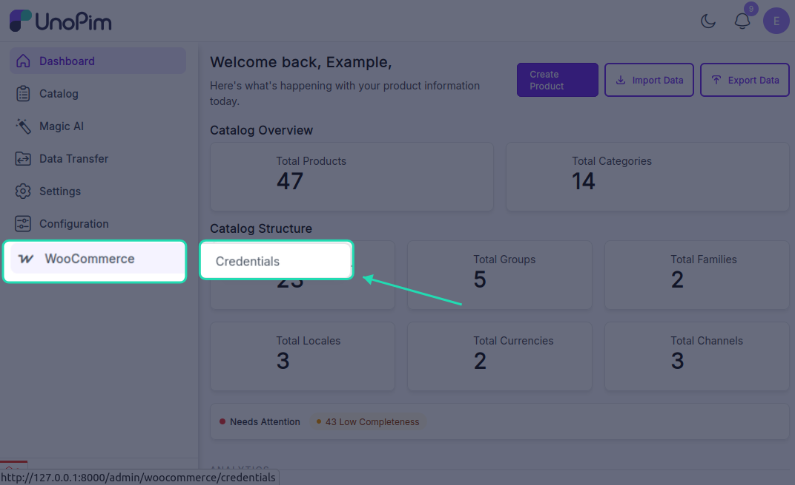
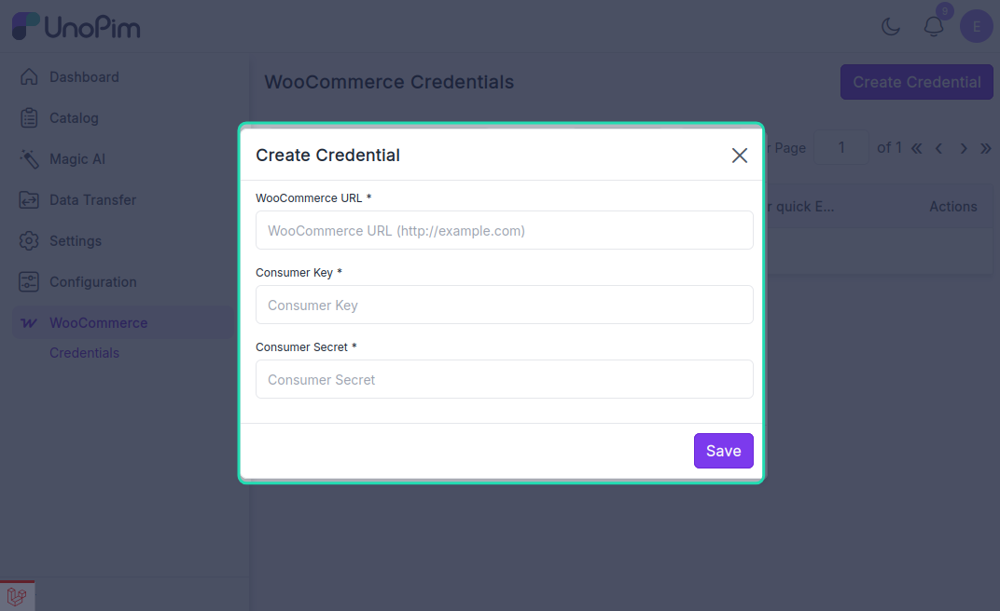
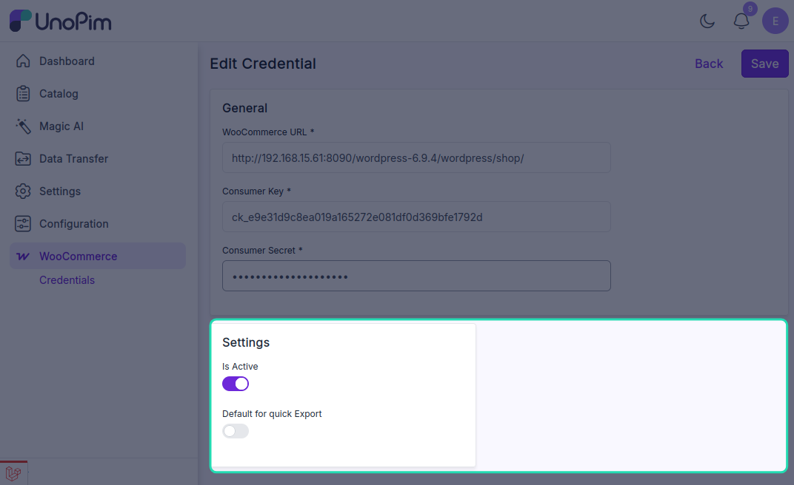

# Setup Credentials in UnoPim

Once the UnoPim WooCommerce Connector is installed, it becomes available in the left-side menu of the UnoPim admin panel.

From there, go to **WooCommerce > Credentials > Create** to add a new WooCommerce account and connect it with UnoPim.

This credential setup allows UnoPim to communicate securely with your WooCommerce store for product, category, attribute, and variation synchronization.

## Create a New Credential

While creating a new credential, the admin needs to enter the following details:

### General Details

- **WooCommerce URL**: Enter the full URL of your WooCommerce store.
- **Consumer Key**: Enter the Consumer Key generated from WooCommerce.
- **Consumer Secret**: Enter the Consumer Secret generated from WooCommerce.

## Settings

The connector also provides the following configuration options:

- **Is Active**: This option is enabled by default when a new credential is created. You can enable or disable the credential at any time by toggling this option.
- **Default for Quick Export**: Enable this option if you want to use the credential for WooCommerce quick export jobs.

> **Note:** Only one credential can be set as the default for quick export at a time.

## Navigation Flow

Follow this path in the UnoPim admin panel:

`WooCommerce > Credentials > Create`

